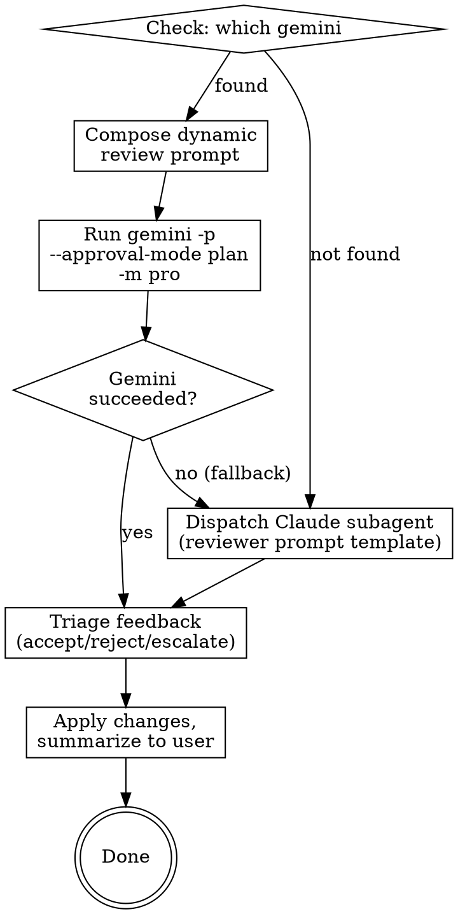

# Gemini CLI Review Integration — Implementation Plan

> **For agentic workers:** REQUIRED SUB-SKILL: Use superartes:subagent-driven-development (recommended) or superartes:executing-plans to implement this plan task-by-task. Steps use checkbox (`- [ ]`) syntax for tracking.

**Goal:** Add a `gemini-review` skill that automates external document review via Gemini CLI, with Claude subagent fallback, and wire it into brainstorming and writing-plans workflows.

**Architecture:** New standalone skill invoked by brainstorming and writing-plans after their self-review steps. Checks for Gemini CLI availability; if present, composes a dynamic review prompt and runs `gemini -p` in read-only mode; if absent, falls back to dispatching a Claude subagent using existing reviewer prompt templates. Triages feedback into accept/reject/escalate buckets.

**Tech Stack:** Gemini CLI (`gemini -p --approval-mode plan -m pro`), SuperArtes skill framework (SKILL.md + reference files), Bash heredoc for prompt passing.

**Spec:** `docs/specs/2026-04-13-gemini-review-design.md`

---

### Task 1: Create the gemini-review SKILL.md

**Files:**
- Create: `skills/gemini-review/SKILL.md`

- [ ] **Step 1: Create the skill directory**

```bash
mkdir -p skills/gemini-review
```

- [ ] **Step 2: Write SKILL.md**

Create `skills/gemini-review/SKILL.md` with the following content:

```markdown
---
name: gemini-review
description: Use when a design spec, implementation plan, or other document needs independent external review - runs Gemini CLI review with Claude subagent fallback, or when the user requests a Gemini review or second opinion on a document
---

# External Document Review

Review a design spec or implementation plan by invoking Gemini CLI in headless, read-only mode. Falls back to a Claude subagent review when Gemini CLI is not available.

## When This Skill Runs

This skill is invoked by other skills (brainstorming, writing-plans) after their inline self-review step, before the user review gate. It can also be invoked directly by user request.

**Inputs the invoking skill must provide (in conversation context):**
- The path to the document being reviewed
- The document type: "spec" or "plan"
- For plans: the path to the spec the plan is based on
- Any related context documents (parent architecture docs, etc.)

## Process



### Step 1: Check Gemini CLI availability

Run `which gemini` via the Bash tool. If it succeeds, proceed with Gemini review. If it fails, note to user: "Gemini CLI not available — running Claude subagent review instead." and skip to Step 4 (Subagent Fallback).

### Step 2: Compose the review prompt

Compose a contextual, tailored review prompt. Do NOT use a rigid template — write the prompt as if you were a developer asking a senior colleague for a thorough review. The prompt quality directly determines the review quality.

**Include in the prompt:**

1. **Role & context** — tell Gemini what project this is, what the document is, and where it fits in the bigger picture
2. **Documents** — reference the primary document and any related context docs using `@path/to/file` syntax
3. **Review focus** — what matters most for this particular document (architectural soundness? spec coverage? consistency with parent design?)
4. **Situational context** — if this is a re-review, explain what changed and why since the last cycle
5. **Permission to explore** — tell Gemini it has read-only access to the whole project and should look up files if needed
6. **Collaborative framing** — ask for issues, suggestions, improvements, and alternative ideas — not just error-finding

**The prompt must NOT:**
- Limit response length (this kills depth and defeats the purpose)
- Over-template the expected output format (let Gemini organize its thoughts)
- Tell Gemini what conclusions to reach

Read `review-guidelines.md` in this skill's directory for document-type-specific review focus areas.

### Step 3: Invoke Gemini CLI

Pass the prompt via heredoc to avoid shell escaping issues:

```bash
cat << 'REVIEW_PROMPT_EOF' | gemini -p "$(cat)" --approval-mode plan -m pro
<your composed prompt here>
REVIEW_PROMPT_EOF
```

Set the Bash tool timeout to 280 seconds. The heredoc delimiter MUST use single quotes (`'REVIEW_PROMPT_EOF'`) to prevent shell variable expansion.

**If Gemini fails** (non-zero exit, timeout, empty output): report the error briefly and fall through to Step 4 (Subagent Fallback).

### Step 4: Subagent Fallback (when Gemini is unavailable or failed)

Dispatch a Claude subagent using the existing reviewer prompt templates:
- For spec reviews: read `skills/brainstorming/spec-document-reviewer-prompt.md` and use its prompt template
- For plan reviews: read `skills/writing-plans/plan-document-reviewer-prompt.md` and use its prompt template

Substitute `[SPEC_FILE_PATH]` and `[PLAN_FILE_PATH]` with the actual file paths. Dispatch using your platform's subagent tool (e.g., the Agent tool in Claude Code). If your platform does not support subagents, execute the review yourself in the current session using the template.

### Step 5: Triage the feedback

Read the reviewer's feedback (whether from Gemini or subagent) and categorize each point:

| Bucket | Criteria | Action |
|--------|----------|--------|
| **Accept & apply** | Clear improvements: bugs, omissions, inconsistencies, better ideas | Fix in the document immediately |
| **Reject** | Reviewer lacked context, contradicts a deliberate decision, unhelpful | Skip silently |
| **Escalate** | Genuine judgment call, design decision, both sides have merit | Present to user with your recommendation |

### Step 6: Summarize and update

Present a brief summary to the user:

```
[Gemini/Subagent] review processed:
- Applied (N): [brief description of each change]
- Skipped (N): [brief reason for each]
- Your input needed (N): [tradeoff + your recommendation for each]
```

If changes were applied, update the document and commit using `superartes:commit-message`.

If there are escalated items, wait for the user's input before proceeding.
```

- [ ] **Step 3: Verify word count is reasonable**

Run: `wc -w skills/gemini-review/SKILL.md`
Expected: under 500 words (target for non-frequently-loaded skills per writing-skills guidelines).

- [ ] **Step 4: Commit (releasable checkpoint)**

```bash
git add skills/gemini-review/SKILL.md
```

Commit using `superartes:commit-message`.

---

### Task 2: Create review-guidelines.md

**Files:**
- Create: `skills/gemini-review/review-guidelines.md`

- [ ] **Step 1: Write review-guidelines.md**

Create `skills/gemini-review/review-guidelines.md` with the following content:

```markdown
# Review Guidelines by Document Type

Reference material for composing review prompts. Read this before composing a review prompt to calibrate focus areas.

## Spec Reviews

Focus the reviewer on:

- **Architectural soundness** — does the proposed architecture make sense? Are the component boundaries clean? Will it scale to the stated requirements?
- **Completeness** — are there missing sections, undefined behaviors, or gaps that would block implementation planning?
- **Internal consistency** — do different sections contradict each other? Do data flows match component descriptions?
- **Feasibility** — can this actually be built as described? Are there hidden complexity traps?
- **YAGNI** — are there unrequested features, premature abstractions, or over-engineering?
- **Suggestions** — alternative approaches, simplifications, better decompositions, edge cases worth considering

## Plan Reviews

Focus the reviewer on:

- **Spec alignment** — does the plan cover all spec requirements? Is there scope creep beyond the spec?
- **Task decomposition** — are tasks well-bounded and independent? Could an engineer pick up any task and know exactly what to do?
- **Buildability** — could someone follow this plan without getting stuck? Are there missing steps, unclear instructions, or implicit knowledge?
- **Completeness** — are there placeholders, TODOs, or vague steps? Does every code step have actual code?
- **DRY** — is there unnecessary duplication across tasks?
- **Code quality** — are the algorithms and code snippets in the plan correct and well-designed?
- **Suggestions** — better task ordering, alternative implementation approaches, missed optimizations

## Calibration

**Flag real issues, not style preferences.**

These ARE issues:
- A missing requirement that would cause the implementer to build the wrong thing
- A contradiction between two sections
- A step so vague it can't be acted on
- An architectural choice that will cause problems at scale

These are NOT issues:
- "I'd phrase this differently"
- "This section is less detailed than that section"
- Minor formatting or wording preferences
- Suggestions that add complexity without clear benefit

## Re-Reviews

When composing a re-review prompt (after changes from a previous cycle):
- Tell the reviewer what changed and why
- Ask it to focus on the changes rather than re-reviewing everything
- Mention which previous feedback points were addressed and which were intentionally declined (with reasons)
```

- [ ] **Step 2: Commit (releasable checkpoint)**

```bash
git add skills/gemini-review/review-guidelines.md
```

Commit using `superartes:commit-message`. Combine with Task 1 commit if both are done together.

---

### Task 3: Verify gemini-review skill works standalone

This task verifies the skill content is correct by running a real review.

- [ ] **Step 1: Invoke the skill manually**

Test the Gemini path by running a review of the design spec itself. Invoke `superartes:gemini-review` and provide:
- Document: `docs/specs/2026-04-13-gemini-review-design.md`
- Type: spec
- Context: "This is the design spec for the gemini-review skill in the SuperArtes plugin"

Follow the skill's instructions exactly. Compose the prompt, run Gemini CLI, triage the feedback.

Expected: Gemini returns a structured review. Claude triages it and presents the summary. No crashes, no shell escaping issues, no timeouts.

- [ ] **Step 2: Verify fallback path**

Test the subagent fallback by temporarily pretending Gemini is not available (skip the Gemini invocation and go directly to the subagent fallback path in Step 4 of the skill).

Use the spec reviewer template from `skills/brainstorming/spec-document-reviewer-prompt.md` against the same document.

Expected: Subagent returns a structured review (Status, Issues, Recommendations). Triage and summary work the same way.

- [ ] **Step 3: Fix any issues found during testing**

If either test reveals problems (bad shell escaping, unclear instructions, missing guidance), fix them in SKILL.md or review-guidelines.md.

- [ ] **Step 4: Commit any fixes (releasable checkpoint)**

If fixes were made, commit using `superartes:commit-message`.

---

### Task 4: Update brainstorming skill — add Gemini review step

**Files:**
- Modify: `skills/brainstorming/SKILL.md`

- [ ] **Step 1: Update the checklist**

In `skills/brainstorming/SKILL.md`, find the checklist section (around line 22). Insert a new item between "Spec self-review" (item 7) and "User reviews written spec" (item 8):

Current:
```markdown
7. **Spec self-review** — quick inline check for placeholders, contradictions, ambiguity, scope (see below)
8. **User reviews written spec** — ask user to review the spec file before proceeding
```

Change to:
```markdown
7. **Spec self-review** — quick inline check for placeholders, contradictions, ambiguity, scope (see below)
8. **External review** — invoke `superartes:gemini-review` with document type "spec"
9. **User reviews written spec** — ask user to review the spec file before proceeding
10. **Transition to implementation** — invoke writing-plans skill to create implementation plan
```

(Renumber item 9 → 10 accordingly.)

- [ ] **Step 2: Update the process flow diagram**

In the `digraph brainstorming` DOT block, add a new node and edges between the self-review and user review nodes.

Add this node:
```dot
    "External review\n(superartes:gemini-review)" [shape=box];
```

Change the edge from self-review to user review:
```dot
    "Spec self-review\n(fix inline)" -> "External review\n(superartes:gemini-review)";
    "External review\n(superartes:gemini-review)" -> "User reviews spec?";
```

Remove the old direct edge:
```dot
    "Spec self-review\n(fix inline)" -> "User reviews spec?";
```

- [ ] **Step 3: Verify the file is valid**

Read the modified file and verify:
- Checklist numbering is correct (1-10)
- Flow diagram has no broken edges
- No other sections were accidentally affected

Run: `wc -w skills/brainstorming/SKILL.md`
Expected: approximately 1750-1800 words (was 1736, adding ~30-50 words).

- [ ] **Step 4: Commit (releasable checkpoint)**

```bash
git add skills/brainstorming/SKILL.md
```

Commit using `superartes:commit-message`.

---

### Task 5: Update writing-plans skill — add Gemini review step and user review gate

**Files:**
- Modify: `skills/writing-plans/SKILL.md`

- [ ] **Step 1: Add external review and user review gate to the Self-Review section**

In `skills/writing-plans/SKILL.md`, find the "Self-Review" section (around line 126). After the self-review checklist (the three numbered items ending with "If you find issues, fix them inline..."), add:

```markdown
## External Review

After self-review, invoke `superartes:gemini-review` with:
- Document type: "plan"
- The plan document path
- The spec document path (for reference)

## User Review Gate

After the external review is processed, commit the plan using `superartes:commit-message` to prepare the relevant commit message. Then ask the user to review the plan before offering execution options:

> "Plan written and committed to `<path>`. Please review it and let me know if you want to make any changes before we proceed to execution."

Wait for the user's response. If they request changes, make them, re-run self-review, and re-run external review. Only proceed to execution handoff once the user approves.
```

- [ ] **Step 2: Update the Execution Handoff section**

The current "Execution Handoff" section starts with "After saving the plan, offer execution choice". Update the opening to reflect the new flow:

Change:
```markdown
## Execution Handoff

After saving the plan, offer execution choice:

Commit the plan using `superartes:commit-message` for message formatting.
```

To:
```markdown
## Execution Handoff

After the user approves the plan, offer execution choice:
```

(The commit step now lives in the User Review Gate section — the plan is committed before asking for review, just like brainstorming commits the spec before asking for review.)

- [ ] **Step 3: Verify the file is valid**

Read the modified file and verify:
- New sections are properly placed between Self-Review and Execution Handoff
- Execution Handoff now comes after User Review Gate
- No other sections were accidentally affected

Run: `wc -w skills/writing-plans/SKILL.md`
Expected: approximately 1100-1150 words (was 1018, adding ~100-130 words).

- [ ] **Step 4: Commit (releasable checkpoint)**

```bash
git add skills/writing-plans/SKILL.md
```

Commit using `superartes:commit-message`.

---

### Task 6: End-to-end verification

- [ ] **Step 1: Review all changes together**

Read all four modified/created files in sequence and verify consistency:
1. `skills/gemini-review/SKILL.md` — the skill references `review-guidelines.md` and the reviewer prompt templates
2. `skills/gemini-review/review-guidelines.md` — referenced by SKILL.md
3. `skills/brainstorming/SKILL.md` — invokes `superartes:gemini-review` with type "spec"
4. `skills/writing-plans/SKILL.md` — invokes `superartes:gemini-review` with type "plan"

Check:
- The skill name used in invocations (`superartes:gemini-review`) matches the YAML `name` field (`gemini-review`)
- Document types used ("spec", "plan") are consistent across all files
- The reviewer prompt template paths referenced in gemini-review match where they actually live
- The flow in brainstorming and writing-plans is: self-review → external review → user review

- [ ] **Step 2: Verify spec coverage**

Cross-reference against `docs/specs/2026-04-13-gemini-review-design.md`:

| Spec requirement | Implemented in |
|---|---|
| Standalone skill | Task 1 (SKILL.md) |
| Dynamic prompt composition | Task 1, Step 2 section |
| Read-only mode (--approval-mode plan) | Task 1, Step 3 |
| Best model (-m pro) | Task 1, Step 3 |
| Graceful degradation | Task 1, Step 1 + Step 4 |
| Subagent fallback | Task 1, Step 4 |
| review-guidelines.md | Task 2 |
| Triage (accept/reject/escalate) | Task 1, Step 5 |
| Summary to user | Task 1, Step 6 |
| Brainstorming skill update | Task 4 |
| Writing-plans skill update | Task 5 |
| Writing-plans user review gate | Task 5 |
| Heredoc prompt passing | Task 1, Step 3 |
| Error handling with fallback | Task 1, Step 3 + error table in spec |
