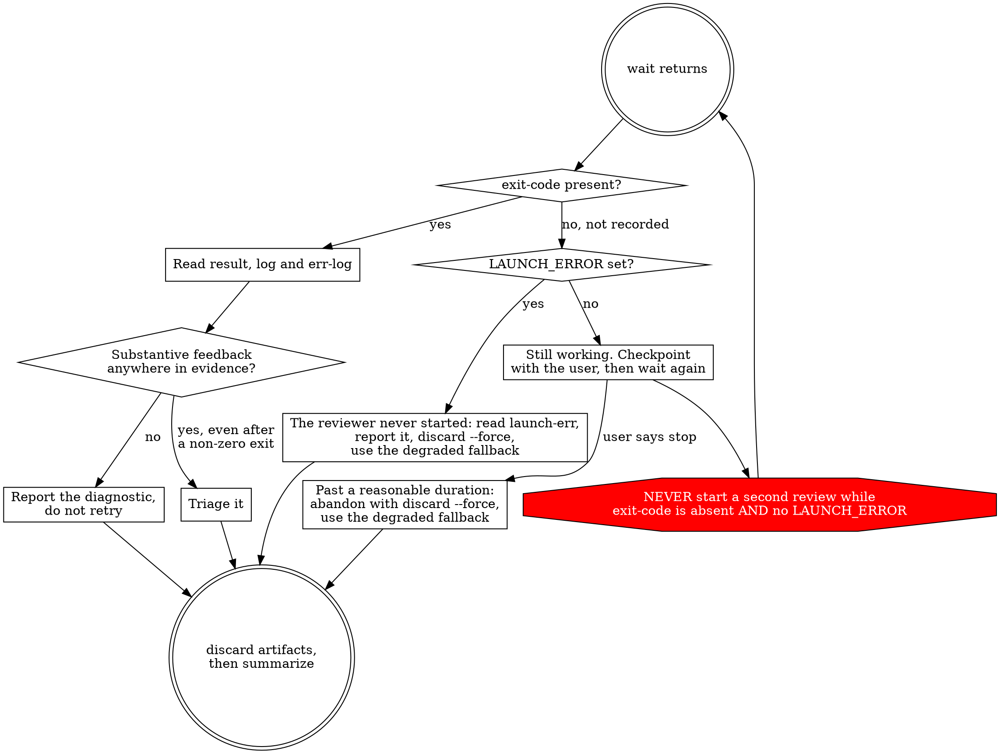

# Simplify External Review Implementation Plan

> **For agentic workers:** REQUIRED SUB-SKILL: Use superartes:subagent-driven-development (recommended) or superartes:executing-plans to implement this plan task-by-task. Steps use checkbox (`- [ ]`) syntax for tracking.

**Goal:** Give the Claude-Code-controller direction of external review a small background runner instead of the 1,266-line managed adapter it does not need, drop the never-executed native-Windows support for the Codex-controller direction, and tell users how to turn on the task-tracking tools that current Claude models withhold by default.

**Architecture:** Two directions, two mechanisms. A Claude Code controller invoking Codex needs only durability across tool calls, because Claude Code does not reap background descendants — so `invoke-codex.sh` / `invoke-codex.ps1` detach the reviewer and signal completion by publishing an `exit-code` sentinel file atomically. A Codex controller invoking Claude keeps the existing managed adapter (`invoke-reviewer.sh`), because Codex's command runner reaps every descendant when a one-shot elevated call ends; that adapter becomes POSIX-only.

**Tech Stack:** POSIX shell (bash), Windows PowerShell 5.1 / PowerShell 7, Python 3 (the plugin validator), Codex CLI 0.153.x, Markdown skills.

---

## Context

### Branch

This plan is written and executed on `external-for-codex`, **not** on trunk. That
departs from the `superartes:writing-plans` default and is deliberate: the handoff
brief directs all of this work to the existing branch, which already carries the
universal-external-review work this change simplifies.

### Why this change exists

`superartes:external-review` (documents) and `superartes:external-code-review` (code
changes) obtain a review from a different model family than the controller. Two
directions exist:

| Direction | Controller | Reviewer | Status before this change |
|---|---|---|---|
| **A** | Claude Code | Codex (`codex exec` / `codex exec review`) | Worked well originally with a 32-line wrapper; later routed through the managed adapter |
| **B** | Codex | Claude (`claude -p`) | Needs the managed adapter for a real reason |

Direction B has a genuine hard problem: on the tested host, Codex's command runner
terminates every descendant when a one-shot elevated call ends, including a supervisor
detached with `nohup setsid`. That is observed behaviour recorded in
`tests/external-review/README.md`.

**What that observation does and does not justify.** It rules out detaching — you cannot
out-detach a teardown scoped to the whole call. What survives it is keeping the enclosing
execution alive, which is why the reference prescribes a persistent shell. The managed
adapter's supervisor, process identities, registry lock and `indeterminate` state are
therefore **not** what makes Direction B survive; they provide duplicate prevention,
cancellation and cross-session recovery, which are separate requirements that may or may
not be worth their cost. An external Codex review of this plan (2026-09-09) demonstrated
that an approved *foreground* command persists across tool-call yields with none of that
machinery, which suggests Direction B could become dramatically simpler — and portable to
native Windows, since nothing platform-specific would remain.

**This plan deliberately does not act on that.** Direction B is out of scope here and is
being handed to a Codex session as follow-up work, because only Codex can verify its own
process hosting. The adapter and its 420 tests stay exactly as they are.

The mistake was making Direction A use it too. The result:

```
invoke-codex.sh        (what Direction A used)     32 lines
invoke-reviewer.sh     (POSIX managed adapter)  1,266 lines
invoke-reviewer.ps1    (Windows managed adapter)1,728 lines
tests/external-review  (both suites)            4,609 lines
                                                ───────────
                                                ~7,600 lines
```

54% of that total is PowerShell that has never been executed anywhere. Windows
PowerShell 5.1 is currently broken on the maintainer's laptop, so it cannot be
verified there either. Unverifiable code of that size is a liability.

### Why a sentinel file replaces the locking

The managed adapter's machinery exists to answer one question reliably: *is this
review still running?* Under Codex it cannot answer by process inspection (the
process is reaped) and cannot answer by inspecting `result` (Codex creates that file
empty and fills it at the end, so an empty file is ambiguous between "running" and
"failed"). Hence PID identity, a registry, and an `indeterminate` state.

Writing the exit status as the **last** action of the launched shell collapses all of
that: the file's existence is the completion signal, and it can only exist if the
child ran to completion. "Running" and "done" become one `test -f`.

The status must be **published atomically**. A plain `echo $? > exit-code` creates the
file before writing the digit, so a `status` call landing in that window sees the
sentinel exist but reads an empty string — reintroducing the exact ambiguity the
sentinel abolishes. Both runners therefore write `exit-code.tmp` and rename it into
place; `rename(2)` within one directory is atomic.

### Established facts — do not re-derive these

- **Claude Code does not reap descendants.** A supervisor launched by `start` showed
  `PPID 1`, its own process group, with `codex exec` alive beneath it, across separate
  Bash tool calls.
- **Real runtimes on this repository:** 285s (`codex-prompt`, 3 documents, whole-repo
  read access) and 254s (`codex-review --uncommitted`). Complex codebases exceed 600s,
  which is the Bash tool cap — a blocking wrapper gets killed, so the runner must
  detach.
- **`codex exec review --uncommitted`** covers staged, unstaged *and* untracked
  changes. It rejects a custom prompt combined with a scope flag.
- **`codex exec review` has no `-s`/`--sandbox` flag of its own** (verified against
  codex-cli 0.153.4) — but it is **not** read-only by design. The review task forces the
  approval policy to `Never` and inherits its filesystem policy from the parent command.
  `codex exec -s read-only review …` parses and is the enforcing form; both verified
  locally. The retained managed adapter omits it and is therefore also under-restricted:
  that is recorded for the Direction B follow-up rather than fixed here, to keep ownership
  of those files clean.
- **Codex writes its final message to stdout and its progress event stream to stderr.**
  Measured on the real review of this plan: 26,660 bytes on stdout against 433,898 on
  stderr. The stderr log is the large one.
- **`setsid` ships in util-linux and is absent on stock macOS.** Calling it
  unconditionally breaks every macOS run; the managed adapter already guards it at
  `invoke-reviewer.sh:671` with a `set -m` subshell fallback.
- **`pwsh` 7.6.5 is installed on the Linux development box**, so a PowerShell runner
  can be exercised there for syntax and logic. That is not a substitute for native
  Windows 5.1 verification, but it is far better than nothing.
- **`dot` (graphviz) is installed.** Verify a DOT block with
  `awk '/^```dot$/{d=1;next} /^```$/{d=0} d' FILE | dot -Tsvg -o /dev/null`.
- **The POSIX suite passes 420/420:** `bash tests/external-review/run-tests.sh` (~2 min).

### Traps

1. **`tests/codex-plugin/validate-codex-plugin.py` reads `invoke-reviewer.ps1` directly**
   (around lines 231-240) and splits it on `function Invoke-RunReviewer {`. Deleting the
   `.ps1` makes the validator raise, not fail gracefully. Task 4 updates it in the same
   commit that removes the file.
2. **That validator pins exact prose substrings inside `skills/external-code-review/SKILL.md`**:
   both reviewer-selection table rows, the phrase ``sibling `external-review` skill's
   absolute source directory``, and the sentence `Stop with "nothing to review" for empty
   or invalid scope.` **All four survive this change unmodified.** The row
   ``| Claude Code / Anthropic | `codex-review` |`` encodes *which model reviews what*,
   which does not change; `codex-review` is simply re-documented as the name of the review
   **mode**, which is what `invoke-codex.sh start review` runs. Do not rephrase any of the
   four.
3. **Do NOT delete the `codex-prompt` and `codex-review` profiles from `invoke-reviewer.sh`.**
   They look like dead code once Direction A stops using the adapter, but they are the
   Codex controller's degraded same-model fallback.
4. **Do not rewrite the two external-review SKILL.md files wholesale.** They were repaired
   in commits `899ae53` and `9908344` (stateless-controller steps, trunk detection, scope
   guards, completion diagram) and the maintainer made direct edits that must survive.
   Amend surgically, section by section.
5. **`.gitattributes` enforces LF** for all text files, including `.ps1`.
6. **`skills/using-superartes/SKILL.md` is injected into every conversation** by
   `hooks/session-start`. Task 5 edits it; that section must not grow. It is 151 words
   today and must stay at or below that.

---

## File Structure

**Created:**

| Path | Responsibility |
|------|----------------|
| `skills/external-review/invoke-codex.ps1` | Windows sibling of the runner; same subcommands, same run-directory layout |
| `tests/external-review/test-invoke-codex.sh` | Deterministic POSIX suite for the runner, using a fake `codex` on `PATH` |
| `tests/external-review/Test-InvokeCodex.ps1` | Deterministic PowerShell suite for the Windows runner |

**Replaced in place (same path, new content):**

| Path | Responsibility |
|------|----------------|
| `skills/external-review/invoke-codex.sh` | Was a 32-line blocking wrapper, now the background runner. Nothing references it today, so this is not a behaviour change for any caller. |

**Modified:**

| Path | Change |
|------|--------|
| `skills/external-review/SKILL.md` | Invocation routes by controller; completion diagram loses `indeterminate`; same-model fallback pointer restored |
| `skills/external-code-review/SKILL.md` | Invocation routes by controller; four pinned strings untouched |
| `skills/external-review/invoking-reviewers.md` | Scoped to the Codex controller and to POSIX; PowerShell forms removed |
| `skills/using-superartes/SKILL.md` | Platform Adaptation fallback chain reranked by visibility, gains the opt-in rung |
| `skills/using-superartes/references/codex-tools.md` | Name-collision note; subagent-dispatch row renamed |
| `tests/codex-plugin/validate-codex-plugin.py` | Drops the `.ps1` read; asserts the two new runners pass no `--model`/`-m` |
| `tests/external-review/README.md` | Windows sections rewritten honestly |
| `README.md` | Recommended-configuration subsection; Optional Dependencies platform support |
| `CHANGELOG.md` | 1.5.0 entry |
| `docs/specs/2026-08-19-universal-external-review-design.md` | Superseded note |
| `package.json`, `.claude-plugin/plugin.json`, `.claude-plugin/marketplace.json`, `.cursor-plugin/plugin.json`, `.codex-plugin/plugin.json`, `CLAUDE.md` | 1.4.5 → 1.5.0 |

**Deleted:**

| Path | Lines | Reason |
|------|-------|--------|
| `skills/external-review/invoke-reviewer.ps1` | 1,728 | Never executed; Windows unsupported for Direction B |
| `tests/external-review/Run-Tests.ps1` | 1,671 | Tests only the above |
| `tests/external-review/Test-Lib.ps1` | 725 | Helper for the above |
| `tests/external-review/test-powershell-version-gate.sh` | 45 | Tests only the deleted `.ps1` and `Run-Tests.ps1` |

**Kept unchanged, deliberately:** `skills/external-review/invoke-reviewer.sh` (1,266
lines) and `tests/external-review/{run-tests.sh,test-lib.sh}` (2,168 lines, 420 tests).
Direction B needs them.

### Task ordering

Deletion comes **fourth**, not first. Removing `invoke-reviewer.ps1` before
`invoke-codex.ps1` exists would leave native Windows with no runner at all in the
intermediate state. Building both runners first, wiring them third, and deleting
fourth means every task ends with a working repository on every platform.

---

## Task 1: POSIX background runner

**Files:**
- Create: `tests/external-review/test-invoke-codex.sh`
- Replace: `skills/external-review/invoke-codex.sh` (currently a 32-line blocking wrapper)

Nothing **on this branch** references `invoke-codex.sh` — the managed rewrite orphaned
it. It is not dead in the wild, though: the released 1.4.5 plugin's `external-review`
skill still calls it directly, in its original blocking form
(`invoke-codex.sh "<prompt>" -s read-only --skip-git-repo-check -o "<output>"`). Since a
plugin update ships `SKILL.md` and the runner together, no installed version ever sees a
new script under old instructions. The new interface is subcommand-driven regardless, so
a stale old-style call (`invoke-codex.sh /tmp/prompt.md`) fails loudly with exit 64
instead of doing something unexpected — which is the reason for keeping the name rather
than the reason against it.

- [ ] **Step 1: Write the failing test suite**

Create `tests/external-review/test-invoke-codex.sh`:

```bash
#!/usr/bin/env bash
# test-invoke-codex.sh — deterministic tests for the background Codex runner.
#
# Uses a fake `codex` on PATH, so this suite needs no credentials, no network and
# no model tokens. Each test gets its own sandbox, with TMPDIR pointed inside it
# so the runner's runs root is isolated per test.

set -u

ROOT_DIR=$(cd "$(dirname "$0")/../.." && pwd)
RUNNER="$ROOT_DIR/skills/external-review/invoke-codex.sh"

# Fail loudly if the runner is missing, instead of letting the harness supply
# the exit codes the assertions expect. `bash <missing-script>` exits 127, which
# is exactly what the missing-codex test expects — so without this guard a
# suite pointed at nothing reports assertions as PASSED for the wrong reason.
if [ ! -f "$RUNNER" ]; then
    printf 'FATAL: runner not found: %s\n' "$RUNNER" >&2
    exit 1
fi

passed=0
failed=0

pass() { passed=$((passed + 1)); printf 'PASS: %s\n' "$1"; }
fail() { failed=$((failed + 1)); printf 'FAIL: %s\n      %s\n' "$1" "${2:-}" >&2; }

assert_status() { if [ "$2" = "$3" ]; then pass "$1"; else fail "$1" "expected exit $2, got $3"; fi; }
assert_equals() { if [ "$2" = "$3" ]; then pass "$1"; else fail "$1" "expected '$2', got '$3'"; fi; }
assert_contains() {
    case "$3" in *"$2"*) pass "$1" ;; *) fail "$1" "expected '$2' in: $3" ;; esac
}

new_sandbox() {
    local sandbox
    sandbox=$(mktemp -d "${TMPDIR:-/tmp}/invoke-codex-test.XXXXXX") || exit 1
    mkdir -p "$sandbox/bin" "$sandbox/tmp" "$sandbox/work"
    cat > "$sandbox/bin/codex" <<'FAKE'
#!/usr/bin/env bash
# Fake codex. Records argv one per line and its stdin verbatim, optionally
# sleeps, emulates -o, and exits as told.
printf '%s\n' "$@" > "$FAKE_CODEX_ARGV"
cat > "$FAKE_CODEX_STDIN"
printf 'fake codex final message\n'
printf 'fake codex event stream\n' >&2
if [ -n "${FAKE_CODEX_SLEEP:-}" ]; then sleep "$FAKE_CODEX_SLEEP"; fi
out=""; prev=""
for arg in "$@"; do
    if [ "$prev" = "-o" ]; then out="$arg"; fi
    prev="$arg"
done
if [ -n "$out" ]; then printf '%s' "${FAKE_CODEX_RESULT:-fake review body}" > "$out"; fi
exit "${FAKE_CODEX_EXIT:-0}"
FAKE
    chmod +x "$sandbox/bin/codex"
    printf '%s' "$sandbox"
}

run_in() {
    local sandbox="$1"; shift
    PATH="$sandbox/bin:$PATH" TMPDIR="$sandbox/tmp" \
    FAKE_CODEX_ARGV="$sandbox/argv" FAKE_CODEX_STDIN="$sandbox/stdin" \
    FAKE_CODEX_SLEEP="${FAKE_CODEX_SLEEP:-}" FAKE_CODEX_EXIT="${FAKE_CODEX_EXIT:-0}" \
    FAKE_CODEX_RESULT="${FAKE_CODEX_RESULT:-fake review body}" \
    SUPERARTES_CODEX_POLL_INTERVAL="${SUPERARTES_CODEX_POLL_INTERVAL:-1}" \
    SUPERARTES_CODEX_NO_SETSID="${SUPERARTES_CODEX_NO_SETSID:-0}" \
        "$RUNNER" "$@"
}

run_dir_or_fail() {
    # run_dir_or_fail <label> <start-output>
    #
    # Reads the RUN_DIR= line from start's output into the global RUN_DIR and
    # proves it names a real directory. Every test must go through this rather
    # than parsing the line itself: if the runner cannot be resolved or dies
    # early, RUN_DIR comes back EMPTY, and assertions of the form
    # `[ -d "$run_dir" ] || pass` then succeed vacuously — a broken suite that
    # reports itself green. Callers pair it with `|| return` so the rest of the
    # test is skipped rather than run against nothing.
    #
    # It counts the check itself, in THIS shell. A helper invoked inside $( )
    # would increment the counters in a subshell, where the increment dies with
    # the subshell and a genuine failure would still print "0 failed".
    local label="$1" out="$2"
    RUN_DIR=$(printf '%s' "$out" | sed -n 's/^RUN_DIR=//p')
    if [ -z "$RUN_DIR" ]; then
        fail "$label yields a usable run directory" "no RUN_DIR= line in: $out"
        return 1
    fi
    if [ ! -d "$RUN_DIR" ]; then
        fail "$label yields a usable run directory" "RUN_DIR is not a directory: $RUN_DIR"
        return 1
    fi
    pass "$label yields a usable run directory"
}

await_done() {
    # await_done <run-dir> [tries] — poll for the completion sentinel, 0.1s apart.
    # The default ceiling is generous on purpose: the longest fake reviewer in
    # this suite sleeps 10 seconds, and a loaded machine must not turn that into
    # a spurious failure. Pass a small ceiling when proving a run never finishes.
    local run_dir="$1" limit="${2:-300}" tries=0
    while [ "$tries" -lt "$limit" ]; do
        [ -f "$run_dir/exit-code" ] && return 0
        sleep 0.1; tries=$((tries + 1))
    done
    return 1
}

# --------------------------------------------------------------------------
# Preflight and usage
# --------------------------------------------------------------------------

test_missing_codex() {
    # The PATH here is a directory of the test's own making, so `codex` cannot be
    # on it however the machine is set up. Deriving it from where coreutils live
    # instead would silently SKIP on any machine that installs codex alongside
    # them — which is common enough that exit 127 would never be tested at all.
    #
    # The directory holds one symlink, to bash: the shebang's `/usr/bin/env bash`
    # resolves bash through PATH, so a truly empty PATH would fail before the
    # runner ran. Everything the runner touches before the codex check is a
    # shell builtin, so nothing else is needed.
    local sandbox out st
    sandbox=$(new_sandbox)
    mkdir -p "$sandbox/nocodex"
    ln -s "$(command -v bash)" "$sandbox/nocodex/bash"

    out=$(PATH="$sandbox/nocodex" TMPDIR="$sandbox/tmp" \
        "$RUNNER" start review "$sandbox/work" uncommitted 2>&1)
    st=$?
    assert_status "missing codex exits 127" 127 "$st"
    assert_contains "missing codex explains itself" "not on PATH" "$out"
    rm -rf "$sandbox"
}

test_usage_errors() {
    local sandbox st
    sandbox=$(new_sandbox)
    run_in "$sandbox" >/dev/null 2>&1; st=$?
    assert_status "no subcommand exits 64" 64 "$st"
    printf 'old style\n' > "$sandbox/p.md"
    run_in "$sandbox" "$sandbox/p.md" >/dev/null 2>&1; st=$?
    assert_status "legacy single-argument call exits 64" 64 "$st"
    run_in "$sandbox" start review "$sandbox/nope" uncommitted >/dev/null 2>&1; st=$?
    assert_status "absent work directory exits 64" 64 "$st"
    run_in "$sandbox" start prompt "$sandbox/work" "$sandbox/nope.md" >/dev/null 2>&1; st=$?
    assert_status "absent prompt file exits 64" 64 "$st"
    rm -rf "$sandbox"
}

# --------------------------------------------------------------------------
# Document review
# --------------------------------------------------------------------------

test_prompt_lifecycle() {
    local sandbox out run_dir st argv expected
    sandbox=$(new_sandbox)
    printf 'review this document\n' > "$sandbox/prompt.md"

    out=$(run_in "$sandbox" start prompt "$sandbox/work" "$sandbox/prompt.md")
    assert_contains "start prompt prints RUN_DIR" "RUN_DIR=" "$out"
    run_dir_or_fail "start prompt" "$out" || { rm -rf "$sandbox"; return; }
    run_dir="$RUN_DIR"
    assert_equals "prompt is copied into the run directory" \
        "review this document" "$(cat "$run_dir/prompt")"

    await_done "$run_dir" || fail "prompt run finishes" "sentinel never appeared"

    # The prompt must actually reach codex on stdin, not merely sit in a file.
    assert_equals "the prompt is fed to codex on stdin" \
        "review this document" "$(cat "$sandbox/stdin")"

    run_in "$sandbox" status "$run_dir" > "$sandbox/status.txt"; st=$?
    assert_status "status of a finished run exits 0" 0 "$st"
    assert_contains "status reports done" "STATE=done" "$(cat "$sandbox/status.txt")"
    assert_contains "status reports exit code" "EXIT_CODE=0" "$(cat "$sandbox/status.txt")"

    assert_equals "result holds the review body" "fake review body" "$(cat "$run_dir/result")"
    # Codex writes its final message to stdout and its event stream to stderr.
    assert_contains "stdout captures the final message" \
        "fake codex final message" "$(cat "$run_dir/log")"
    assert_contains "stderr captures the event stream" \
        "fake codex event stream" "$(cat "$run_dir/err-log")"

    # Exact argument vector, one per line. A substring test would still pass with
    # `-s` and `read-only` separated, or with the sandbox flag landing after the
    # `-` that makes codex read the prompt from stdin — the precise defect class
    # an earlier review caught in review mode.
    argv=$(cat "$sandbox/argv")
    expected="exec
-
-s
read-only
--skip-git-repo-check
-o
$run_dir/result"
    assert_equals "prompt mode builds the exact argument vector" "$expected" "$argv"
    rm -rf "$sandbox"
}

test_exit_code_is_a_bare_integer() {
    local sandbox out run_dir contents
    sandbox=$(new_sandbox); printf 'x\n' > "$sandbox/p.md"
    out=$(run_in "$sandbox" start prompt "$sandbox/work" "$sandbox/p.md")
    run_dir_or_fail "start prompt" "$out" || { rm -rf "$sandbox"; return; }
    run_dir="$RUN_DIR"
    await_done "$run_dir" || fail "run finishes" "no sentinel"
    contents=$(cat "$run_dir/exit-code")
    case "$contents" in
        ''|*[!0-9]*) fail "exit-code holds a bare integer" "got '$contents'" ;;
        *) pass "exit-code holds a bare integer" ;;
    esac
    rm -rf "$sandbox"
}

test_nonzero_exit_is_recorded() {
    local sandbox out run_dir
    sandbox=$(new_sandbox); printf 'x\n' > "$sandbox/p.md"
    out=$(FAKE_CODEX_EXIT=7 run_in "$sandbox" start prompt "$sandbox/work" "$sandbox/p.md")
    run_dir_or_fail "start prompt" "$out" || { rm -rf "$sandbox"; return; }
    run_dir="$RUN_DIR"
    await_done "$run_dir" || fail "run finishes" "no sentinel"
    assert_equals "non-zero reviewer exit is recorded" "7" "$(cat "$run_dir/exit-code")"
    rm -rf "$sandbox"
}

# --------------------------------------------------------------------------
# Code review
# --------------------------------------------------------------------------

test_review_scopes() {
    local sandbox out run_dir argv expected
    for scope in uncommitted base commit; do
        sandbox=$(new_sandbox)
        case "$scope" in
            uncommitted) out=$(run_in "$sandbox" start review "$sandbox/work" uncommitted) ;;
            base)        out=$(run_in "$sandbox" start review "$sandbox/work" base master) ;;
            commit)      out=$(run_in "$sandbox" start review "$sandbox/work" commit deadbeef) ;;
        esac
        run_dir_or_fail "start review $scope" "$out" || { rm -rf "$sandbox"; continue; }
        run_dir="$RUN_DIR"
        await_done "$run_dir" || fail "$scope run finishes" "no sentinel"
        argv=$(cat "$sandbox/argv")

        # Exact argument vector, one per line — not a substring match, so a flag
        # landing in the wrong position cannot pass.
        case "$scope" in
            uncommitted) expected="exec
-s
read-only
review
--uncommitted
--skip-git-repo-check
-o
$run_dir/result" ;;
            base) expected="exec
-s
read-only
review
--base
master
--skip-git-repo-check
-o
$run_dir/result" ;;
            commit) expected="exec
-s
read-only
review
--commit
deadbeef
--skip-git-repo-check
-o
$run_dir/result" ;;
        esac
        assert_equals "$scope builds the exact argument vector" "$expected" "$argv"
        rm -rf "$sandbox"
    done
}

test_review_scope_validation() {
    local sandbox st
    sandbox=$(new_sandbox)
    run_in "$sandbox" start review "$sandbox/work" uncommitted extra >/dev/null 2>&1; st=$?
    assert_status "uncommitted rejects a scope value" 64 "$st"
    run_in "$sandbox" start review "$sandbox/work" base >/dev/null 2>&1; st=$?
    assert_status "base requires a scope value" 64 "$st"
    run_in "$sandbox" start review "$sandbox/work" commit >/dev/null 2>&1; st=$?
    assert_status "commit requires a scope value" 64 "$st"
    run_in "$sandbox" start review "$sandbox/work" nonsense >/dev/null 2>&1; st=$?
    assert_status "unknown scope kind exits 64" 64 "$st"
    rm -rf "$sandbox"
}

# --------------------------------------------------------------------------
# Portability
# --------------------------------------------------------------------------

test_runs_without_setsid() {
    # Stock macOS has no setsid; the runner must fall back rather than fail, and
    # must not report a launch error when it does.
    local sandbox out run_dir
    sandbox=$(new_sandbox)
    out=$(SUPERARTES_CODEX_NO_SETSID=1 run_in "$sandbox" start review "$sandbox/work" uncommitted)
    run_dir_or_fail "start review without setsid" "$out" || { rm -rf "$sandbox"; return; }
    run_dir="$RUN_DIR"
    if await_done "$run_dir"; then pass "the run completes without setsid"; else
        fail "the run completes without setsid" "sentinel never appeared"; fi
    assert_equals "no launcher error without setsid" "" "$(cat "$run_dir/launch-err" 2>/dev/null)"
    rm -rf "$sandbox"
}

test_launch_error_is_surfaced() {
    # A launch failure must not look like a running reviewer.
    #
    # The launcher's stderr is redirected to launch-err instead of /dev/null for
    # exactly one reason: a reviewer that never starts would otherwise be
    # indistinguishable from one still working, and the controller would wait
    # forever. So the launch is made to FAIL FOR REAL — a setsid shim on the
    # sandbox PATH that refuses — rather than hand-writing launch-err, which
    # would test only how status formats a file the test itself created.
    local sandbox out run_dir status_out
    sandbox=$(new_sandbox)
    cat > "$sandbox/bin/setsid" <<'SHIM'
#!/usr/bin/env bash
printf 'setsid: shim refusing to launch\n' >&2
exit 1
SHIM
    chmod +x "$sandbox/bin/setsid"

    out=$(SUPERARTES_CODEX_NO_SETSID=0 run_in "$sandbox" start review "$sandbox/work" uncommitted)
    run_dir_or_fail "start with a failing setsid" "$out" || { rm -rf "$sandbox"; return; }
    run_dir="$RUN_DIR"

    # A short ceiling: the shim fails immediately, so the sentinel is not merely
    # late — it must never arrive at all.
    if await_done "$run_dir" 30; then
        fail "a failed launch never records completion" "exit-code appeared anyway"
    else
        pass "a failed launch never records completion"
    fi
    if [ -s "$run_dir/launch-err" ]; then
        pass "the launcher's own stderr reaches launch-err"
    else
        fail "the launcher's own stderr reaches launch-err" "launch-err is empty"
    fi

    status_out=$(run_in "$sandbox" status "$run_dir" 2>&1)
    assert_contains "status surfaces a launcher error" "LAUNCH_ERROR=" "$status_out"
    assert_contains "an unfinished run is not called running" "STATE=not-recorded" "$status_out"
    rm -rf "$sandbox"
}

# --------------------------------------------------------------------------
# status / wait / discard
# --------------------------------------------------------------------------

test_status_and_wait() {
    # The fake reviewer sleeps 10 seconds so that "still unfinished" is a
    # comfortable claim on a loaded machine: the status check below and the
    # 2-second wait both have seconds of headroom before it could finish early.
    local sandbox out run_dir st
    sandbox=$(new_sandbox)
    out=$(FAKE_CODEX_SLEEP=10 run_in "$sandbox" start review "$sandbox/work" uncommitted)
    run_dir_or_fail "start review" "$out" || { rm -rf "$sandbox"; return; }
    run_dir="$RUN_DIR"

    run_in "$sandbox" status "$run_dir" > "$sandbox/s.txt" 2>&1; st=$?
    assert_status "status of an unfinished run exits 3" 3 "$st"
    assert_contains "status names the state honestly" "STATE=not-recorded" "$(cat "$sandbox/s.txt")"

    run_in "$sandbox" wait "$run_dir" 2 > "$sandbox/w.txt" 2>&1; st=$?
    assert_status "wait exits 3 when it times out" 3 "$st"

    run_in "$sandbox" wait "$run_dir" 60 > "$sandbox/w.txt" 2>&1; st=$?
    assert_status "wait exits 0 once the run finishes" 0 "$st"
    assert_contains "wait reports done" "STATE=done" "$(cat "$sandbox/w.txt")"

    run_in "$sandbox" wait "$run_dir" soon >/dev/null 2>&1; st=$?
    assert_status "wait rejects a non-numeric timeout" 64 "$st"

    run_in "$sandbox" status "$sandbox/not-a-run" >/dev/null 2>&1; st=$?
    assert_status "status of a missing run directory exits 65" 65 "$st"
    rm -rf "$sandbox"
}

test_discard() {
    local sandbox out run_dir st
    sandbox=$(new_sandbox)
    out=$(FAKE_CODEX_SLEEP=10 run_in "$sandbox" start review "$sandbox/work" uncommitted)
    run_dir_or_fail "start review" "$out" || { rm -rf "$sandbox"; return; }
    run_dir="$RUN_DIR"

    run_in "$sandbox" discard "$run_dir" >/dev/null 2>&1; st=$?
    assert_status "discard of an unfinished run exits 66" 66 "$st"
    if [ -d "$run_dir" ]; then pass "a refused discard leaves the run intact"; else
        fail "a refused discard leaves the run intact" "directory was removed"; fi

    run_in "$sandbox" discard "$run_dir" --force > "$sandbox/d.txt" 2>&1; st=$?
    assert_status "forced discard exits 0" 0 "$st"
    assert_contains "discard reports its state" "STATE=discarded" "$(cat "$sandbox/d.txt")"
    if [ -d "$run_dir" ]; then fail "forced discard removes the run" "directory survived"; else
        pass "forced discard removes the run"; fi
    # Nothing to await: the run directory has just been removed, and the reviewer
    # this test discarded is still sleeping. Waiting on the sandbox path (which
    # never holds a sentinel) only burned the full polling ceiling.
    rm -rf "$sandbox"
}

test_discard_after_completion() {
    local sandbox out run_dir st
    sandbox=$(new_sandbox)
    out=$(run_in "$sandbox" start review "$sandbox/work" uncommitted)
    run_dir_or_fail "start review" "$out" || { rm -rf "$sandbox"; return; }
    run_dir="$RUN_DIR"
    await_done "$run_dir" || fail "run finishes" "no sentinel"
    run_in "$sandbox" discard "$run_dir" >/dev/null 2>&1; st=$?
    assert_status "discard of a finished run exits 0" 0 "$st"
    if [ -d "$run_dir" ]; then fail "discard removes the run directory" "directory survived"; else
        pass "discard removes the run directory"; fi
    rm -rf "$sandbox"
}

test_discard_rejects_traversal() {
    # ".../run.x/../../victim" matches a naive "$RUNS_ROOT"/run.* glob. Canonical
    # comparison must reject it before rm -rf sees it.
    local sandbox out run_dir victim traversal st
    sandbox=$(new_sandbox)
    out=$(run_in "$sandbox" start review "$sandbox/work" uncommitted)
    run_dir_or_fail "start review" "$out" || { rm -rf "$sandbox"; return; }
    run_dir="$RUN_DIR"
    await_done "$run_dir" || fail "run finishes" "no sentinel"

    victim="$sandbox/tmp/victim"
    mkdir -p "$victim"
    date +%s > "$victim/started-at"; printf 'review\n' > "$victim/mode"
    printf '0\n' > "$victim/exit-code"
    traversal="$run_dir/../../victim"

    run_in "$sandbox" discard "$traversal" >/dev/null 2>&1; st=$?
    assert_status "discard rejects a traversal path" 65 "$st"
    if [ -d "$victim" ]; then pass "the traversal target survives"; else
        fail "the traversal target survives" "victim was removed"; fi

    run_in "$sandbox" discard "$victim" >/dev/null 2>&1; st=$?
    assert_status "discard rejects a directory outside the runs root" 65 "$st"
    rm -rf "$sandbox"
}

test_malformed_run_directory() {
    # A directory that exists but carries neither marker file was not produced by
    # this runner. It is the case that stands between `discard` and an rm -rf of
    # something the caller merely mistyped, so both commands must refuse it.
    local sandbox bare st
    sandbox=$(new_sandbox)
    bare="$sandbox/tmp/superartes-codex-runs/run.bare"
    mkdir -p "$bare"

    run_in "$sandbox" status "$bare" >/dev/null 2>&1; st=$?
    assert_status "status of a malformed run directory exits 65" 65 "$st"

    run_in "$sandbox" discard "$bare" >/dev/null 2>&1; st=$?
    assert_status "discard of a malformed run directory exits 65" 65 "$st"
    if [ -d "$bare" ]; then pass "a malformed run directory survives discard"; else
        fail "a malformed run directory survives discard" "it was removed"; fi
    rm -rf "$sandbox"
}

test_discard_rejects_a_foreign_child_of_the_runs_root() {
    # Well-formed enough to pass require_run_dir, and sitting directly inside the
    # runs root, but not named run.* — so this runner did not create it and must
    # not remove it. Only the name check stands between the two cases.
    local sandbox intruder st
    sandbox=$(new_sandbox)
    intruder="$sandbox/tmp/superartes-codex-runs/somebody-elses-data"
    mkdir -p "$intruder"
    date +%s > "$intruder/started-at"; printf 'review\n' > "$intruder/mode"
    printf '0\n' > "$intruder/exit-code"

    run_in "$sandbox" discard "$intruder" >/dev/null 2>&1; st=$?
    assert_status "discard rejects a runs-root child it did not create" 65 "$st"
    if [ -d "$intruder" ]; then pass "the foreign directory survives"; else
        fail "the foreign directory survives" "it was removed"; fi
    rm -rf "$sandbox"
}

test_discard_across_tmpdirs() {
    # Each subcommand is a separate process for an agent, and TMPDIR need not
    # match between the call that starts a run and the call that discards it.
    # Validating against a runs root recomputed from $TMPDIR would make a run
    # started under one TMPDIR permanently undiscardable under another, so the
    # check is on the run directory's shape instead. This is the regression test.
    local sandbox out run_dir st
    sandbox=$(new_sandbox)
    mkdir -p "$sandbox/other-tmp"
    out=$(run_in "$sandbox" start review "$sandbox/work" uncommitted)
    run_dir_or_fail "start review" "$out" || { rm -rf "$sandbox"; return; }
    run_dir="$RUN_DIR"
    await_done "$run_dir" || fail "run finishes" "no sentinel"

    PATH="$sandbox/bin:$PATH" TMPDIR="$sandbox/other-tmp" \
        "$RUNNER" discard "$run_dir" >/dev/null 2>&1; st=$?
    assert_status "discard works under a different TMPDIR" 0 "$st"
    if [ -d "$run_dir" ]; then fail "the cross-TMPDIR discard removes the run" "directory survived"; else
        pass "the cross-TMPDIR discard removes the run"; fi
    rm -rf "$sandbox"
}

test_force_flag_position() {
    # `discard --force <run-dir>` and `discard <run-dir> --force` must both work:
    # an agent composing the command from a template should not have to remember
    # which side the flag goes on, and the wrong order used to be reported as
    # "not a run directory: --force".
    local sandbox out run_dir st
    sandbox=$(new_sandbox)
    out=$(FAKE_CODEX_SLEEP=10 run_in "$sandbox" start review "$sandbox/work" uncommitted)
    run_dir_or_fail "start review" "$out" || { rm -rf "$sandbox"; return; }
    run_dir="$RUN_DIR"

    run_in "$sandbox" discard --force "$run_dir" > "$sandbox/d.txt" 2>&1; st=$?
    assert_status "--force before the run directory exits 0" 0 "$st"
    assert_contains "--force before the run directory discards" \
        "STATE=discarded" "$(cat "$sandbox/d.txt")"
    rm -rf "$sandbox"
}

test_help() {
    # The sibling invoke-reviewer.sh treats --help as a success path, and a
    # controller written against one runner should not trip over the other.
    local sandbox out st
    sandbox=$(new_sandbox)
    out=$(run_in "$sandbox" --help 2>/dev/null); st=$?
    assert_status "--help exits 0" 0 "$st"
    assert_contains "--help prints usage to stdout" "invoke-codex.sh start prompt" "$out"
    out=$(run_in "$sandbox" -h 2>/dev/null); st=$?
    assert_status "-h exits 0" 0 "$st"
    rm -rf "$sandbox"
}

test_poll_interval_validation() {
    # SUPERARTES_CODEX_POLL_INTERVAL is an environment knob that feeds both a loop
    # guard and shell arithmetic. Zero spins forever; a non-numeric value is read
    # as a variable name and aborts with "unbound variable" and exit 1, outside
    # this runner's documented exit codes. Both must be usage errors instead.
    local sandbox out run_dir st
    sandbox=$(new_sandbox)
    out=$(run_in "$sandbox" start review "$sandbox/work" uncommitted)
    run_dir_or_fail "start review" "$out" || { rm -rf "$sandbox"; return; }
    run_dir="$RUN_DIR"
    await_done "$run_dir" || fail "run finishes" "no sentinel"

    SUPERARTES_CODEX_POLL_INTERVAL=0 run_in "$sandbox" wait "$run_dir" 4 >/dev/null 2>&1; st=$?
    assert_status "a zero poll interval exits 64" 64 "$st"
    SUPERARTES_CODEX_POLL_INTERVAL=soon run_in "$sandbox" wait "$run_dir" 4 >/dev/null 2>&1; st=$?
    assert_status "a non-numeric poll interval exits 64" 64 "$st"
    rm -rf "$sandbox"
}

# --------------------------------------------------------------------------

test_missing_codex
test_usage_errors
test_prompt_lifecycle
test_exit_code_is_a_bare_integer
test_nonzero_exit_is_recorded
test_review_scopes
test_review_scope_validation
test_runs_without_setsid
test_launch_error_is_surfaced
test_status_and_wait
test_discard
test_discard_after_completion
test_discard_rejects_traversal
test_malformed_run_directory
test_discard_rejects_a_foreign_child_of_the_runs_root
test_discard_across_tmpdirs
test_force_flag_position
test_help
test_poll_interval_validation

printf '\n%s passed, %s failed\n' "$passed" "$failed"
[ "$failed" -eq 0 ]
```

Make it executable and register it with git:

```bash
chmod +x tests/external-review/test-invoke-codex.sh
git add tests/external-review/test-invoke-codex.sh
```

- [ ] **Step 2: Run the suite to verify it fails**

Run: `bash tests/external-review/test-invoke-codex.sh`

Expected: many `FAIL` lines and a non-zero exit. The current `invoke-codex.sh` takes a
prompt file as its first argument, so `start` is treated as a prompt path and the script
exits 1 with `Error: prompt file not found: start`.

- [ ] **Step 3: Replace the runner**

Replace the entire contents of `skills/external-review/invoke-codex.sh` with:

```bash
#!/usr/bin/env bash
#
# invoke-codex.sh — run a Codex review in the background for a Claude Code controller.
#
# Claude Code does not kill background descendants when a Bash tool call ends, so a
# review that outlives the tool's 600-second cap only needs to be detached. It needs
# no supervisor, no PID identity checks and no lock registry.
#
# Completion is signalled by the `exit-code` file appearing in the run directory.
# That file is written last and published atomically with mv(1), so its presence
# always means "finished" and its contents are never half-written. Its ABSENCE is
# weaker evidence: it means completion was not recorded, which covers a running
# reviewer, a failed launch, and a killed wrapper alike. Inspect `launch-err`.
#
# Commands:
#   invoke-codex.sh start prompt <work-dir> <prompt-file>
#   invoke-codex.sh start review <work-dir> uncommitted
#   invoke-codex.sh start review <work-dir> base   <base-ref>
#   invoke-codex.sh start review <work-dir> commit <commit-sha>
#   invoke-codex.sh status  <run-dir>
#   invoke-codex.sh wait    <run-dir> <timeout-seconds>
#   invoke-codex.sh discard <run-dir> [--force]
#   invoke-codex.sh --help
#
# Exit codes (a subset of the managed adapter's, so the two never contradict):
#   0    operation succeeded; for status/wait, completion has been recorded
#   3    completion not yet recorded (status/wait only) — a lifecycle fact, not a failure
#   64   usage error
#   65   the run's storage is unusable — it could not be created, written to,
#        validated as a run directory this runner made, or removed
#   66   discard refused because completion is not recorded (--force overrides)
#   127  the `codex` executable is not on PATH

set -u

# All runs live under one predictable parent so a lost run directory can be found
# again by matching recorded metadata, without a registry. The directory NAME is
# the constant; `discard` validates against that name rather than against the
# path below, because TMPDIR can differ between the tool call that starts a run
# and the one that discards it, and a run must stay discardable when it does.
RUNS_DIR_NAME="superartes-codex-runs"
RUNS_ROOT="${TMPDIR:-/tmp}/$RUNS_DIR_NAME"

# Seconds between sentinel checks in `wait`. Overridable for the test suite only,
# and validated in cmd_wait, which is its only consumer.
POLL_INTERVAL="${SUPERARTES_CODEX_POLL_INTERVAL:-2}"

die() {
    printf '%s\n' "$2" >&2
    exit "$1"
}

usage() {
    # Printed to STDOUT, so `--help` is a success path — the sibling
    # invoke-reviewer.sh behaves the same way, and a controller written against
    # one runner should not trip over the other. usage_error is the failure form.
    cat <<'USAGE'
Usage:
  invoke-codex.sh start prompt <work-dir> <prompt-file>
  invoke-codex.sh start review <work-dir> uncommitted
  invoke-codex.sh start review <work-dir> base   <base-ref>
  invoke-codex.sh start review <work-dir> commit <commit-sha>
  invoke-codex.sh status  <run-dir>
  invoke-codex.sh wait    <run-dir> <timeout-seconds>
  invoke-codex.sh discard <run-dir> [--force]
  invoke-codex.sh --help
USAGE
}

usage_error() {
    usage >&2
    exit 64
}

require_run_dir() {
    # Reject anything that is not a run directory this script created. Both marker
    # files are required: a bare directory with one of them is not enough to earn
    # the rm -rf that `discard` performs.
    [ -n "${1:-}" ] || usage_error
    [ -d "$1" ] || die 65 "not a run directory: $1"
    [ -f "$1/started-at" ] && [ -f "$1/mode" ] || \
        die 65 "run directory is malformed (missing started-at or mode): $1"
}

launch() {
    # launch <run-dir> <work-dir> <stdin-file> <command> [args...]
    #
    # Detach the reviewer so it survives the end of this shell-tool call.
    #
    # `setsid` puts the job in a new session and process group. It ships in
    # util-linux and is therefore ABSENT on stock macOS, so it must be guarded:
    # calling it unconditionally makes every macOS run fail. The fallback runs the
    # job inside a subshell with `set -o monitor` (job control), which gives it
    # its own process group -- the portable approximation the managed adapter
    # already uses. The long spelling is deliberate: the short spelling of this
    # same builtin collides token-for-token with codex's short model flag, and
    # the plugin validator scans these runners for that flag with no exception
    # carved out. Keep the long form here.
    #
    # The launcher's own stderr goes to `launch-err`, not /dev/null. Swallowing it
    # turns "the reviewer never started" into a silent, permanent wait. A FILE is
    # safe here where a pipe would not be: the caller never blocks on it.
    local run_dir="$1" work_dir="$2" stdin_file="$3"
    shift 3

    # The inner shell runs codex, then publishes the exit status atomically.
    # Writing straight to exit-code would create the file before the digit landed
    # in it, and a status call in that window would read an empty sentinel.
    local inner='
        run_dir="$1"; work_dir="$2"; stdin_file="$3"; shift 3
        if cd "$work_dir"; then
            "$@" < "$stdin_file" > "$run_dir/log" 2> "$run_dir/err-log"
            status=$?
        else
            status=127
            printf "cannot enter work directory: %s\n" "$work_dir" > "$run_dir/err-log"
        fi
        printf "%s\n" "$status" > "$run_dir/exit-code.tmp"
        mv "$run_dir/exit-code.tmp" "$run_dir/exit-code"
    '

    # SUPERARTES_CODEX_NO_SETSID=1 forces the fallback so the macOS path can be
    # exercised on Linux. The managed adapter carries the same switch. Compared as
    # a STRING: a numeric test on a knob someone may set to "true" prints
    # "integer expected" onto start's stderr instead of just not matching.
    if [ "${SUPERARTES_CODEX_NO_SETSID:-0}" != 1 ] && command -v setsid >/dev/null 2>&1; then
        nohup setsid sh -c "$inner" _ "$run_dir" "$work_dir" "$stdin_file" "$@" \
            </dev/null >/dev/null 2>"$run_dir/launch-err" &
    else
        (
            set -o monitor
            nohup sh -c "$inner" _ "$run_dir" "$work_dir" "$stdin_file" "$@" \
                </dev/null >/dev/null 2>"$run_dir/launch-err" &
        )
    fi
}

start_prompt() {
    local run_dir="$1" work_dir="$2" prompt_file="${3:-}"
    [ -n "$prompt_file" ] || { rm -rf "$run_dir"; usage_error; }
    [ -f "$prompt_file" ] || { rm -rf "$run_dir"; die 64 "prompt file not found: $prompt_file"; }

    # Copy the prompt in, so the caller may delete its own temporary copy as soon
    # as start returns and the run stays self-contained for later inspection.
    cp "$prompt_file" "$run_dir/prompt" || { rm -rf "$run_dir"; die 65 "cannot copy the prompt file"; }

    set -- codex exec - -s read-only --skip-git-repo-check -o "$run_dir/result"
    printf '%s\n' "$*" > "$run_dir/cmd"
    launch "$run_dir" "$work_dir" "$run_dir/prompt" "$@"
}

start_review() {
    # `codex exec review` has no -s/--sandbox flag of its own, but it does NOT
    # impose a read-only filesystem policy either: the review task forces the
    # approval policy to Never and inherits everything else. The sandbox must
    # therefore be set on the PARENT command, before the `review` subcommand.
    # `codex exec -s read-only review ...` parses and is the enforcing form.
    #
    # `codex exec review` also rejects a custom prompt combined with a scope flag,
    # so no prompt is composed for this mode.
    local run_dir="$1" work_dir="$2" scope_kind="${3:-}" scope_value="${4:-}"
    [ -n "$scope_kind" ] || { rm -rf "$run_dir"; usage_error; }

    case "$scope_kind" in
        uncommitted)
            [ -z "$scope_value" ] || { rm -rf "$run_dir"; die 64 "uncommitted takes no scope value"; }
            set -- codex exec -s read-only review --uncommitted \
                --skip-git-repo-check -o "$run_dir/result"
            ;;
        base|commit)
            [ -n "$scope_value" ] || { rm -rf "$run_dir"; die 64 "$scope_kind requires a scope value"; }
            set -- codex exec -s read-only review "--$scope_kind" "$scope_value" \
                --skip-git-repo-check -o "$run_dir/result"
            ;;
        *)
            rm -rf "$run_dir"
            die 64 "unknown scope kind: $scope_kind (expected uncommitted, base or commit)"
            ;;
    esac

    printf '%s\n' "$*" > "$run_dir/cmd"
    launch "$run_dir" "$work_dir" /dev/null "$@"
}

cmd_start() {
    local mode="${1:-}" work_dir="${2:-}"
    [ -n "$mode" ] && [ -n "$work_dir" ] || usage_error
    shift 2

    command -v codex >/dev/null 2>&1 || die 127 "codex is not on PATH"
    [ -d "$work_dir" ] || die 64 "work directory does not exist: $work_dir"

    # Canonicalise before storing. Every path this script prints is absolute and
    # physical, because the agent records it as a literal string and reuses it from
    # a different process on a later tool call.
    work_dir=$(cd "$work_dir" && pwd -P) || die 64 "cannot enter work directory: $work_dir"

    mkdir -p "$RUNS_ROOT" || die 65 "cannot create the runs root: $RUNS_ROOT"
    # The runs root has a fixed, predictable name in a directory that is usually
    # shared, and mkdir gives it the ambient umask. Reviews carry repository
    # contents, so narrow it to the owner rather than trusting that umask.
    chmod 700 "$RUNS_ROOT" || die 65 "cannot restrict the runs root: $RUNS_ROOT"
    local run_dir
    run_dir=$(mktemp -d "$RUNS_ROOT/run.XXXXXXXX") || die 65 "cannot create a run directory"
    run_dir=$(cd "$run_dir" && pwd -P)

    date +%s > "$run_dir/started-at"
    printf '%s\n' "$mode" > "$run_dir/mode"
    printf '%s\n' "$work_dir" > "$run_dir/work-dir"

    case "$mode" in
        prompt) start_prompt "$run_dir" "$work_dir" "$@" ;;
        review) start_review "$run_dir" "$work_dir" "$@" ;;
        *) rm -rf "$run_dir"; usage_error ;;
    esac

    printf 'RUN_DIR=%s\n' "$run_dir"
}

cmd_status() {
    require_run_dir "${1:-}"
    local run_dir="$1" started elapsed
    started=$(cat "$run_dir/started-at")
    elapsed=$(( $(date +%s) - started ))

    printf 'RUN_DIR=%s\n' "$run_dir"
    printf 'MODE=%s\n' "$(cat "$run_dir/mode")"
    # A recovered run is identified by its recorded metadata — that is the whole
    # justification for the fixed runs root — so status must report which working
    # tree it belongs to and what was actually run, not just that it exists.
    printf 'WORK_DIR=%s\n' "$(cat "$run_dir/work-dir" 2>/dev/null)"
    printf 'CMD=%s\n' "$(cat "$run_dir/cmd" 2>/dev/null)"
    printf 'ELAPSED_SECONDS=%s\n' "$elapsed"
    printf 'RESULT=%s\n' "$run_dir/result"
    # Codex writes its FINAL MESSAGE to stdout and its progress event stream to
    # stderr, so err-log is the large one — hundreds of kilobytes is normal.
    printf 'STDOUT_LOG=%s\n' "$run_dir/log"
    printf 'STDERR_LOG=%s\n' "$run_dir/err-log"

    # A non-empty launch-err means the reviewer never started. Surfacing it here
    # is what stops "no exit-code yet" from being read as "still working".
    if [ -s "$run_dir/launch-err" ]; then
        printf 'LAUNCH_ERROR=%s\n' "$run_dir/launch-err"
    fi

    if [ -f "$run_dir/exit-code" ]; then
        printf 'STATE=done\n'
        printf 'EXIT_CODE=%s\n' "$(cat "$run_dir/exit-code")"
        if [ -s "$run_dir/result" ]; then
            printf 'RESULT_BYTES=%s\n' "$(wc -c < "$run_dir/result" | tr -d ' ')"
        else
            printf 'RESULT_BYTES=0\n'
        fi
        return 0
    fi

    printf 'STATE=not-recorded\n'
    return 3
}

cmd_wait() {
    require_run_dir "${1:-}"
    local run_dir="$1" timeout="${2:-}" waited=0
    case "$timeout" in
        ''|*[!0-9]*) usage_error ;;
    esac

    # The poll interval arrives from the environment, so hold it to the same
    # standard as the timeout argument. Zero would spin the loop below forever
    # without ever advancing `waited`, and a non-numeric value is read as a
    # variable name by the arithmetic, aborting with "unbound variable" and
    # exit 1 — a failure outside this script's documented contract.
    case "$POLL_INTERVAL" in
        ''|*[!0-9]*) die 64 "SUPERARTES_CODEX_POLL_INTERVAL must be a positive integer: $POLL_INTERVAL" ;;
    esac
    [ "$POLL_INTERVAL" -gt 0 ] || \
        die 64 "SUPERARTES_CODEX_POLL_INTERVAL must be a positive integer: $POLL_INTERVAL"

    while [ "$waited" -lt "$timeout" ]; do
        [ -f "$run_dir/exit-code" ] && break
        sleep "$POLL_INTERVAL"
        waited=$(( waited + POLL_INTERVAL ))
    done

    cmd_status "$run_dir"
}

cmd_discard() {
    # Removes the run's artifacts. It does NOT stop the reviewer: this runner has
    # no cancellation, so a discarded review keeps running and keeps spending
    # tokens until it finishes on its own. Say so when reporting to the user.
    #
    # --force is accepted on either side of the run directory, so an agent
    # composing the command from a template need not remember which.
    local run_dir="" force="" arg
    for arg in "$@"; do
        case "$arg" in
            --force) force="--force" ;;
            *)
                [ -z "$run_dir" ] || usage_error
                run_dir="$arg"
                ;;
        esac
    done
    require_run_dir "$run_dir"

    if [ ! -f "$run_dir/exit-code" ] && [ "$force" != "--force" ]; then
        die 66 "completion not recorded for: $run_dir (pass --force to discard the artifacts anyway)"
    fi

    # Canonicalise before checking, because a test on the raw argument accepts
    # traversal: ".../run.x/../../victim" matches a "$RUNS_ROOT"/run.* glob.
    #
    # The check is on the resolved path's SHAPE — a "run.*" directory whose parent
    # is named superartes-codex-runs — and deliberately not on $RUNS_ROOT, which is
    # recomputed from $TMPDIR on every invocation. Comparing against that path
    # makes a run started under one TMPDIR undiscardable under another, and each
    # subcommand is a separate process for an agent, so the two need not agree.
    # A shape check also survives /var versus /private/var on macOS for free.
    # require_run_dir has already demanded both marker files, so a directory that
    # merely borrows the naming cannot reach the removal below.
    local canon_run parent
    canon_run=$(cd "$run_dir" 2>/dev/null && pwd -P) || die 65 "not a run directory: $run_dir"
    parent="${canon_run%/*}"

    case "${canon_run##*/}" in
        run.*) ;;
        *) die 65 "refusing to remove a directory this runner did not create: $canon_run" ;;
    esac
    [ "${parent##*/}" = "$RUNS_DIR_NAME" ] || \
        die 65 "refusing to remove a path outside a $RUNS_DIR_NAME directory: $canon_run"

    rm -rf "$canon_run"
    [ ! -d "$canon_run" ] || die 65 "run directory still present after removal: $canon_run"
    printf 'STATE=discarded\n'
}

case "${1:-}" in
    start)     shift; cmd_start "$@" ;;
    status)    shift; cmd_status "$@" ;;
    wait)      shift; cmd_wait "$@" ;;
    discard)   shift; cmd_discard "$@" ;;
    -h|--help) usage ;;
    *)         usage_error ;;
esac
```

- [ ] **Step 4: Run the suite to verify it passes**

Run: `bash tests/external-review/test-invoke-codex.sh`

Expected: every line begins `PASS:` (or `SKIP:` for the missing-codex case if `codex`
happens to live alongside coreutils), final line `NN passed, 0 failed`, exit 0.

- [ ] **Step 5: Verify the Direction B suite is untouched**

Run: `bash tests/external-review/run-tests.sh`

Expected: `420 passed, 0 failed` (takes about 2 minutes). This task changed nothing
the managed adapter depends on, so any regression here means the wrong file was edited.

- [ ] **Step 6: Verify the plugin validator still passes**

Run: `python3 tests/codex-plugin/validate-codex-plugin.py`

Expected: `[PASS] Codex plugin metadata is valid`

- [ ] **Step 7: Commit (releasable checkpoint)**

The runner is complete and tested; nothing calls it yet, so the repository behaves
exactly as before. Compose the message with `superartes:commit-message`.

```bash
git add skills/external-review/invoke-codex.sh tests/external-review/test-invoke-codex.sh
git commit
```

---

## Task 2: Windows background runner

**Files:**
- Create: `skills/external-review/invoke-codex.ps1`
- Create: `tests/external-review/Test-InvokeCodex.ps1`

Still additive: nothing calls either runner until Task 3. The `.ps1` is written to the
Windows PowerShell 5.1 subset (no `??`, no ternaries, no `-Parallel`) so one file serves
5.1 and 7, and it computes its own host interpreter so the launch path can actually be
exercised under `pwsh` 7 on the Linux development box. That is not native-Windows
verification and Task 6 says so in the user-facing documentation.

There is deliberately **no PowerShell version gate**. The 1,728-line adapter targeted 5.1
exclusively and rejected 7 before dispatch; a runner this small has no reason to.

The Windows run directory carries three files the POSIX one does not — `stdin`,
`argv.json` and `worker-log` (its `worker-err` is the counterpart of POSIX `launch-err`). That is deliberate, not drift. The shell
runner passes its argument vector straight to the detached child inside one `sh -c`,
whereas the PowerShell worker is a *separately launched process* that must read back
what it was asked to run; and the worker's own two streams must be redirected to files
rather than inherited, because inheriting the caller's stdout handle is what would make
the caller block for the entire review.

- [ ] **Step 1: Write the runner**

Create `skills/external-review/invoke-codex.ps1`:

```powershell
# invoke-codex.ps1 — run a Codex review in the background for a Claude Code
# controller on Windows. Sibling of invoke-codex.sh: same subcommands, same run
# directory layout, same exit codes.
#
# Written for Windows PowerShell 5.1 (which ships with Windows) and PowerShell 7.
# It avoids 7-only syntax so a single file serves both.
#
# Commands:
#   invoke-codex.ps1 start prompt <work-dir> <prompt-file>
#   invoke-codex.ps1 start review <work-dir> uncommitted
#   invoke-codex.ps1 start review <work-dir> base   <base-ref>
#   invoke-codex.ps1 start review <work-dir> commit <commit-sha>
#   invoke-codex.ps1 status  <run-dir>
#   invoke-codex.ps1 wait    <run-dir> <timeout-seconds>
#   invoke-codex.ps1 discard <run-dir> [--force]
#   invoke-codex.ps1 --help
#
# Exit codes: 0 completion recorded, 3 not recorded, 64 usage, 65 bad run directory,
#             66 discard refused, 127 codex not found. 65 covers any case where
#             the run's storage is unusable: it could not be created, written to,
#             validated as a run directory this runner made, or removed — and the
#             case where the run exists but its worker could not be launched.
#
# `__run` is an internal subcommand. `start` re-invokes this script with it in a
# hidden window, and that hidden copy is what blocks on codex and writes the
# sentinel. Re-invoking the script beats assembling a long -Command string, which
# is where PowerShell quoting usually goes wrong.
#
# Deliberately no Set-StrictMode: this script reads $IsWindows, which does not
# exist on Windows PowerShell 5.1. Without strict mode it is simply $null there,
# which is what Test-OnWindows below relies on.

$ErrorActionPreference = 'Stop'

$RunsDirName = 'superartes-codex-runs'
$RunsRoot = Join-Path ([System.IO.Path]::GetTempPath()) $RunsDirName

# Seconds between sentinel checks in `wait`. Overridable for the test suite only,
# and held as a STRING here because it is validated in Wait-ForRun, which is its
# only consumer. Validating it at script scope instead would fail `start`,
# `status` and `discard` as well — on Windows only, since the shell sibling
# validates inside `wait` — answering a request to discard a run with a complaint
# about a poll interval the caller never mentioned.
$PollInterval = '2'
if ($env:SUPERARTES_CODEX_POLL_INTERVAL) {
    $PollInterval = $env:SUPERARTES_CODEX_POLL_INTERVAL
}

function Test-OnWindows {
    # True on Windows PowerShell 5.1 (PSEdition Desktop) and on PowerShell 7 for
    # Windows; false on PowerShell 7 for Linux or macOS, where this script is only
    # ever exercised by its own test suite.
    return ($PSVersionTable.PSEdition -eq 'Desktop') -or ($IsWindows -eq $true)
}

function Resolve-PhysicalPath {
    # Absolute AND physical, matching the shell sibling's `cd "$dir" && pwd -P`.
    # An agent records a printed path as a literal string and reuses it from a
    # different process on a later tool call, so a symlinked checkout must be
    # recorded identically by both runners. Resolve-Path normalises but never
    # resolves a link, which is why it is not enough on its own.
    #
    # PowerShell 7 resolves the whole chain through ResolveLinkTarget. Windows
    # PowerShell 5.1 has no such method and falls back to the reparse point's own
    # target, which covers the final component — a junction or a directory
    # symlink, the usual case — and leaves intermediate links unresolved.
    param([string] $Path)
    $item = Get-Item -LiteralPath (Resolve-Path -LiteralPath $Path).ProviderPath -Force
    if ($item.PSObject.Methods.Name -contains 'ResolveLinkTarget') {
        $target = $item.ResolveLinkTarget($true)
        if ($target) { return $target.FullName }
        return $item.FullName
    }
    if ($item.Target) { return ([System.IO.Path]::GetFullPath(@($item.Target)[0])) }
    return $item.FullName
}

function Resolve-CodexPath {
    # Resolve `codex` to one absolute program path, in the parent, once. Returns
    # an empty string when it cannot be found.
    #
    # -CommandType Application earns its place twice over. It rejects aliases,
    # functions and .ps1 files — all of which a bare Get-Command accepts and the
    # worker could not launch — and it returns the actual program file, which for
    # the documented npm install route is codex.cmd.
    #
    # The worker cannot repeat this lookup for itself. Its stream redirects force
    # UseShellExecute=false, so Windows goes through CreateProcessW, which appends
    # only ".exe" and never consults PATHEXT: a bare "codex" resolves here and
    # fails there. Recording the resolved path is what closes that gap.
    $found = @(Get-Command 'codex' -CommandType Application -ErrorAction SilentlyContinue)
    if ($found.Count -eq 0) { return '' }
    return $found[0].Source
}

function Get-HostExecutable {
    # The interpreter to re-invoke for the hidden worker. On 5.1 that is
    # powershell.exe from $PSHOME; on PowerShell 7 it is the running pwsh, which
    # is also what makes the launch path testable on Linux.
    if ($PSVersionTable.PSEdition -eq 'Desktop') {
        return (Join-Path $PSHOME 'powershell.exe')
    }
    return (Get-Process -Id $PID).Path
}

function Get-EpochSeconds {
    # Get-Date -UFormat %s returns a decimal on PowerShell 7 and an integer on
    # 5.1, so compute it explicitly instead.
    return [int] [Math]::Floor((Get-Date).ToUniversalTime().Subtract([datetime]'1970-01-01').TotalSeconds)
}

function Write-Line {
    # All normal output goes straight to the console rather than the pipeline, so
    # a function's return value is only ever its exit code.
    #
    # The explicit Flush is required. When stdout is redirected to a file the
    # stream is buffered, and PowerShell's `exit` tears the process down without
    # flushing it — status would emit only its first line and the caller would
    # never see STATE=.
    param([string] $Text)
    [Console]::Out.WriteLine($Text)
    [Console]::Out.Flush()
}

function Get-UsageText {
    return @'
Usage:
  invoke-codex.ps1 start prompt <work-dir> <prompt-file>
  invoke-codex.ps1 start review <work-dir> uncommitted
  invoke-codex.ps1 start review <work-dir> base   <base-ref>
  invoke-codex.ps1 start review <work-dir> commit <commit-sha>
  invoke-codex.ps1 status  <run-dir>
  invoke-codex.ps1 wait    <run-dir> <timeout-seconds>
  invoke-codex.ps1 discard <run-dir> [--force]
  invoke-codex.ps1 --help
'@
}

function Write-Usage {
    # Asking for help is a success path and goes to stdout. The sibling
    # invoke-reviewer.sh behaves the same way; a controller written against one
    # runner should not trip on the other.
    [Console]::Out.WriteLine((Get-UsageText))
    [Console]::Out.Flush()
    exit 0
}

function Write-UsageError {
    [Console]::Error.WriteLine((Get-UsageText))
    exit 64
}

function Stop-WithError {
    param([int] $Code, [string] $Message)
    [Console]::Error.WriteLine($Message)
    exit $Code
}

function Write-RunFile {
    # Write one line with no byte-order mark, so the contract the shell sibling
    # defines still holds: a bare integer in exit-code, a bare path in work-dir.
    param([string] $Path, [string] $Value)
    $utf8NoBom = New-Object System.Text.UTF8Encoding($false)
    [System.IO.File]::WriteAllText($Path, $Value + "`n", $utf8NoBom)
}

function Read-RunFile {
    param([string] $Path)
    return ([System.IO.File]::ReadAllText($Path)).Trim()
}

function Read-RunFileOrEmpty {
    # For the status fields the shell sibling prints unconditionally with
    # `cat 2>/dev/null`: a missing file is an empty value, not an error.
    param([string] $Path)
    if (-not (Test-Path -LiteralPath $Path -PathType Leaf)) { return '' }
    return (Read-RunFile $Path)
}

function Remove-RunDirectoryQuietly {
    # Best-effort cleanup on an error path, with `rm -rf` semantics: failing to
    # clean up must not turn a usage error into a stack trace and exit 1.
    param([string] $RunDir)
    Remove-Item -Recurse -Force -LiteralPath $RunDir -ErrorAction SilentlyContinue
}

function Select-Rest {
    # PowerShell 5.1 has no safe slice for an empty array, so guard it here once.
    #
    # PowerShell unwraps a single-element array when a function returns it, so a
    # one-element result arrives at the caller as a bare string — and $result[0]
    # then yields its first CHARACTER rather than the element. Every call site
    # therefore wraps this in @(), which re-wraps a scalar and leaves a real array
    # alone. Do NOT also return with the unary comma: the two mechanisms cancel
    # out, producing a one-element array whose element is the array you wanted.
    param([object[]] $Items, [int] $From)
    if ($null -eq $Items -or $Items.Count -le $From) { return @() }
    return @($Items[$From..($Items.Count - 1)])
}

function ConvertTo-ProcessArgument {
    # Start-Process joins -ArgumentList with spaces and does NOT quote the
    # elements, so anything containing whitespace must arrive already quoted.
    # A checkout or temp directory with a space in its name is the usual victim.
    param([string] $Value)
    if ($Value -match '\s') { return '"' + $Value + '"' }
    return $Value
}

function Assert-RunDirectory {
    # Reject anything that is not a run directory this script created. BOTH marker
    # files are required, exactly as the shell sibling requires them: a directory
    # carrying only one of them has not earned the rm -rf that `discard` performs.
    # That shape is reachable, not theoretical — Start-Run writes started-at before
    # mode, so a start killed between those two lines leaves precisely it.
    param([string] $RunDir)
    if ([string]::IsNullOrWhiteSpace($RunDir)) { Write-UsageError }
    if (-not (Test-Path -LiteralPath $RunDir -PathType Container)) {
        Stop-WithError 65 "not a run directory: $RunDir"
    }
    if ((-not (Test-Path -LiteralPath (Join-Path $RunDir 'started-at') -PathType Leaf)) -or
        (-not (Test-Path -LiteralPath (Join-Path $RunDir 'mode') -PathType Leaf))) {
        Stop-WithError 65 "run directory is malformed (missing started-at or mode): $RunDir"
    }
}

function Start-Run {
    param([string] $Mode, [string] $WorkDir, [object[]] $Rest)

    if ([string]::IsNullOrWhiteSpace($Mode) -or [string]::IsNullOrWhiteSpace($WorkDir)) {
        Write-UsageError
    }
    # Resolve codex here, once, and hand the answer to the worker in the run
    # directory. See Resolve-CodexPath: the worker cannot do this for itself.
    $codexPath = Resolve-CodexPath
    if ([string]::IsNullOrWhiteSpace($codexPath)) {
        Stop-WithError 127 'codex is not on PATH'
    }
    if (-not (Test-Path -LiteralPath $WorkDir -PathType Container)) {
        Stop-WithError 64 "work directory does not exist: $WorkDir"
    }
    try { $WorkDir = Resolve-PhysicalPath $WorkDir }
    catch { Stop-WithError 64 "cannot enter work directory: $WorkDir" }

    # Every storage failure below is a 65. Left unguarded these surface as exit 1
    # with a raw stack trace, which is outside this runner's documented contract
    # and tells a controller nothing it can act on.
    try { New-Item -ItemType Directory -Path $RunsRoot -Force | Out-Null }
    catch { Stop-WithError 65 "cannot create the runs root: $RunsRoot" }
    # A fixed, predictable name in a shared temp directory, holding repository
    # contents. On Windows the user's TEMP is already private; elsewhere, tighten
    # it explicitly rather than trusting the ambient umask.
    if (-not (Test-OnWindows)) {
        try { & chmod 700 $RunsRoot }
        catch { Stop-WithError 65 "cannot restrict the runs root: $RunsRoot" }
        if ($LASTEXITCODE -ne 0) { Stop-WithError 65 "cannot restrict the runs root: $RunsRoot" }
    }
    $runDir = Join-Path $RunsRoot ('run.' + [System.IO.Path]::GetRandomFileName().Replace('.', ''))
    try {
        New-Item -ItemType Directory -Path $runDir | Out-Null
        $runDir = Resolve-PhysicalPath $runDir
    }
    catch { Stop-WithError 65 'cannot create a run directory' }

    # An empty FILE, used as null stdin for the worker and, in review mode, for
    # codex itself. It has to be a real file: Start-Process pre-validates every
    # redirect path with File.Exists, and the Windows null device \\.\NUL is a DOS
    # device rather than a file, so naming it there makes the launch throw before
    # RUN_DIR is ever printed. A file also works identically on both platforms,
    # which /dev/null and \\.\NUL never could.
    $nullStdin = Join-Path $runDir 'null-stdin'
    try {
        $emptyEncoding = New-Object System.Text.UTF8Encoding($false)
        [System.IO.File]::WriteAllText($nullStdin, '', $emptyEncoding)
        Write-RunFile (Join-Path $runDir 'started-at') (Get-EpochSeconds)
        Write-RunFile (Join-Path $runDir 'mode') $Mode
        Write-RunFile (Join-Path $runDir 'work-dir') $WorkDir
        Write-RunFile (Join-Path $runDir 'codex-path') $codexPath
    }
    catch { Stop-WithError 65 "cannot write to the run directory: $runDir" }

    $resultPath = Join-Path $runDir 'result'
    $stdinPath = $nullStdin
    $argv = @()

    if ($Mode -eq 'prompt') {
        $promptFile = $Rest[0]
        if ([string]::IsNullOrWhiteSpace($promptFile)) {
            Remove-RunDirectoryQuietly $runDir
            Write-UsageError
        }
        if (-not (Test-Path -LiteralPath $promptFile -PathType Leaf)) {
            Remove-RunDirectoryQuietly $runDir
            Stop-WithError 64 "prompt file not found: $promptFile"
        }
        # Copy the prompt in so the caller may delete its own temporary copy as
        # soon as start returns, and the run stays self-contained.
        try { Copy-Item -LiteralPath $promptFile -Destination (Join-Path $runDir 'prompt') }
        catch {
            Remove-RunDirectoryQuietly $runDir
            Stop-WithError 65 'cannot copy the prompt file'
        }
        $stdinPath = Join-Path $runDir 'prompt'
        $argv = @('exec', '-', '-s', 'read-only', '--skip-git-repo-check', '-o', $resultPath)
    }
    elseif ($Mode -eq 'review') {
        # `codex exec review` has no -s/--sandbox flag of its own, but it does
        # NOT impose a read-only filesystem policy either: the review task forces
        # the approval policy to Never and inherits everything else. The sandbox
        # must therefore be set on the PARENT command, before `review`.
        # It also rejects a custom prompt combined with a scope flag, so no
        # prompt is composed for this mode.
        $scopeKind = $Rest[0]
        $scopeValue = $Rest[1]
        if ([string]::IsNullOrWhiteSpace($scopeKind)) {
            Remove-RunDirectoryQuietly $runDir
            Write-UsageError
        }
        if ($scopeKind -eq 'uncommitted') {
            if (-not [string]::IsNullOrWhiteSpace($scopeValue)) {
                Remove-RunDirectoryQuietly $runDir
                Stop-WithError 64 'uncommitted takes no scope value'
            }
            $argv = @('exec', '-s', 'read-only', 'review', '--uncommitted', '--skip-git-repo-check', '-o', $resultPath)
        }
        elseif ($scopeKind -eq 'base' -or $scopeKind -eq 'commit') {
            if ([string]::IsNullOrWhiteSpace($scopeValue)) {
                Remove-RunDirectoryQuietly $runDir
                Stop-WithError 64 "$scopeKind requires a scope value"
            }
            $argv = @('exec', '-s', 'read-only', 'review', "--$scopeKind", $scopeValue, '--skip-git-repo-check', '-o', $resultPath)
        }
        else {
            Remove-RunDirectoryQuietly $runDir
            Stop-WithError 64 "unknown scope kind: $scopeKind (expected uncommitted, base or commit)"
        }
    }
    else {
        Remove-RunDirectoryQuietly $runDir
        Write-UsageError
    }

    try {
        Write-RunFile (Join-Path $runDir 'stdin') $stdinPath
        Write-RunFile (Join-Path $runDir 'cmd') ('codex ' + ($argv -join ' '))
        $utf8NoBom = New-Object System.Text.UTF8Encoding($false)
        [System.IO.File]::WriteAllText(
            (Join-Path $runDir 'argv.json'),
            (ConvertTo-Json -InputObject $argv -Compress),
            $utf8NoBom)
    }
    catch { Stop-WithError 65 "cannot write to the run directory: $runDir" }

    # Re-invoke this script for the worker. Every path element is quoted
    # explicitly because Start-Process will not do it.
    $launchArgs = @('-NoProfile')
    if (Test-OnWindows) { $launchArgs += @('-ExecutionPolicy', 'Bypass') }
    $launchArgs += @('-File', (ConvertTo-ProcessArgument $PSCommandPath),
                     '__run', (ConvertTo-ProcessArgument $runDir))

    # Redirecting all three of the worker's streams is what actually detaches it,
    # and it is not optional. Without it the worker inherits our caller's stdout
    # handle; the caller then blocks until that handle closes — that is, until the
    # whole review finishes — which is precisely the 600-second shell-tool timeout
    # this runner exists to escape. This is the PowerShell equivalent of the shell
    # sibling's `</dev/null >/dev/null 2>&1`.
    #
    # It is NOT a logging channel. Start-Process pumps a redirected stream through
    # THIS process, and this process is about to exit, so nothing the worker
    # writes to its own stdout or stderr is ever copied anywhere: worker-log and
    # worker-stderr are created here and then stay empty for the life of the run.
    # That is expected, not a symptom. Everything a controller needs to read comes
    # from worker-err, which the worker writes for itself — see Write-WorkerError.
    #
    # worker-stderr is deliberately NOT named worker-err. Two processes writing
    # one file through two mechanisms is how a sharing violation gets introduced:
    # this process holds its redirect target open until it exits, and a worker
    # that fails in its first milliseconds would then be unable to write its own
    # explanation — silently, since Write-WorkerError may not throw.
    $startArgs = @{
        FilePath = (Get-HostExecutable)
        ArgumentList = $launchArgs
        NoNewWindow = $true
        RedirectStandardInput = $nullStdin
        RedirectStandardOutput = (Join-Path $runDir 'worker-log')
        RedirectStandardError = (Join-Path $runDir 'worker-stderr')
    }
    try { Start-Process @startArgs | Out-Null }
    catch {
        # The worker never started, so nothing will ever write the sentinel.
        # Record why where status looks for it rather than dying silently.
        #
        # This is the one other write to worker-err, and it cannot race the
        # worker's own: reaching it means Start-Process THREW, so no worker
        # exists, and this process exits on the next line.
        [System.IO.File]::WriteAllText(
            (Join-Path $runDir 'worker-err'),
            ($_.Exception.Message + "`n"),
            (New-Object System.Text.UTF8Encoding($false)))
        Stop-WithError 65 "cannot launch the worker: $($_.Exception.Message)"
    }

    Write-Line "RUN_DIR=$runDir"
    return 0
}

function Write-WorkerError {
    # The worker records its OWN diagnostics, because the parent's stream
    # redirection cannot carry them. Start-Process pumps a redirected stream
    # through the PARENT process, so once `start` has exited — which is the entire
    # point of a detached worker — nothing copies the worker's stdout or stderr
    # into worker-log or worker-stderr, and both stay empty however loudly it
    # fails. Verified on Linux; the pumping is done by the same PowerShell code
    # path on Windows. The parent's redirects are still what detaches the worker
    # from the caller's console — they are simply not a logging channel. This
    # file, worker-err, is written by the worker alone and by no other mechanism.
    #
    # What this does NOT cover: a worker that dies before its first statement — a
    # missing interpreter, a blocked execution policy, a script that will not
    # parse. Nothing can report those, because the process that would write the
    # explanation is the one that failed to start, and the parent cannot see it
    # either. The shell sibling does cover them, in launch-err, because there a
    # SHELL owns the redirection. Closing that gap here would mean launching the
    # worker through cmd.exe with its own redirection operators; it is recorded as
    # a known difference instead, because that dispatch cannot be verified on the
    # platform this file is developed on.
    #
    # Nothing here may throw: this runs on the path where something already has.
    param([string] $RunDir, [string] $Message)
    try {
        [System.IO.File]::WriteAllText(
            (Join-Path $RunDir 'worker-err'),
            ($Message + "`n"),
            (New-Object System.Text.UTF8Encoding($false)))
    }
    catch { }
}

function Invoke-RunWorker {
    # The hidden copy: block on codex, then publish the exit status atomically.
    #
    # Everything is wrapped, because any failure in here means the sentinel will
    # never be written, and an unrecorded run with no explanation is exactly the
    # "wait forever" state worker-err exists to prevent.
    param([string] $RunDir)
    try {
        Invoke-RunWorkerCore $RunDir
    }
    catch {
        Write-WorkerError $RunDir $_.Exception.Message
    }
}

function Invoke-RunWorkerCore {
    param([string] $RunDir)

    $workDir = Read-RunFile (Join-Path $RunDir 'work-dir')
    $stdinPath = Read-RunFile (Join-Path $RunDir 'stdin')
    $codexPath = Read-RunFile (Join-Path $RunDir 'codex-path')
    $rawArgv = @(ConvertFrom-Json ([System.IO.File]::ReadAllText((Join-Path $RunDir 'argv.json'))))
    $argv = @()
    foreach ($item in $rawArgv) { $argv += (ConvertTo-ProcessArgument $item) }

    # Launch the exact program the parent resolved, never a bare name.
    #
    # A .cmd or .bat — which is how the documented npm install route puts codex on
    # PATH — cannot be launched directly here: the redirects below force
    # UseShellExecute=false, and CreateProcessW refuses a batch file with Win32
    # 193. Note the trap in that sentence: the redirection this runner needs in
    # order to detach is exactly what disables the ShellExecute path that would
    # otherwise have handled the .cmd. So hand it to the command interpreter.
    #
    # /d skips any AutoRun command from the registry. /s makes cmd strip exactly
    # the outermost quote pair and take the rest verbatim, which is the only
    # reliable form once the program path itself needs quoting — and the temp path
    # holding `result` routinely contains a space on Windows, under a user name
    # like "John Smith".
    $launchFile = $codexPath
    $launchArgs = $argv
    $extension = [System.IO.Path]::GetExtension($codexPath)
    if (($extension -eq '.cmd') -or ($extension -eq '.bat')) {
        # ComSpec is normally set; when it is not, an empty -FilePath throws and
        # the run would be recorded as exit 127 — "codex not found" — for a codex
        # that is present and a command interpreter that is merely unnamed.
        $launchFile = $env:ComSpec
        if ([string]::IsNullOrWhiteSpace($launchFile)) { $launchFile = 'cmd.exe' }
        $inner = '"' + $codexPath + '"'
        if ($argv.Count -gt 0) { $inner = $inner + ' ' + ($argv -join ' ') }
        $launchArgs = @('/d', '/s', '/c', ('"' + $inner + '"'))
    }

    $exitCode = 127
    try {
        $proc = Start-Process -FilePath $launchFile -ArgumentList $launchArgs `
            -WorkingDirectory $workDir -NoNewWindow -Wait -PassThru `
            -RedirectStandardOutput (Join-Path $RunDir 'log') `
            -RedirectStandardError (Join-Path $RunDir 'err-log') `
            -RedirectStandardInput $stdinPath
        $exitCode = $proc.ExitCode
    }
    catch {
        [System.IO.File]::WriteAllText((Join-Path $RunDir 'err-log'), $_.Exception.Message)
    }

    # Writing straight to exit-code would create the file before the digit landed
    # in it, and a status call in that window would read an empty sentinel.
    $tmp = Join-Path $RunDir 'exit-code.tmp'
    Write-RunFile $tmp $exitCode
    Move-Item -LiteralPath $tmp -Destination (Join-Path $RunDir 'exit-code') -Force
}

function Get-RunStatus {
    param([string] $RunDir)
    Assert-RunDirectory $RunDir
    $RunDir = Resolve-PhysicalPath $RunDir

    # Field order matches the shell sibling exactly, and WORK_DIR and CMD are
    # printed unconditionally as it prints them, so one parser reads both runners.
    $started = [int] (Read-RunFile (Join-Path $RunDir 'started-at'))
    Write-Line "RUN_DIR=$RunDir"
    Write-Line ('MODE=' + (Read-RunFile (Join-Path $RunDir 'mode')))
    # A recovered run is identified by its recorded metadata — that is the whole
    # justification for the fixed runs root — so status must report which working
    # tree it belongs to and what was actually run, not merely that it exists.
    Write-Line ('WORK_DIR=' + (Read-RunFileOrEmpty (Join-Path $RunDir 'work-dir')))
    Write-Line ('CMD=' + (Read-RunFileOrEmpty (Join-Path $RunDir 'cmd')))
    Write-Line ('ELAPSED_SECONDS=' + ((Get-EpochSeconds) - $started))
    Write-Line ('RESULT=' + (Join-Path $RunDir 'result'))
    # Codex writes its final message to stdout and its progress event stream to
    # stderr, so the stderr log is the large one.
    Write-Line ('STDOUT_LOG=' + (Join-Path $RunDir 'log'))
    Write-Line ('STDERR_LOG=' + (Join-Path $RunDir 'err-log'))

    # A non-empty worker-err means the worker never got as far as running codex,
    # or died before it could record completion. Surfacing it is what stops "no
    # exit-code yet" from reading as "still working". It is the counterpart of the
    # shell sibling's launch-err, and status names it with the same key. The
    # worker writes that file itself; no stream redirect feeds it.
    $workerErr = Join-Path $RunDir 'worker-err'
    if ((Test-Path -LiteralPath $workerErr -PathType Leaf) -and ((Get-Item -LiteralPath $workerErr).Length -gt 0)) {
        Write-Line ('LAUNCH_ERROR=' + $workerErr)
    }

    $sentinel = Join-Path $RunDir 'exit-code'
    if (Test-Path -LiteralPath $sentinel -PathType Leaf) {
        Write-Line 'STATE=done'
        Write-Line ('EXIT_CODE=' + (Read-RunFile $sentinel))
        $result = Join-Path $RunDir 'result'
        if (Test-Path -LiteralPath $result -PathType Leaf) {
            Write-Line ('RESULT_BYTES=' + (Get-Item -LiteralPath $result).Length)
        }
        else {
            Write-Line 'RESULT_BYTES=0'
        }
        return 0
    }

    Write-Line 'STATE=not-recorded'
    return 3
}

function Wait-ForRun {
    param([string] $RunDir, [string] $TimeoutSeconds)
    Assert-RunDirectory $RunDir
    if ($TimeoutSeconds -notmatch '^[0-9]+$') { Write-UsageError }

    # The poll interval arrives from the environment, so hold it to the same
    # standard as the timeout argument — here, where it is the only thing that
    # consumes it. Zero would spin the loop below forever without ever advancing
    # $waited. Leading zeros are accepted because the shell sibling accepts them,
    # and the offending value is quoted back because a caller who exported it in
    # a parent shell may not know what it currently holds.
    if (($PollInterval -notmatch '^[0-9]+$') -or ([int] $PollInterval -le 0)) {
        Stop-WithError 64 "SUPERARTES_CODEX_POLL_INTERVAL must be a positive integer: $PollInterval"
    }
    $poll = [int] $PollInterval

    $timeout = [int] $TimeoutSeconds
    $waited = 0
    $sentinel = Join-Path $RunDir 'exit-code'
    while ($waited -lt $timeout) {
        if (Test-Path -LiteralPath $sentinel -PathType Leaf) { break }
        Start-Sleep -Seconds $poll
        $waited = $waited + $poll
    }

    return (Get-RunStatus $RunDir)
}

function Remove-Run {
    # Removes the run's artifacts. It does NOT stop the reviewer: this runner has
    # no cancellation, so a discarded review keeps running and keeps spending
    # tokens until it finishes on its own. Say so when reporting to the user.
    param([object[]] $Arguments)

    # Accept --force on either side of the run directory: an agent may reasonably
    # write it first, and "not a run directory: --force" is a misleading answer.
    $force = $false
    $target = ''
    foreach ($item in @($Arguments)) {
        if ($item -eq '--force') { $force = $true }
        elseif ([string]::IsNullOrWhiteSpace($target)) { $target = $item }
        else { Write-UsageError }
    }

    $RunDir = $target
    Assert-RunDirectory $RunDir

    $sentinel = Join-Path $RunDir 'exit-code'
    if ((-not (Test-Path -LiteralPath $sentinel -PathType Leaf)) -and (-not $force)) {
        Stop-WithError 66 "completion not recorded for: $RunDir (pass --force to discard the artifacts anyway)"
    }

    # Validate the SHAPE of the canonicalised path rather than comparing against a
    # runs root recomputed from the environment. Every subcommand is a separate
    # process for an agent, so a run started under one TEMP and discarded under
    # another would otherwise be impossible to clean up, and the error would read
    # as a corrupted run rather than an environment mismatch.
    #
    # Canonicalising first is what defeats traversal: a path ending
    # "run.x/../../victim" resolves to a basename of "victim", which fails the
    # run.* test below.
    $canonRun = Resolve-PhysicalPath $RunDir
    if (-not (Split-Path -Leaf $canonRun).StartsWith('run.', [System.StringComparison]::Ordinal)) {
        Stop-WithError 65 "refusing to remove a directory this runner did not create: $canonRun"
    }
    # A drive or share root has no parent, and Split-Path -Leaf throws on the
    # empty string it returns — which would exit 1 instead of the documented 65.
    $canonParent = Split-Path -Parent $canonRun
    if ([string]::IsNullOrEmpty($canonParent) -or
        ((Split-Path -Leaf $canonParent) -ne $RunsDirName)) {
        Stop-WithError 65 "refusing to remove a path outside a ${RunsDirName} directory: $canonRun"
    }

    # rm -rf semantics: the removal itself must not throw. On Windows a still
    # running worker holds log, err-log, worker-log and worker-stderr open, and
    # Remove-Item raises a sharing violation partway through — which is the
    # documented `discard --force` case, so an unguarded call would exit 1 after a
    # partial delete and leave the Test-Path check below unreachable. Let that
    # check be the one that decides.
    #
    # The consequence is a known difference from the shell sibling, where an open
    # file never blocks unlink: on Windows, `discard --force` on an IN-FLIGHT run
    # can leave part of the directory behind and exit 65, "run directory still
    # present after removal", where the sibling exits 0. Discarding a finished run
    # behaves identically on both.
    try { Remove-Item -Recurse -Force -LiteralPath $canonRun }
    catch { }
    if (Test-Path -LiteralPath $canonRun) {
        Stop-WithError 65 "run directory still present after removal: $canonRun"
    }
    Write-Line 'STATE=discarded'
    return 0
}

$command = $null
if ($args.Count -gt 0) { $command = $args[0] }
# The @() is required, not decorative: without it a single-argument subcommand
# such as `status <run-dir>` binds $rest to a string and $rest[0] becomes "/".
$rest = @(Select-Rest $args 1)

if ($command -eq 'start') {
    exit (Start-Run $rest[0] $rest[1] @(Select-Rest $rest 2))
}
elseif ($command -eq 'status') {
    exit (Get-RunStatus $rest[0])
}
elseif ($command -eq 'wait') {
    exit (Wait-ForRun $rest[0] $rest[1])
}
elseif ($command -eq 'discard') {
    exit (Remove-Run @(Select-Rest $args 1))
}
elseif ($command -eq '__run') {
    Invoke-RunWorker $rest[0]
    exit 0
}
elseif (($command -eq '-h') -or ($command -eq '--help')) {
    Write-Usage
}
else {
    Write-UsageError
}
```

- [ ] **Step 2: Confirm the file parses before writing any test**

Run:

```bash
pwsh -NoProfile -Command "\$e = \$null; \
  [System.Management.Automation.Language.Parser]::ParseFile( \
    (Resolve-Path './skills/external-review/invoke-codex.ps1').Path, \
    [ref] \$null, [ref] \$e) | Out-Null; \
  if (\$e) { \$e; exit 1 } else { 'parse OK' }"
```

Expected: `parse OK` and exit 0. Do this before writing any test — a PowerShell parse
failure inside a detached hidden process produces no diagnostic anywhere the caller can
see, so an unparseable script looks exactly like a review that never finishes.

- [ ] **Step 3: Write the PowerShell test suite**

Create `tests/external-review/Test-InvokeCodex.ps1`:

```powershell
# Test-InvokeCodex.ps1 — deterministic tests for the Windows background runner.
#
# Uses a fake `codex` on PATH, so it needs no credentials, network or model
# tokens. Runs under Windows PowerShell 5.1 and under PowerShell 7 on any
# platform. The Linux run is a syntax-and-logic check, not native-Windows
# verification. Three things it cannot reach: on Windows the fake is served by a
# codex.cmd shim, the runner then dispatches that through cmd.exe, and
# `Get-Command -CommandType Application` has to pick the .cmd out of a PATHEXT
# search that Linux has no equivalent of — nothing here shadows `codex`, so the
# resolution has only ever chosen between one candidate. None of the three has
# been exercised on a Windows host.
#
#   pwsh           -NoProfile -File tests/external-review/Test-InvokeCodex.ps1
#   powershell.exe -NoProfile -ExecutionPolicy Bypass -File tests\external-review\Test-InvokeCodex.ps1

$ErrorActionPreference = 'Continue'

# Forward slashes, not '..\..': PowerShell normalises them on Windows, whereas a
# backslash is a literal filename character on Linux and macOS.
$RepoRoot = (Resolve-Path -LiteralPath (Join-Path $PSScriptRoot '../..')).ProviderPath
$Runner = Join-Path $RepoRoot 'skills/external-review/invoke-codex.ps1'
# Fail loudly if the runner is missing, instead of letting the harness supply the
# exit codes the assertions expect. `pwsh -File <missing-script>` exits 64 — the
# same code this runner uses for EVERY usage error — so without this guard a suite
# pointed at nothing reports 14 assertions as PASSED for entirely the wrong reason.
if (-not (Test-Path -LiteralPath $Runner -PathType Leaf)) {
    # To stderr, where the shell sibling sends it: this is a harness failure, not
    # a line of test output.
    [Console]::Error.WriteLine("FATAL: runner not found: $Runner")
    [Console]::Error.Flush()
    exit 1
}

$script:Passed = 0
$script:Failed = 0

function Pass { param([string] $Label) $script:Passed++; Write-Host "PASS: $Label" }
function Fail {
    param([string] $Label, [string] $Detail)
    $script:Failed++
    Write-Host "FAIL: $Label`n      $Detail"
}
function AssertStatus {
    param([string] $Label, [int] $Expected, [int] $Actual)
    if ($Expected -eq $Actual) { Pass $Label } else { Fail $Label "expected exit $Expected, got $Actual" }
}
# -like treats its right side as a WILDCARD PATTERN, so a needle containing [, ]
# or * would not match itself — '-o' is fine, but a run directory or a scope value
# need not be. .Contains is a literal search. The interpolation is deliberate:
# Get-Content -Raw on an empty file returns AutomationNull, which a [string] cast
# leaves null and .Contains would then throw on.
function AssertContains {
    param([string] $Label, [string] $Needle, [string] $Haystack)
    if ("$Haystack".Contains($Needle)) { Pass $Label } else { Fail $Label "expected '$Needle' in: $Haystack" }
}
function AssertAbsent {
    param([string] $Label, [string] $Needle, [string] $Haystack)
    if ("$Haystack".Contains($Needle)) { Fail $Label "did not expect '$Needle' in: $Haystack" } else { Pass $Label }
}
function AssertEquals {
    param([string] $Label, [string] $Expected, [string] $Actual)
    if ($Expected -eq $Actual) { Pass $Label } else { Fail $Label "expected '$Expected', got '$Actual'" }
}

function Test-OnWindowsHost {
    return ($PSVersionTable.PSEdition -eq 'Desktop') -or ($IsWindows -eq $true)
}

function New-Sandbox {
    # Isolated temp directory plus a fake codex on PATH. GetTempPath honours TMPDIR
    # on Linux and, on Windows, checks TMP FIRST and only then TEMP — which is why
    # Invoke-Runner sets both of those. Setting TEMP alone leaves the runner writing
    # into the real user temp on Windows.
    # The name carries a SPACE on purpose. Quoting is the stated reason
    # ConvertTo-ProcessArgument and the cmd `/s /c` form exist, and a Windows temp
    # path under a user named "John Smith" is the ordinary case, not an exotic one.
    # Putting the space here buys that coverage for every test in the file.
    $sandbox = Join-Path ([System.IO.Path]::GetTempPath()) ('invoke-codex test.' + [System.IO.Path]::GetRandomFileName().Replace('.', ''))
    New-Item -ItemType Directory -Path $sandbox | Out-Null
    foreach ($sub in @('bin', 'tmp', 'work')) {
        New-Item -ItemType Directory -Path (Join-Path $sandbox $sub) | Out-Null
    }
    $utf8NoBom = New-Object System.Text.UTF8Encoding($false)

    # The fake's logic lives in PowerShell so both platforms share one
    # implementation of the contract: record argv one per line, record stdin,
    # honour a delay, emulate -o, and exit as told.
    $fakeLogic = @'
$argv = @($args)
$utf8NoBom = New-Object System.Text.UTF8Encoding($false)
[System.IO.File]::WriteAllText($env:FAKE_CODEX_ARGV, (($argv -join "`n") + "`n"), $utf8NoBom)
$stdin = [Console]::In.ReadToEnd()
[System.IO.File]::WriteAllText($env:FAKE_CODEX_STDIN, $stdin, $utf8NoBom)
[Console]::Out.WriteLine('fake codex final message'); [Console]::Out.Flush()
[Console]::Error.WriteLine('fake codex event stream'); [Console]::Error.Flush()
if ($env:FAKE_CODEX_SLEEP) { Start-Sleep -Seconds ([int] $env:FAKE_CODEX_SLEEP) }
$out = ''
for ($i = 0; $i -lt $argv.Count - 1; $i++) { if ($argv[$i] -eq '-o') { $out = $argv[$i + 1] } }
if ($out) {
    $body = 'fake review body'
    if ($env:FAKE_CODEX_RESULT) { $body = $env:FAKE_CODEX_RESULT }
    [System.IO.File]::WriteAllText($out, $body, $utf8NoBom)
}
$code = 0
if ($env:FAKE_CODEX_EXIT) { $code = [int] $env:FAKE_CODEX_EXIT }
exit $code
'@
    [System.IO.File]::WriteAllText((Join-Path $sandbox 'bin/codex-fake.ps1'), $fakeLogic, $utf8NoBom)

    if (Test-OnWindowsHost) {
        # Windows resolves codex.cmd via PATHEXT. UNVERIFIED on a Windows host.
        $shim = "@echo off`r`npowershell.exe -NoProfile -ExecutionPolicy Bypass -File `"%~dp0codex-fake.ps1`" %*`r`n"
        [System.IO.File]::WriteAllText((Join-Path $sandbox 'bin/codex.cmd'), $shim, $utf8NoBom)
    }
    else {
        $shim = "#!/usr/bin/env bash`nexec pwsh -NoProfile -File `"`$(dirname `"`$0`")/codex-fake.ps1`" `"`$@`"`n"
        $shimPath = Join-Path $sandbox 'bin/codex'
        [System.IO.File]::WriteAllText($shimPath, $shim, $utf8NoBom)
        & chmod +x $shimPath
    }
    return $sandbox
}

function Invoke-Runner {
    # Invoke-Runner <sandbox> <args> [<env overrides>] -> @{ ExitCode; StdOut; StdErr }
    param([string] $Sandbox, [string[]] $RunnerArgs, [hashtable] $Overrides = @{})

    $saved = @{}
    foreach ($name in @('PATH','TMPDIR','TEMP','TMP','FAKE_CODEX_ARGV','FAKE_CODEX_STDIN',
                        'FAKE_CODEX_SLEEP','FAKE_CODEX_EXIT','FAKE_CODEX_RESULT',
                        'SUPERARTES_CODEX_POLL_INTERVAL')) {
        $saved[$name] = (Get-Item -Path ("env:" + $name) -ErrorAction SilentlyContinue).Value
    }

    $env:PATH = (Join-Path $Sandbox 'bin') + [System.IO.Path]::PathSeparator + $saved['PATH']
    # TMP as well as TEMP: Win32 GetTempPath reads TMP first, so setting only TEMP
    # would isolate nothing on Windows and would make the cross-temp discard test
    # a vacuous pass, its "different TEMP" being the same directory as before.
    $env:TMPDIR = Join-Path $Sandbox 'tmp'
    $env:TEMP = Join-Path $Sandbox 'tmp'
    $env:TMP = Join-Path $Sandbox 'tmp'
    $env:FAKE_CODEX_ARGV = Join-Path $Sandbox 'argv'
    $env:FAKE_CODEX_STDIN = Join-Path $Sandbox 'stdin'
    $env:FAKE_CODEX_SLEEP = ''
    $env:FAKE_CODEX_EXIT = '0'
    $env:FAKE_CODEX_RESULT = ''
    $env:SUPERARTES_CODEX_POLL_INTERVAL = '1'
    foreach ($key in $Overrides.Keys) { Set-Item -Path ("env:" + $key) -Value $Overrides[$key] }

    $outFile = Join-Path $Sandbox 'out.txt'
    $errFile = Join-Path $Sandbox 'err.txt'

    # Quote every element: Start-Process joins -ArgumentList with spaces and does
    # not quote, so a sandbox path containing a space would split into two args.
    # -ExecutionPolicy Bypass unconditionally. It is per-process and NOT inherited,
    # so without it these children run under the machine policy — Restricted by
    # default on Windows clients — and every assertion fails for a reason that has
    # nothing to do with the runner. Linux pwsh accepts and ignores the switch.
    $quoted = @()
    foreach ($item in (@('-NoProfile', '-ExecutionPolicy', 'Bypass', '-File', $Runner) + $RunnerArgs)) {
        if ($item -match '\s') { $quoted += ('"' + $item + '"') } else { $quoted += $item }
    }

    # -PassThru WITHOUT -Wait, then WaitForExit on the direct child only.
    # Start-Process -Wait waits for the whole process tree on Windows, via a job
    # object that no redirect can opt out of, so it would block here until the fake
    # reviewer's sleep elapsed — inverting every "unfinished run" assertion. The
    # runner's own worker keeps -Wait, because blocking on the tree is what a
    # worker is for.
    $proc = Start-Process -FilePath ((Get-Process -Id $PID).Path) -ArgumentList $quoted `
        -NoNewWindow -PassThru -RedirectStandardOutput $outFile -RedirectStandardError $errFile
    $proc.WaitForExit()

    $result = [pscustomobject] @{
        ExitCode = $proc.ExitCode
        StdOut   = (Get-Content -LiteralPath $outFile -Raw -ErrorAction SilentlyContinue)
        StdErr   = (Get-Content -LiteralPath $errFile -Raw -ErrorAction SilentlyContinue)
    }

    foreach ($name in $saved.Keys) { Set-Item -Path ("env:" + $name) -Value $saved[$name] }
    return $result
}

function Get-RunDir {
    param([string] $StdOut)
    if ($StdOut -match 'RUN_DIR=(.+)') { return $Matches[1].Trim() }
    return ''
}

function Get-RunDirOrFail {
    # Without this gate an empty run directory makes later assertions pass
    # vacuously: Test-Path on '' is false, so "the directory is gone" succeeds
    # for a run that never started. A suite that cannot fail is worse than none.
    param([string] $Label, [string] $StdOut)
    $dir = Get-RunDir $StdOut
    if ([string]::IsNullOrWhiteSpace($dir)) {
        Fail $Label 'no RUN_DIR was printed'
        return ''
    }
    if (-not (Test-Path -LiteralPath $dir -PathType Container)) {
        Fail $Label "RUN_DIR is not a directory: $dir"
        return ''
    }
    Pass $Label
    return $dir
}

function Wait-Sentinel {
    param([string] $RunDir, [int] $Tries = 400)
    for ($i = 0; $i -lt $Tries; $i++) {
        if (Test-Path -LiteralPath (Join-Path $RunDir 'exit-code') -PathType Leaf) { return $true }
        Start-Sleep -Milliseconds 100
    }
    return $false
}

# --------------------------------------------------------------------------

function Test-Usage {
    $sandbox = New-Sandbox
    AssertStatus 'no subcommand exits 64' 64 (Invoke-Runner $sandbox @()).ExitCode
    AssertStatus 'unknown subcommand exits 64' 64 (Invoke-Runner $sandbox @('nonsense')).ExitCode
    AssertStatus 'absent work directory exits 64' 64 `
        (Invoke-Runner $sandbox @('start', 'review', (Join-Path $sandbox 'nope'), 'uncommitted')).ExitCode
    AssertStatus 'absent prompt file exits 64' 64 `
        (Invoke-Runner $sandbox @('start', 'prompt', (Join-Path $sandbox 'work'), (Join-Path $sandbox 'nope.md'))).ExitCode
    Remove-Item -Recurse -Force -LiteralPath $sandbox -ErrorAction SilentlyContinue
}

function Test-PromptLifecycle {
    $sandbox = New-Sandbox
    $promptFile = Join-Path $sandbox 'prompt.md'
    [System.IO.File]::WriteAllText($promptFile, 'review this document')

    $r = Invoke-Runner $sandbox @('start', 'prompt', (Join-Path $sandbox 'work'), $promptFile)
    AssertStatus 'start prompt exits 0' 0 $r.ExitCode
    AssertContains 'start prompt prints RUN_DIR' 'RUN_DIR=' $r.StdOut

    $runDir = Get-RunDirOrFail 'start printed a usable RUN_DIR' $r.StdOut
    if (-not $runDir) { Remove-Item -Recurse -Force -LiteralPath $sandbox -ErrorAction SilentlyContinue; return }
    AssertContains 'prompt is copied into the run directory' 'review this document' `
        (Get-Content -LiteralPath (Join-Path $runDir 'prompt') -Raw)

    if (Wait-Sentinel $runDir) { Pass 'prompt run finishes' } else { Fail 'prompt run finishes' 'no sentinel' }

    AssertContains 'the prompt is fed to codex on stdin' 'review this document' `
        (Get-Content -LiteralPath (Join-Path $sandbox 'stdin') -Raw)

    # Exact vector, not a substring: a flag drifting to the wrong position is
    # precisely the defect class an earlier review already caught here.
    $argv = @((Get-Content -LiteralPath (Join-Path $sandbox 'argv')) | Where-Object { $_ -ne '' })
    $expectedArgv = @('exec', '-', '-s', 'read-only', '--skip-git-repo-check', '-o', (Join-Path $runDir 'result'))
    AssertEquals 'prompt mode builds the exact argument vector' `
        ($expectedArgv -join '|') ($argv -join '|')
    AssertEquals 'result holds the review body' 'fake review body' `
        (Get-Content -LiteralPath (Join-Path $runDir 'result') -Raw)
    AssertContains 'stdout captures the final message' 'fake codex final message' `
        (Get-Content -LiteralPath (Join-Path $runDir 'log') -Raw)
    AssertContains 'stderr captures the event stream' 'fake codex event stream' `
        (Get-Content -LiteralPath (Join-Path $runDir 'err-log') -Raw)

    $s = Invoke-Runner $sandbox @('status', $runDir)
    AssertStatus 'status of a finished run exits 0' 0 $s.ExitCode
    AssertContains 'status reports done' 'STATE=done' $s.StdOut
    AssertContains 'status reports exit code' 'EXIT_CODE=0' $s.StdOut
    AssertAbsent 'a finished run reports no launch error' 'LAUNCH_ERROR=' $s.StdOut

    $sentinel = (Get-Content -LiteralPath (Join-Path $runDir 'exit-code') -Raw).Trim()
    if ($sentinel -match '^[0-9]+$') { Pass 'exit-code holds a bare integer' }
    else { Fail 'exit-code holds a bare integer' "got '$sentinel'" }

    Remove-Item -Recurse -Force -LiteralPath $sandbox -ErrorAction SilentlyContinue
}

function Test-NonZeroExit {
    $sandbox = New-Sandbox
    $promptFile = Join-Path $sandbox 'p.md'
    [System.IO.File]::WriteAllText($promptFile, 'x')
    $r = Invoke-Runner $sandbox @('start', 'prompt', (Join-Path $sandbox 'work'), $promptFile) @{ FAKE_CODEX_EXIT = '7' }
    $runDir = Get-RunDirOrFail 'start printed a usable RUN_DIR' $r.StdOut
    if (-not $runDir) { Remove-Item -Recurse -Force -LiteralPath $sandbox -ErrorAction SilentlyContinue; return }
    Wait-Sentinel $runDir | Out-Null
    AssertEquals 'non-zero reviewer exit is recorded' '7' `
        (Get-Content -LiteralPath (Join-Path $runDir 'exit-code') -Raw).Trim()
    Remove-Item -Recurse -Force -LiteralPath $sandbox -ErrorAction SilentlyContinue
}

function Test-ReviewScopes {
    foreach ($case in @(
        @{ Scope = 'uncommitted'; Extra = @(); Middle = @('--uncommitted') },
        @{ Scope = 'base'; Extra = @('master'); Middle = @('--base', 'master') },
        @{ Scope = 'commit'; Extra = @('deadbeef'); Middle = @('--commit', 'deadbeef') }
    )) {
        $sandbox = New-Sandbox
        $runnerArgs = @('start', 'review', (Join-Path $sandbox 'work'), $case.Scope) + $case.Extra
        $r = Invoke-Runner $sandbox $runnerArgs
        AssertStatus ($case.Scope + ' scope starts') 0 $r.ExitCode

        $runDir = Get-RunDirOrFail ($case.Scope + ' printed a usable RUN_DIR') $r.StdOut
        if (-not $runDir) { Remove-Item -Recurse -Force -LiteralPath $sandbox -ErrorAction SilentlyContinue; continue }
        Wait-Sentinel $runDir | Out-Null

        # Assert on the argument vector the FAKE received, not on the runner's own
        # cmd file — otherwise the runner is grading its own homework.
        $argv = @((Get-Content -LiteralPath (Join-Path $sandbox 'argv')) | Where-Object { $_ -ne '' })
        $expected = @('exec', '-s', 'read-only', 'review') + $case.Middle +
                    @('--skip-git-repo-check', '-o', (Join-Path $runDir 'result'))
        AssertEquals ($case.Scope + ' builds the exact argument vector') `
            ($expected -join '|') ($argv -join '|')
        Remove-Item -Recurse -Force -LiteralPath $sandbox -ErrorAction SilentlyContinue
    }
}

function Test-ScopeValidation {
    $sandbox = New-Sandbox
    $work = Join-Path $sandbox 'work'
    AssertStatus 'uncommitted rejects a scope value' 64 (Invoke-Runner $sandbox @('start','review',$work,'uncommitted','extra')).ExitCode
    AssertStatus 'base requires a scope value' 64 (Invoke-Runner $sandbox @('start','review',$work,'base')).ExitCode
    AssertStatus 'commit requires a scope value' 64 (Invoke-Runner $sandbox @('start','review',$work,'commit')).ExitCode
    AssertStatus 'unknown scope kind exits 64' 64 (Invoke-Runner $sandbox @('start','review',$work,'nonsense')).ExitCode
    Remove-Item -Recurse -Force -LiteralPath $sandbox -ErrorAction SilentlyContinue
}

function Test-StatusAndWait {
    $sandbox = New-Sandbox
    $r = Invoke-Runner $sandbox @('start','review',(Join-Path $sandbox 'work'),'uncommitted') @{ FAKE_CODEX_SLEEP = '12' }
    $runDir = Get-RunDirOrFail 'start printed a usable RUN_DIR' $r.StdOut
    if (-not $runDir) { Remove-Item -Recurse -Force -LiteralPath $sandbox -ErrorAction SilentlyContinue; return }

    $s = Invoke-Runner $sandbox @('status', $runDir)
    AssertStatus 'status of an unfinished run exits 3' 3 $s.ExitCode
    AssertContains 'status names the state honestly' 'STATE=not-recorded' $s.StdOut

    AssertStatus 'wait exits 3 when it times out' 3 (Invoke-Runner $sandbox @('wait', $runDir, '2')).ExitCode

    $w = Invoke-Runner $sandbox @('wait', $runDir, '60')
    AssertStatus 'wait exits 0 once the run finishes' 0 $w.ExitCode
    AssertContains 'wait reports done' 'STATE=done' $w.StdOut

    AssertStatus 'wait rejects a non-numeric timeout' 64 (Invoke-Runner $sandbox @('wait', $runDir, 'soon')).ExitCode
    AssertStatus 'status of a missing run directory exits 65' 65 `
        (Invoke-Runner $sandbox @('status', (Join-Path $sandbox 'not-a-run'))).ExitCode
    Remove-Item -Recurse -Force -LiteralPath $sandbox -ErrorAction SilentlyContinue
}

function Test-Discard {
    $sandbox = New-Sandbox
    $r = Invoke-Runner $sandbox @('start','review',(Join-Path $sandbox 'work'),'uncommitted') @{ FAKE_CODEX_SLEEP = '12' }
    $runDir = Get-RunDirOrFail 'start printed a usable RUN_DIR' $r.StdOut
    if (-not $runDir) { Remove-Item -Recurse -Force -LiteralPath $sandbox -ErrorAction SilentlyContinue; return }

    AssertStatus 'discard of an unfinished run exits 66' 66 (Invoke-Runner $sandbox @('discard', $runDir)).ExitCode
    if (Test-Path -LiteralPath $runDir) { Pass 'a refused discard leaves the run intact' }
    else { Fail 'a refused discard leaves the run intact' 'directory was removed' }

    $d = Invoke-Runner $sandbox @('discard', $runDir, '--force')
    AssertStatus 'forced discard exits 0' 0 $d.ExitCode
    AssertContains 'discard reports its state' 'STATE=discarded' $d.StdOut
    if (Test-Path -LiteralPath $runDir) { Fail 'forced discard removes the run' 'directory survived' }
    else { Pass 'forced discard removes the run' }
    Remove-Item -Recurse -Force -LiteralPath $sandbox -ErrorAction SilentlyContinue
}

function Test-DiscardRejectsTraversal {
    $sandbox = New-Sandbox
    $r = Invoke-Runner $sandbox @('start','review',(Join-Path $sandbox 'work'),'uncommitted')
    $runDir = Get-RunDirOrFail 'start printed a usable RUN_DIR' $r.StdOut
    if (-not $runDir) { Remove-Item -Recurse -Force -LiteralPath $sandbox -ErrorAction SilentlyContinue; return }
    Wait-Sentinel $runDir | Out-Null

    $victim = Join-Path (Join-Path $sandbox 'tmp') 'victim'
    New-Item -ItemType Directory -Path $victim | Out-Null
    $utf8NoBom = New-Object System.Text.UTF8Encoding($false)
    [System.IO.File]::WriteAllText((Join-Path $victim 'started-at'), "0`n", $utf8NoBom)
    [System.IO.File]::WriteAllText((Join-Path $victim 'mode'), "review`n", $utf8NoBom)
    [System.IO.File]::WriteAllText((Join-Path $victim 'exit-code'), "0`n", $utf8NoBom)

    $traversal = Join-Path $runDir '../../victim'
    AssertStatus 'discard rejects a traversal path' 65 (Invoke-Runner $sandbox @('discard', $traversal)).ExitCode
    if (Test-Path -LiteralPath $victim) { Pass 'the traversal target survives' }
    else { Fail 'the traversal target survives' 'victim was removed' }

    AssertStatus 'discard rejects a directory outside the runs root' 65 `
        (Invoke-Runner $sandbox @('discard', $victim)).ExitCode
    Remove-Item -Recurse -Force -LiteralPath $sandbox -ErrorAction SilentlyContinue
}

function Test-MissingCodex {
    # PATH holding only a pwsh symlink, so `codex` genuinely cannot be resolved.
    $sandbox = New-Sandbox
    $bare = Join-Path $sandbox 'bare'
    New-Item -ItemType Directory -Path $bare | Out-Null
    $psExe = (Get-Process -Id $PID).Path
    if (-not (Test-OnWindowsHost)) { & ln -s $psExe (Join-Path $bare 'pwsh') }

    $savedPath = $env:PATH
    $savedTemp = $env:TEMP
    $savedTmp = $env:TMPDIR
    $savedTmpWin = $env:TMP
    $env:PATH = $bare
    $env:TEMP = Join-Path $sandbox 'tmp'
    $env:TMPDIR = Join-Path $sandbox 'tmp'
    $env:TMP = Join-Path $sandbox 'tmp'
    $outFile = Join-Path $sandbox 'mc-out.txt'
    $errFile = Join-Path $sandbox 'mc-err.txt'
    $proc = Start-Process -FilePath $psExe `
        -ArgumentList @('-NoProfile', '-ExecutionPolicy', 'Bypass', '-File', $Runner, 'start', 'review', (Join-Path $sandbox 'work'), 'uncommitted') `
        -NoNewWindow -PassThru -RedirectStandardOutput $outFile -RedirectStandardError $errFile
    $proc.WaitForExit()
    $env:PATH = $savedPath; $env:TEMP = $savedTemp; $env:TMPDIR = $savedTmp; $env:TMP = $savedTmpWin

    AssertStatus 'missing codex exits 127' 127 $proc.ExitCode
    AssertContains 'missing codex explains itself' 'not on PATH' `
        (Get-Content -LiteralPath $errFile -Raw -ErrorAction SilentlyContinue)
    Remove-Item -Recurse -Force -LiteralPath $sandbox -ErrorAction SilentlyContinue
}

function Test-HelpAndPollInterval {
    $sandbox = New-Sandbox
    foreach ($flag in @('-h', '--help')) {
        $r = Invoke-Runner $sandbox @($flag)
        AssertStatus "$flag exits 0" 0 $r.ExitCode
        AssertContains "$flag prints usage on stdout" 'invoke-codex.ps1 start prompt' $r.StdOut
        AssertEquals "$flag writes nothing to stderr" '' "$($r.StdErr)".Trim()
    }
    # Emptiness is asserted through string interpolation, never a [string] cast.
    # Get-Content -Raw on an EMPTY file returns AutomationNull; casting that to
    # [string] stays null, so .Trim() throws and the assertion is skipped WITHOUT
    # being counted — the suite then reports fewer assertions and stays green.
    $r = Invoke-Runner $sandbox @('nonsense')
    AssertContains 'a usage error goes to stderr' 'invoke-codex.ps1 start prompt' $r.StdErr
    AssertEquals 'a usage error writes nothing to stdout' '' "$($r.StdOut)".Trim()

    Remove-Item -Recurse -Force -LiteralPath $sandbox -ErrorAction SilentlyContinue
}

function Test-PollIntervalValidation {
    # The poll interval feeds one loop, in `wait`, and is validated there and
    # nowhere else. Validating it at script scope instead would fail every OTHER
    # subcommand too — answering `discard` with a complaint about a poll interval
    # — so each of these cases is asserted twice: rejected by `wait`, ignored by
    # the subcommands that never read it.
    $sandbox = New-Sandbox
    $r = Invoke-Runner $sandbox @('start', 'review', (Join-Path $sandbox 'work'), 'uncommitted')
    $runDir = Get-RunDirOrFail 'poll-interval start printed a usable RUN_DIR' $r.StdOut
    if (-not $runDir) { Remove-Item -Recurse -Force -LiteralPath $sandbox -ErrorAction SilentlyContinue; return }
    Wait-Sentinel $runDir | Out-Null

    foreach ($bad in @('0', 'soon', '2x')) {
        AssertStatus "wait rejects poll interval '$bad'" 64 `
            (Invoke-Runner $sandbox @('wait', $runDir, '4') @{ SUPERARTES_CODEX_POLL_INTERVAL = $bad }).ExitCode
        AssertStatus "status ignores poll interval '$bad'" 0 `
            (Invoke-Runner $sandbox @('status', $runDir) @{ SUPERARTES_CODEX_POLL_INTERVAL = $bad }).ExitCode
    }

    # Leading zeros are accepted, because the shell sibling accepts them.
    AssertStatus 'wait accepts a leading-zero poll interval' 0 `
        (Invoke-Runner $sandbox @('wait', $runDir, '4') @{ SUPERARTES_CODEX_POLL_INTERVAL = '02' }).ExitCode
    Remove-Item -Recurse -Force -LiteralPath $sandbox -ErrorAction SilentlyContinue
}

function Test-MalformedAndForeignRunDirs {
    $sandbox = New-Sandbox
    $runsRoot = Join-Path (Join-Path $sandbox 'tmp') 'superartes-codex-runs'
    New-Item -ItemType Directory -Path $runsRoot -Force | Out-Null

    # Exists, but carries none of the marker files this runner writes.
    $malformed = Join-Path $runsRoot 'run.malformed'
    New-Item -ItemType Directory -Path $malformed | Out-Null
    AssertStatus 'status of a malformed run directory exits 65' 65 (Invoke-Runner $sandbox @('status', $malformed)).ExitCode
    AssertStatus 'discard of a malformed run directory exits 65' 65 (Invoke-Runner $sandbox @('discard', $malformed)).ExitCode

    # started-at but no mode — the shape a start killed between those two writes
    # leaves behind. BOTH markers are required before discard will rm -rf, so this
    # must be refused rather than deleted.
    $utf8NoBom = New-Object System.Text.UTF8Encoding($false)
    $halfWritten = Join-Path $runsRoot 'run.halfwritten'
    New-Item -ItemType Directory -Path $halfWritten | Out-Null
    [System.IO.File]::WriteAllText((Join-Path $halfWritten 'started-at'), "0`n", $utf8NoBom)
    AssertStatus 'status of a run directory without mode exits 65' 65 (Invoke-Runner $sandbox @('status', $halfWritten)).ExitCode
    $d = Invoke-Runner $sandbox @('discard', $halfWritten, '--force')
    AssertStatus 'discard of a run directory without mode exits 65' 65 $d.ExitCode
    AssertContains 'the malformed message names both markers' 'missing started-at or mode' $d.StdErr
    if (Test-Path -LiteralPath $halfWritten) { Pass 'a half-written run directory survives discard' }
    else { Fail 'a half-written run directory survives discard' 'it was removed' }

    # A direct child of the runs root that this runner did not create.
    $foreign = Join-Path $runsRoot 'somebody-elses-data'
    New-Item -ItemType Directory -Path $foreign | Out-Null
    $utf8NoBom = New-Object System.Text.UTF8Encoding($false)
    foreach ($f in @(@('started-at', '0'), @('mode', 'review'), @('exit-code', '0'))) {
        [System.IO.File]::WriteAllText((Join-Path $foreign $f[0]), $f[1] + "`n", $utf8NoBom)
    }
    AssertStatus 'discard refuses a foreign directory in the runs root' 65 (Invoke-Runner $sandbox @('discard', $foreign)).ExitCode
    if (Test-Path -LiteralPath $foreign) { Pass 'the foreign directory survives' }
    else { Fail 'the foreign directory survives' 'it was removed' }
    Remove-Item -Recurse -Force -LiteralPath $sandbox -ErrorAction SilentlyContinue
}

function Test-DiscardAcrossTempDirs {
    # Every subcommand is a separate process for an agent, so discard must not
    # depend on the ambient TEMP matching the one start used.
    $sandbox = New-Sandbox
    $r = Invoke-Runner $sandbox @('start', 'review', (Join-Path $sandbox 'work'), 'uncommitted')
    $runDir = Get-RunDirOrFail 'cross-TEMP start printed a usable RUN_DIR' $r.StdOut
    if (-not $runDir) { Remove-Item -Recurse -Force -LiteralPath $sandbox -ErrorAction SilentlyContinue; return }
    Wait-Sentinel $runDir | Out-Null

    $elsewhere = Join-Path $sandbox 'elsewhere'
    New-Item -ItemType Directory -Path $elsewhere | Out-Null
    # TMP as well, or on Windows this "different TEMP" is not different at all:
    # GetTempPath reads TMP first, so the runner would keep using the same
    # directory and the test would pass without ever crossing a temp boundary.
    $d = Invoke-Runner $sandbox @('discard', $runDir) @{ TEMP = $elsewhere; TMPDIR = $elsewhere; TMP = $elsewhere }
    AssertStatus 'discard works from a different TEMP' 0 $d.ExitCode
    if (Test-Path -LiteralPath $runDir) { Fail 'cross-TEMP discard removes the run' 'directory survived' }
    else { Pass 'cross-TEMP discard removes the run' }
    Remove-Item -Recurse -Force -LiteralPath $sandbox -ErrorAction SilentlyContinue
}

function Test-ForcePosition {
    # A short sleep, not a long one: the fake reviewer keeps its working directory
    # INSIDE the sandbox, and on Windows a directory cannot be removed while it is
    # some process's current directory. Long enough that the run is still
    # unfinished when discard runs, short enough to be over before teardown.
    $sandbox = New-Sandbox
    foreach ($order in @('after', 'before')) {
        $r = Invoke-Runner $sandbox @('start', 'review', (Join-Path $sandbox 'work'), 'uncommitted') @{ FAKE_CODEX_SLEEP = '2' }
        $runDir = Get-RunDirOrFail "$order-form start printed a usable RUN_DIR" $r.StdOut
        if (-not $runDir) { continue }
        if ($order -eq 'after') { $d = Invoke-Runner $sandbox @('discard', $runDir, '--force') }
        else { $d = Invoke-Runner $sandbox @('discard', '--force', $runDir) }
        AssertStatus "--force $order the run directory works" 0 $d.ExitCode
        # Exit 0 alone would also be reported by a discard that removed nothing.
        if (Test-Path -LiteralPath $runDir) { Fail "--force $order removes the run" 'directory survived' }
        else { Pass "--force $order removes the run" }
    }
    Start-Sleep -Seconds 3
    Remove-Item -Recurse -Force -LiteralPath $sandbox -ErrorAction SilentlyContinue
}

function Test-WorkerErrIsClean {
    # worker-err is written by the WORKER ITSELF, and only when something has gone
    # wrong. It is not fed by any stream redirect: the parent's redirects (to
    # worker-log and worker-stderr) exist solely to detach the worker from the
    # caller's console, and cannot carry anything, because Start-Process pumps a
    # redirected stream through the parent and the parent exits immediately.
    # A healthy run must therefore leave worker-err empty or absent, or
    # LAUNCH_ERROR would fire spuriously on every review.
    $sandbox = New-Sandbox
    $r = Invoke-Runner $sandbox @('start', 'review', (Join-Path $sandbox 'work'), 'uncommitted')
    $runDir = Get-RunDirOrFail 'worker-err check printed a usable RUN_DIR' $r.StdOut
    if (-not $runDir) { Remove-Item -Recurse -Force -LiteralPath $sandbox -ErrorAction SilentlyContinue; return }
    Wait-Sentinel $runDir | Out-Null

    $workerErr = Join-Path $runDir 'worker-err'
    $size = 0
    if (Test-Path -LiteralPath $workerErr -PathType Leaf) { $size = (Get-Item -LiteralPath $workerErr).Length }
    AssertEquals 'a healthy run leaves worker-err empty' '0' ([string] $size)
    Remove-Item -Recurse -Force -LiteralPath $sandbox -ErrorAction SilentlyContinue
}

function Test-WorkerFailureIsSurfaced {
    # A worker that dies must not look like a reviewer still working.
    #
    # worker-err exists for exactly one reason: without it, a worker that failed
    # and a worker that is busy are indistinguishable, and the controller waits
    # forever. So the failure here is made to happen FOR REAL, rather than by
    # hand-writing worker-err — which would only test how status formats a file
    # the test itself created.
    #
    # The shell sibling forces its equivalent with a failing setsid shim on PATH.
    # There is no PowerShell analogue: the worker's interpreter is resolved to an
    # absolute path, so no PATH entry can intercept it. Instead the worker is made
    # to fail at the write it exists to perform — the sentinel — by putting a
    # DIRECTORY where exit-code.tmp must go while the fake reviewer is still
    # sleeping. The write throws, and the worker's own try/catch is what records
    # the reason: it calls Write-WorkerError, which WRITES worker-err directly.
    #
    # Nothing about this arrives through the parent's stream redirection, which
    # carries nothing at all once the parent has exited. That is precisely why the
    # worker's wrap exists, and why deleting it as redundant would restore the
    # silent-hang state this test was written to prevent: no sentinel, no
    # explanation, and a controller waiting forever.
    $sandbox = New-Sandbox
    $r = Invoke-Runner $sandbox @('start', 'review', (Join-Path $sandbox 'work'), 'uncommitted') @{ FAKE_CODEX_SLEEP = '3' }
    $runDir = Get-RunDirOrFail 'worker-failure start printed a usable RUN_DIR' $r.StdOut
    if (-not $runDir) { Remove-Item -Recurse -Force -LiteralPath $sandbox -ErrorAction SilentlyContinue; return }
    New-Item -ItemType Directory -Path (Join-Path $runDir 'exit-code.tmp') | Out-Null

    # A bounded ceiling well past the fake's sleep: the sentinel must never
    # arrive at all, not merely be late.
    if (Wait-Sentinel $runDir 90) {
        Fail 'a failed worker never records completion' 'exit-code appeared anyway'
    }
    else { Pass 'a failed worker never records completion' }

    $workerErr = Join-Path $runDir 'worker-err'
    $size = 0
    if (Test-Path -LiteralPath $workerErr -PathType Leaf) { $size = (Get-Item -LiteralPath $workerErr).Length }
    if ($size -gt 0) { Pass 'the worker records its own failure in worker-err' }
    else { Fail 'the worker records its own failure in worker-err' 'worker-err is empty' }

    # And the parent's redirect target stays empty, as the pump argument predicts.
    $workerStderr = Join-Path $runDir 'worker-stderr'
    $redirectSize = 0
    if (Test-Path -LiteralPath $workerStderr -PathType Leaf) { $redirectSize = (Get-Item -LiteralPath $workerStderr).Length }
    AssertEquals 'the parent redirect target carries nothing' '0' ([string] $redirectSize)

    $s = Invoke-Runner $sandbox @('status', $runDir)
    AssertStatus 'status of a failed worker exits 3' 3 $s.ExitCode
    AssertContains 'status surfaces the worker error' 'LAUNCH_ERROR=' $s.StdOut
    AssertContains 'a failed run is not called running' 'STATE=not-recorded' $s.StdOut
    Remove-Item -Recurse -Force -LiteralPath $sandbox -ErrorAction SilentlyContinue
}

function Test-StatusReportsProvenance {
    $sandbox = New-Sandbox
    $r = Invoke-Runner $sandbox @('start', 'review', (Join-Path $sandbox 'work'), 'uncommitted')
    $runDir = Get-RunDirOrFail 'provenance check printed a usable RUN_DIR' $r.StdOut
    if (-not $runDir) { Remove-Item -Recurse -Force -LiteralPath $sandbox -ErrorAction SilentlyContinue; return }
    Wait-Sentinel $runDir | Out-Null
    $s = Invoke-Runner $sandbox @('status', $runDir)
    AssertContains 'status names the working tree' 'WORK_DIR=' $s.StdOut
    AssertContains 'status names the command it ran' 'CMD=' $s.StdOut

    # One parser must read both runners, so the KEY SEQUENCE is part of the
    # contract rather than an implementation detail. This is the shell sibling's.
    $keys = @()
    foreach ($line in ($s.StdOut -split "`n")) {
        if ($line.Trim() -match '^([A-Z_]+)=') { $keys += $Matches[1] }
    }
    $expected = @('RUN_DIR', 'MODE', 'WORK_DIR', 'CMD', 'ELAPSED_SECONDS', 'RESULT',
                  'STDOUT_LOG', 'STDERR_LOG', 'STATE', 'EXIT_CODE', 'RESULT_BYTES')
    AssertEquals 'status prints the sibling field order' ($expected -join '|') ($keys -join '|')
    Remove-Item -Recurse -Force -LiteralPath $sandbox -ErrorAction SilentlyContinue
}

function Test-RecoveredRunReportsEmptyMetadata {
    # A run directory found again after the fact may hold only its markers. The
    # shell sibling still prints WORK_DIR and CMD, empty, because a controller
    # parses a fixed field list; printing them conditionally would make an
    # incomplete run parse as a different shape of record.
    $sandbox = New-Sandbox
    $runsRoot = Join-Path (Join-Path $sandbox 'tmp') 'superartes-codex-runs'
    New-Item -ItemType Directory -Path $runsRoot -Force | Out-Null
    $partial = Join-Path $runsRoot 'run.partial'
    New-Item -ItemType Directory -Path $partial | Out-Null
    $utf8NoBom = New-Object System.Text.UTF8Encoding($false)
    [System.IO.File]::WriteAllText((Join-Path $partial 'started-at'), "0`n", $utf8NoBom)
    [System.IO.File]::WriteAllText((Join-Path $partial 'mode'), "review`n", $utf8NoBom)

    $s = Invoke-Runner $sandbox @('status', $partial)
    AssertStatus 'status of a bare run directory exits 3' 3 $s.ExitCode
    AssertContains 'WORK_DIR is printed even when unrecorded' 'WORK_DIR=' $s.StdOut
    AssertContains 'CMD is printed even when unrecorded' 'CMD=' $s.StdOut
    AssertContains 'a bare run directory is not called running' 'STATE=not-recorded' $s.StdOut
    Remove-Item -Recurse -Force -LiteralPath $sandbox -ErrorAction SilentlyContinue
}

function Test-RunDirectoryContract {
    # The two run-directory files that exist only because the worker is a
    # separately launched process, and both of which have already been a Critical
    # defect: null-stdin (a real file, because Start-Process pre-validates every
    # redirect path with File.Exists and \\.\NUL is not a file) and codex-path
    # (the resolved program, because the worker's redirects rule out PATHEXT).
    $sandbox = New-Sandbox
    $r = Invoke-Runner $sandbox @('start', 'review', (Join-Path $sandbox 'work'), 'uncommitted')
    $runDir = Get-RunDirOrFail 'run-contract start printed a usable RUN_DIR' $r.StdOut
    if (-not $runDir) { Remove-Item -Recurse -Force -LiteralPath $sandbox -ErrorAction SilentlyContinue; return }
    Wait-Sentinel $runDir | Out-Null

    $nullStdin = Join-Path $runDir 'null-stdin'
    if (Test-Path -LiteralPath $nullStdin -PathType Leaf) { Pass 'a null stdin file is created in the run directory' }
    else { Fail 'a null stdin file is created in the run directory' "not found: $nullStdin" }
    AssertEquals 'the null stdin file is empty' '0' ([string] (Get-Item -LiteralPath $nullStdin).Length)
    AssertEquals 'review mode records the null stdin file as its stdin' $nullStdin `
        "$(Get-Content -LiteralPath (Join-Path $runDir 'stdin') -Raw)".Trim()
    # Trimmed, not compared raw: PowerShell pumps a redirected stdin file into the
    # child and terminates it with a newline, so an empty file arrives as "`n"
    # where the shell sibling's /dev/null arrives as nothing at all. What matters
    # is that no CONTENT reaches the reviewer.
    AssertEquals 'the reviewer receives no stdin content in review mode' '' `
        "$(Get-Content -LiteralPath (Join-Path $sandbox 'stdin') -Raw)".Trim()

    # The fake is reached through codex.cmd on Windows and a bash shim elsewhere;
    # either way the recorded path must be the resolved program, not a bare name.
    $shimName = 'codex'
    if (Test-OnWindowsHost) { $shimName = 'codex.cmd' }
    AssertEquals 'the resolved codex program is recorded for the worker' `
        (Join-Path (Join-Path $sandbox 'bin') $shimName) `
        "$(Get-Content -LiteralPath (Join-Path $runDir 'codex-path') -Raw)".Trim()
    Remove-Item -Recurse -Force -LiteralPath $sandbox -ErrorAction SilentlyContinue
}

function Test-SymlinkedWorkDirIsResolved {
    # A symlinked checkout must be recorded as the path it points AT, the way the
    # shell sibling's `cd && pwd -P` records it. Resolve-Path alone normalises but
    # does not resolve, so this silently regresses to the link path if anyone
    # simplifies Resolve-PhysicalPath away.
    #
    # Asserted by comparing two runs rather than against a path this test computes
    # itself: the temp directory may sit behind a link of its own on some hosts,
    # and self-consistency between the two forms is the property that matters.
    $sandbox = New-Sandbox
    $work = Join-Path $sandbox 'work'
    $link = Join-Path $sandbox 'work-link'

    $linked = $true
    try {
        if (Test-OnWindowsHost) { New-Item -ItemType SymbolicLink -Path $link -Target $work -ErrorAction Stop | Out-Null }
        else { & ln -s $work $link; if ($LASTEXITCODE -ne 0) { $linked = $false } }
    }
    catch { $linked = $false }

    if (-not $linked) {
        # Creating a symbolic link on Windows needs Developer Mode or elevation.
        # Announced rather than silently passed: a skipped check must never look
        # like a satisfied one.
        Write-Host 'SKIP: symlinked work directory (cannot create a symbolic link on this host)'
        Remove-Item -Recurse -Force -LiteralPath $sandbox -ErrorAction SilentlyContinue
        return
    }

    $direct = Invoke-Runner $sandbox @('start', 'review', $work, 'uncommitted')
    $directDir = Get-RunDirOrFail 'direct work directory starts' $direct.StdOut
    $viaLink = Invoke-Runner $sandbox @('start', 'review', $link, 'uncommitted')
    $linkDir = Get-RunDirOrFail 'symlinked work directory starts' $viaLink.StdOut
    if ((-not $directDir) -or (-not $linkDir)) {
        Remove-Item -Recurse -Force -LiteralPath $sandbox -ErrorAction SilentlyContinue
        return
    }
    Wait-Sentinel $directDir | Out-Null
    Wait-Sentinel $linkDir | Out-Null

    $recordedDirect = "$(Get-Content -LiteralPath (Join-Path $directDir 'work-dir') -Raw)".Trim()
    $recordedLink = "$(Get-Content -LiteralPath (Join-Path $linkDir 'work-dir') -Raw)".Trim()
    AssertEquals 'a symlinked work directory records the physical path' $recordedDirect $recordedLink
    AssertAbsent 'the recorded work directory is not the link' 'work-link' $recordedLink
    Remove-Item -Recurse -Force -LiteralPath $sandbox -ErrorAction SilentlyContinue
}

function Test-PromptModeStdin {
    # Prompt mode feeds codex the copied prompt, not the null stdin — the run
    # directory has both files and they must not be confused.
    $sandbox = New-Sandbox
    $promptFile = Join-Path $sandbox 'p.md'
    [System.IO.File]::WriteAllText($promptFile, 'prompt body')
    $r = Invoke-Runner $sandbox @('start', 'prompt', (Join-Path $sandbox 'work'), $promptFile)
    $runDir = Get-RunDirOrFail 'prompt-stdin start printed a usable RUN_DIR' $r.StdOut
    if (-not $runDir) { Remove-Item -Recurse -Force -LiteralPath $sandbox -ErrorAction SilentlyContinue; return }
    Wait-Sentinel $runDir | Out-Null
    AssertEquals 'prompt mode records the prompt as its stdin' (Join-Path $runDir 'prompt') `
        "$(Get-Content -LiteralPath (Join-Path $runDir 'stdin') -Raw)".Trim()
    if (Test-Path -LiteralPath (Join-Path $runDir 'null-stdin') -PathType Leaf) {
        Pass 'prompt mode still creates a null stdin for the worker'
    }
    else { Fail 'prompt mode still creates a null stdin for the worker' 'null-stdin not found' }
    Remove-Item -Recurse -Force -LiteralPath $sandbox -ErrorAction SilentlyContinue
}

Test-Usage
Test-MissingCodex
Test-HelpAndPollInterval
Test-PollIntervalValidation
Test-PromptLifecycle
Test-PromptModeStdin
Test-SymlinkedWorkDirIsResolved
Test-RunDirectoryContract
Test-NonZeroExit
Test-ReviewScopes
Test-ScopeValidation
Test-StatusAndWait
Test-Discard
Test-DiscardRejectsTraversal
Test-MalformedAndForeignRunDirs
Test-DiscardAcrossTempDirs
Test-ForcePosition
Test-WorkerErrIsClean
Test-WorkerFailureIsSurfaced
Test-StatusReportsProvenance
Test-RecoveredRunReportsEmptyMetadata

Write-Host ""
Write-Host "$($script:Passed) passed, $($script:Failed) failed"
if ($script:Failed -gt 0) { exit 1 }
exit 0
```

- [ ] **Step 4: Run the PowerShell suite under pwsh 7**

Run: `pwsh -NoProfile -File tests/external-review/Test-InvokeCodex.ps1`

Expected: every line begins `PASS:`, final line `117 passed, 0 failed`, exit 0, and
**no `InvalidOperation` lines** — three assertions compare a stream against the empty
string, and a `[string]` cast there throws on `AutomationNull` and silently skips them.

If a test fails inside the detached worker, read `err-log` in the surviving run
directory under `$TMPDIR/superartes-codex-runs/` — the hidden process writes its
own diagnostics there and nowhere else.

- [ ] **Step 5: Confirm LF line endings**

`.gitattributes` enforces LF for all text files including `.ps1`. Verify nothing
introduced CRLF:

```bash
file skills/external-review/invoke-codex.ps1 tests/external-review/Test-InvokeCodex.ps1
```

Expected: no mention of `CRLF line terminators` for either file.

- [ ] **Step 6: Re-run the POSIX suites**

Run:
```bash
bash tests/external-review/test-invoke-codex.sh
bash tests/external-review/run-tests.sh
python3 tests/codex-plugin/validate-codex-plugin.py
```

Expected: the runner suite all-pass, `420 passed, 0 failed`, and
`[PASS] Codex plugin metadata is valid`.

- [ ] **Step 7: Commit (releasable checkpoint)**

Both runners now exist and are tested; nothing calls them yet. Compose the message with
`superartes:commit-message`.

```bash
git add skills/external-review/invoke-codex.ps1 tests/external-review/Test-InvokeCodex.ps1
git commit
```

---

## Task 3: Route the Claude Code controller through the runner

**Files:**
- Modify: `skills/external-review/SKILL.md` (Invocation, Completion and fallback)
- Modify: `skills/external-code-review/SKILL.md` (Invocation)

Amend **surgically**. Both files were repaired in commits `899ae53` and `9908344`
and carry direct edits by the maintainer. Replace only the named sections.

**The four validator-pinned strings must survive byte-identical.** Three of them sit
outside the sections this task touches; the fourth — ``sibling `external-review`
skill's absolute source directory`` — is reproduced verbatim in the replacement text
below. Do not rephrase it.

- [ ] **Step 1: Replace the Invocation section of `skills/external-review/SKILL.md`**

Replace everything from the line `## Invocation` up to (but not including) the line
`## Completion and fallback` with:

`````markdown
## Invocation

Resolve this skill's absolute source directory — the path your skill loader
reported, never a path resolved against the user's project. Under Claude Code,
`${CLAUDE_PLUGIN_ROOT}/skills/external-review` is the preferred root when
available. Quote every resolved path.

`codex-prompt` names the document-review mode: a composed prompt fed to `codex exec`
on stdin, with the repository readable but not writable. A Claude Code controller
runs that mode through the background runner's `start prompt`; a Codex controller
runs it as the managed adapter's profile of the same name. The Reviewer selection
table above names the mode, not the mechanism.

### Claude Code controller

Write the composed prompt to a unique temporary file, then run the background
runner. Each shell call is a separate process, so a shell variable holding the run
directory is empty by your next call: **record the `RUN_DIR` the runner prints as a
literal path in your own reply** and paste that literal into every later call.

```bash
"$DIR/invoke-codex.sh" start prompt "$WORK_DIR" "$PROMPT_FILE"   # prints RUN_DIR=...
"$DIR/invoke-codex.sh" wait    "<the literal RUN_DIR>" 540
"$DIR/invoke-codex.sh" status  "<the literal RUN_DIR>"
"$DIR/invoke-codex.sh" discard "<the literal RUN_DIR>"
```

Every `$NAME` above is a placeholder for you to substitute: `$DIR` is the resolved
skill directory, `$WORK_DIR` the directory the reviewer should read, `$PROMPT_FILE`
your temporary prompt. Only `RUN_DIR` is written as a literal you paste back.

`status` reports on a run without waiting, and `wait` ends by printing exactly the
same block. That block is where every artifact path comes from — `RESULT=`,
`STDOUT_LOG=`, `STDERR_LOG=`, `ELAPSED_SECONDS=`, and `LAUNCH_ERROR=` when the
reviewer failed to start. Read the paths from there rather than assembling them
yourself; the Windows runner names one file differently on disk, and `LAUNCH_ERROR=`
is what makes that invisible to you.

On native Windows use `invoke-codex.ps1` with identical subcommands:

```powershell
powershell.exe -NoProfile -ExecutionPolicy Bypass -File "<DIR>\invoke-codex.ps1" start prompt "<work-dir>" "<prompt-file>"
```

`$DIR` above stands for that resolved skill directory. It is subject to the same
rule as `RUN_DIR`: a shell variable does not survive to your next call, so either write
the absolute path literally into every command or re-derive it in the same call that
uses it.

The runner copies your prompt into the run directory, so delete your own temporary
copy as soon as `start` returns.

**Run `status` once, a few seconds after `start`.** A reviewer that failed to launch
never writes `exit-code`, so a `wait` would poll for its whole timeout before showing
you `LAUNCH_ERROR` — nine minutes to learn something visible in five seconds.

`wait` exits 3 while completion has **not been recorded** and 0 once it has; 3 is a
lifecycle fact, not a failure. It does not by itself mean the reviewer is alive — check
`LAUNCH_ERROR` to tell a working reviewer from one that never started. Size each `wait` at 540 seconds or less under a
600-second shell-tool cap. Reviews of 250–600 seconds are ordinary and complex
repositories exceed that — keep waiting rather than starting a second review.
Never start a second review while the first has no `exit-code` file.

If you lose the printed `RUN_DIR`, do **not** take the newest run — a concurrent session
reviewing another project would win that race and you would read or destroy its result.
Match on the work directory the runner recorded, and require exactly one hit:

```bash
grep -lx "<the work directory you started the run against>" \
  "${TMPDIR:-/tmp}"/superartes-codex-runs/run.*/work-dir \
  /tmp/superartes-codex-runs/run.*/work-dir 2>/dev/null |
  sed 's:/work-dir$::' | sort -u
```

Substitute the **physical** path of the directory you started the run against —
`cd <that directory> && pwd -P`, since the runner canonicalises before recording, and
`grep -lx` matches whole lines exactly. A symlinked path or a trailing slash silently
returns nothing. For a code review that directory is the repository, which is not
necessarily your current one. The `sed` matters:
the grep finds `work-dir` files, and `RUN_DIR` is the directory containing one. The
runner tolerates a changed `TMPDIR` — it validates a run directory by shape rather
than against a recomputed root — so search both the current temporary directory
and `/tmp`.

On native Windows, list the runs root instead and read each run's `work-dir`, since
the PowerShell runner roots its runs at the .NET temporary path rather than `$TMPDIR`:

```powershell
Get-ChildItem (Join-Path ([System.IO.Path]::GetTempPath()) 'superartes-codex-runs') -Directory -ErrorAction SilentlyContinue |
  Where-Object { (Get-Content -LiteralPath (Join-Path $_.FullName 'work-dir') -Raw -ErrorAction SilentlyContinue) -and
                 (Get-Content -LiteralPath (Join-Path $_.FullName 'work-dir') -Raw).Trim() -eq '<work directory>' } |
  ForEach-Object { $_.FullName }
```

The `ForEach-Object` is what makes the output pasteable: without it PowerShell renders
a table whose directory header line-wraps, and a wrapped path is exactly the copy
corruption the literal-path rule exists to prevent.

If either returns more than one run, read each one's `mode`, `cmd` and `started-at`
and choose deliberately. Never guess.

### Codex controller

Read `invoking-reviewers.md` from this skill's absolute source directory and follow
the managed lifecycle it describes. That adapter exists because Codex's command
runner reaps detached descendants, which the simple runner cannot survive. It is
POSIX-only: on native Windows a Codex controller has no supported path to an
independent reviewer — say so and stop.
`````

- [ ] **Step 2: Replace the Completion and fallback section of `skills/external-review/SKILL.md`**

Replace everything from the line `## Completion and fallback` up to (but not
including) the line `## Triage and summary` with:

`````markdown
## Completion and fallback



Inspect `result` first — it holds the review Codex wrote through `-o`. `log` is stdout,
carrying Codex's final message; `err-log` is stderr, carrying its progress event stream,
which routinely runs to hundreds of kilobytes. `launch-err` is where a failure to start
the reviewer at all explains itself, and `status` prints `LAUNCH_ERROR=` when it is
non-empty. Substantive feedback anywhere in that evidence means triage it, even after a
non-zero exit.

An absent `exit-code` means **completion was not recorded** — which covers a running
reviewer, a failed launch and a killed wrapper alike. `LAUNCH_ERROR` is what tells
those apart, and it is the first thing to check.

**If `LAUNCH_ERROR` is set, the reviewer never started and `exit-code` will never
appear.** `status` shows this as `STATE=not-recorded` with a `LAUNCH_ERROR=` line.
Waiting again is futile: read the file it names, report the cause, run
`discard "<the literal RUN_DIR>" --force`, and go to the degraded fallback. Plain
`discard` exits 66 on a run with no `exit-code`, so pass `--force` here.

A failed launch is **not** a retry precondition — do not read it as "a demonstrated
terminal failure" below and start a second review. The prohibition on a second review
guards against duplicating a reviewer that might still be alive; a launch that failed
leaves nothing alive, and nothing to gain from repeating it under the same conditions.
Report it and fall back.

For interactive work, fifteen minutes of recorded runtime is a checkpoint: report
`ELAPSED_SECONDS` and ask whether to continue or abandon. For autonomous work, judge a
reasonable duration from scope and complexity and extend it when justified.

Abandoning a run that has not completed needs `discard "<the literal RUN_DIR>" --force`
(the flag works on either side of the path). `discard` removes the run's artifacts and
**does not stop a reviewer that is running** — this runner has
no cancellation, so an abandoned review keeps running and keeps spending tokens until it
finishes on its own. Say that plainly when you report abandoning one. `discard` refuses a
run with no `exit-code` unless given `--force`.

Exit 127 from `start` means `codex` is not on PATH. That is the "unavailable CLI"
case below: do not retry it, go straight to the degraded fallback or report that no
independent reviewer is available.

A second attempt is permitted only by an unavailable CLI, a demonstrated terminal
failure that produced no review, or explicit user approval. Approval never permits
one while `exit-code` is absent — a live reviewer is not a failed one.

When no external review is obtainable and the user accepts a degraded same-model
review, dispatch a subagent with the matching template: the `brainstorming` skill's
`spec-document-reviewer-prompt.md` for a spec, substituting `[SPEC_FILE_PATH]`, or the
`writing-plans` skill's `plan-document-reviewer-prompt.md` for a plan, which needs **both**
`[PLAN_FILE_PATH]` and `[SPEC_FILE_PATH]` — say explicitly when no parent spec exists.
Compose an equivalent brief for other document types. Label the result degraded, never
independent.

A Codex controller follows the reference's terminal-evidence order and its
`indeterminate` handling instead. That state cannot arise under Claude Code, where
nothing reaps the reviewer.
`````

- [ ] **Step 3: Replace the Invocation section of `skills/external-code-review/SKILL.md`**

Replace everything from the line `## Invocation` up to (but not including) the line
`## Completion and triage` with:

`````markdown
## Invocation

`codex-review` names Codex's own `codex exec review` subcommand with the native
scope flag, so compose no prompt for it. Claude receives an explicit review-only
prompt with equivalent Git commands and must report inspection evidence: commands
used and relevant files inspected.

### Claude Code controller

Run the background runner from the `external-review` skill's source directory,
passing the scope kind and its value as two separate arguments. Record the printed
`RUN_DIR` as a literal path in your own reply — a shell variable is empty by your
next call.

```bash
"$DIR/invoke-codex.sh" start review "$REPO_DIR" uncommitted
"$DIR/invoke-codex.sh" start review "$REPO_DIR" base "$TRUNK"
"$DIR/invoke-codex.sh" start review "$REPO_DIR" commit "$SHA"
"$DIR/invoke-codex.sh" wait    "<the literal RUN_DIR>" 540
"$DIR/invoke-codex.sh" status  "<the literal RUN_DIR>"
"$DIR/invoke-codex.sh" discard "<the literal RUN_DIR>"
```

Pick ONE `start` line. Every `$NAME` is a placeholder to substitute — `$DIR` the
resolved `external-review` skill directory, `$REPO_DIR` the repository, `$TRUNK` the
detected trunk branch, `$SHA` the validated commit. Only `RUN_DIR` is a literal you
paste back. `status` reports without waiting, and `wait` ends by printing the same
block; take every artifact path from it rather than assembling paths yourself.

Resolve `$DIR` from the sibling skill's absolute source directory as reported by your
skill loader; never resolve it relative to the user's project.

Follow `superartes:external-review`'s Invocation and Completion sections for `wait`
sizing, exit 3 meaning completion-not-recorded rather than failure, the
fifteen-minute checkpoint, what exit 127 means, `discard` semantics, the retry
preconditions, and the rule that both `$DIR` and `RUN_DIR` must be written as absolute
literals because no shell variable survives to your next call. Never treat a live run
as a failure.

Native Windows uses `invoke-codex.ps1` with the same subcommands.

### Codex controller

Read `invoking-reviewers.md` from the sibling `external-review` skill's absolute source directory; never resolve it relative to the user's project. Use a stable code review key containing canonical repository and scope, then follow the managed lifecycle. Never treat a live process or an empty live result as failure, and never retry `indeterminate` immediately. That adapter is POSIX-only; a Codex controller on native Windows has no supported independent reviewer.
`````

- [ ] **Step 3b: Define the degraded fallback in `skills/external-code-review/SKILL.md`**

The word "fallback" appeared exactly once in that file and was never defined — the text
that defined it named a managed-adapter profile the Claude Code path no longer uses.
`external-review`'s fallback is document-only, and a diff is not a document. Replace:

```
## Completion and triage

Inspect all terminal evidence before fallback.
```

with:

```
## Completion and triage

Inspect all terminal evidence before fallback. The degraded fallback for a code review
is `superartes:requesting-code-review` — a same-model reviewer of the same changes.
`superartes:external-review`'s document templates do not apply here; a diff is not a
document. Label it degraded, never independent.
```

- [ ] **Step 3c: Retire "profile" from both Reviewer selection table headers**

"Profile" is managed-adapter vocabulary, and it now sits directly above a paragraph
saying the table names the mode rather than the mechanism. The header is **not**
validator-pinned — only the two data rows are — so this is safe, but re-check the pins
afterwards. In BOTH `skills/external-review/SKILL.md` and
`skills/external-code-review/SKILL.md`, change:

```
| Controller | Independent profile |
```

to:

```
| Controller | Independent review mode |
```

- [ ] **Step 3d: Make the Scope justification cover both controllers**

In `skills/external-code-review/SKILL.md`, the rule is right on both paths but its
reason had gone one-sided: a Claude Code controller has no review key and no adapter.
Leave the pinned sentence below it untouched. Replace:

```
Choose one scope. Its kind and value are two separate adapter arguments, and two
separate fields of the review key — never a single `kind|value` string.
```

with:

```
Choose one scope. Its kind and value are always two separate arguments — two
positional arguments to the runner under a Claude Code controller, two separate
fields of the review key under a Codex controller — never a single `kind|value`
string.
```

- [ ] **Step 4: Verify the pinned strings and the DOT block**

```bash
python3 tests/codex-plugin/validate-codex-plugin.py
awk '/^```dot$/{d=1;next} /^```$/{d=0} d' skills/external-review/SKILL.md | dot -Tsvg -o /dev/null
```

Expected: `[PASS] Codex plugin metadata is valid`, and no output from `dot`.

- [ ] **Step 5: Confirm no stale managed-lifecycle instructions remain for Claude Code**

```bash
grep -n "stable review key\|--after-terminal\|indeterminate" skills/external-review/SKILL.md skills/external-code-review/SKILL.md
```

Expected: every remaining hit sits inside a "Codex controller" subsection or the
sentence that explicitly says `indeterminate` cannot arise under Claude Code. A hit in
a Claude Code subsection means the replacement was incomplete.

- [ ] **Step 6: Live end-to-end check against real Codex**

This step spends model tokens and needs network access. It is the only proof that the
runner drives the real CLI rather than the fake one.

```bash
DIR=skills/external-review
"$DIR/invoke-codex.sh" start review "$(pwd)" uncommitted
# record the printed RUN_DIR literally, then:
"$DIR/invoke-codex.sh" wait "<the literal RUN_DIR>" 540
```

Expected: `STATE=not-recorded` on an early `status`, then `STATE=done` with
`EXIT_CODE=0` and a non-zero `RESULT_BYTES`. Read `result` and confirm it is a real review
of the working tree, and confirm `err-log` is far larger than `log` (the event stream
against the final message). Then `discard` with the same literal path.

Record the observed elapsed time in the commit message. For calibration, the Codex review
*of this plan* took **531 seconds** — within 70 seconds of the shell-tool cap, which is
the measurement that justifies the whole design.

- [ ] **Step 7: Commit (releasable checkpoint)**

Both directions now work: Claude Code through the runner, Codex through the managed
adapter. Compose the message with `superartes:commit-message`.

```bash
git add skills/external-review/SKILL.md skills/external-code-review/SKILL.md
git commit
```

---

## Task 4: Remove native Windows support for the Codex-controller direction

**Files:**
- Delete: `skills/external-review/invoke-reviewer.ps1` (1,728 lines)
- Delete: `tests/external-review/Run-Tests.ps1` (1,671 lines)
- Delete: `tests/external-review/Test-Lib.ps1` (725 lines)
- Delete: `tests/external-review/test-powershell-version-gate.sh` (45 lines)
- Modify: `tests/codex-plugin/validate-codex-plugin.py`
- Modify: `skills/external-review/invoking-reviewers.md`
- Modify: `tests/external-review/README.md`

None of the deleted PowerShell has ever been executed anywhere. Windows PowerShell 5.1
is currently broken on the maintainer's laptop, so it cannot be verified there either.
This task states that plainly in the documentation instead of calling it "deferred".

**Order matters inside this task:** update the validator *before* deleting the `.ps1`,
or the intermediate state has a validator that raises rather than fails.

- [ ] **Step 1: Update the plugin validator**

In `tests/codex-plugin/validate-codex-plugin.py`, find this block inside
`validate_external_code_review_skill`:

```python
    powershell_adapter = (
        REPO_ROOT / "skills" / "external-review" / "invoke-reviewer.ps1"
    ).read_text(encoding="utf-8")
    powershell_profile_builder = powershell_adapter.split(
        "function Invoke-RunReviewer {", 1
    )[1].split("\nfunction Wait-ForCancellationTerminalState {", 1)[0]

    for adapter_name, profile_builder in (
        ("POSIX", shell_reviewer_commands),
        ("PowerShell", powershell_profile_builder),
    ):
        require(
            "--model" not in profile_builder,
            f"{adapter_name} reviewer profiles must not pass --model",
        )
        require(
            re.search(r"(?<![\w-])-m(?![\w-])", profile_builder) is None,
            f"{adapter_name} reviewer profiles must not pass -m",
        )
```

Replace it with:

```python
    # The managed adapter is POSIX-only; native Windows is unsupported for the
    # Codex-controller direction, so there is no PowerShell adapter to inspect.
    require(
        "--model" not in shell_reviewer_commands,
        "POSIX reviewer profiles must not pass --model",
    )
    require(
        re.search(r"(?<![\w-])-m(?![\w-])", shell_reviewer_commands) is None,
        "POSIX reviewer profiles must not pass -m",
    )

    # The Claude-Code-controller runners must honour the same rule: the user's own
    # configuration chooses the model, never this repository. Unlike the POSIX
    # adapter check above, this scans the whole runner file rather than a
    # profile-builder slice, so a model flag must stay out of the runners'
    # comments as well as their code.
    #
    # A model can be pinned four ways, so all four are rejected: the long flag,
    # the short flag, a `-c model=` / `--config model=` override, and `--profile`,
    # which selects a config profile that may itself set a model. `set -o monitor`
    # in invoke-codex.sh is the long spelling of the job-control builtin precisely
    # so that the short-flag scan below needs no exception.
    model_config_override = re.compile(
        r"(?<![\w-])(?:-c|--config)[=\s]+[\'\"]?model\b\s*="
    )

    for runner_name in ("invoke-codex.sh", "invoke-codex.ps1"):
        runner_path = REPO_ROOT / "skills" / "external-review" / runner_name
        require(runner_path.is_file(), f"Missing {runner_name}")

        runner = runner_path.read_text(encoding="utf-8")
        require(
            "--model" not in runner,
            f"{runner_name} must not pass --model",
        )
        require(
            re.search(r"(?<![\w-])-m(?![\w-])", runner) is None,
            f"{runner_name} must not pass -m",
        )
        require(
            model_config_override.search(runner) is None,
            f"{runner_name} must not pin a model with -c/--config model=",
        )
        require(
            "--profile" not in runner,
            f"{runner_name} must not pass --profile",
        )
```

This scan covers the whole runner file rather than a profile-builder slice. That
collides with the shell builtin `set -m`, so `invoke-codex.sh` uses the identical long
form `set -o monitor` instead and the pattern needs **no exception** — do not add one.
Keep the short spelling out of the runners' comments too; it will be caught there, as
it was during implementation.

- [ ] **Step 2: Run the validator before deleting anything**

Run: `python3 tests/codex-plugin/validate-codex-plugin.py`

Expected: `[PASS] Codex plugin metadata is valid`. It still passes with the `.ps1`
present because the new code never reads it.

- [ ] **Step 3: Delete the unverified PowerShell**

```bash
git rm skills/external-review/invoke-reviewer.ps1
git rm tests/external-review/Run-Tests.ps1
git rm tests/external-review/Test-Lib.ps1
git rm tests/external-review/test-powershell-version-gate.sh
```

`test-powershell-version-gate.sh` tests only the two files above — it asserts that both
reject PowerShell 7 — so it dies with them. The new runner has no version gate by
design.

- [ ] **Step 4: Re-run the validator to prove the dependency is gone**

Run: `python3 tests/codex-plugin/validate-codex-plugin.py`

Expected: `[PASS] Codex plugin metadata is valid`. Before Step 1 this same command
would now raise `FileNotFoundError`, which is the trap this ordering avoids.

- [ ] **Step 5: Scope `invoking-reviewers.md` to POSIX and to the Codex controller**

Replace the opening section — from `# Invoking Managed Reviewers` down to (but not
including) `## Codex controller process hosting` — with:

`````markdown
# Invoking Managed Reviewers

This reference describes the **managed adapter**, `invoke-reviewer.sh`. It exists
for one situation: a **Codex controller** obtaining a review from Claude. Codex's
command runner reaps every descendant when a one-shot elevated call ends, including
a supervisor detached with `nohup` and `setsid`, so that direction needs a
supervisor, process-identity validation and a lock registry.

A **Claude Code controller does not need any of it** and must not use it. Claude
Code leaves background descendants alone, so it uses the small background runner
described in `superartes:external-review`'s own Invocation section
(`invoke-codex.sh`, or `invoke-codex.ps1` on native Windows).

**Platform support:** the managed adapter is POSIX only — Linux, macOS and WSL. There
is no native-Windows adapter, so superartes does not *currently* support this direction
on native Windows. That is a project support decision, not a Codex limitation: Codex
itself runs natively on Windows, and a route that avoids POSIX process plumbing
altogether is under investigation. Until one lands, tell the user this direction is
unavailable on native Windows and offer WSL, rather than falling back to a same-model
review without saying so.

Resolve the adapter from the absolute directory containing this reference and its
sibling `SKILL.md`; never resolve it relative to the user's project. Under Codex,
use the absolute skill source directory provided by the skill catalog. Quote every
resolved path. Run the adapter's `check PROFILE` once per session before
model-backed work.
`````

- [ ] **Step 6: Remove the PowerShell invocation forms**

In the `## Profiles` section, delete the block that begins `Native Windows forms,
where `$Adapter` is the literal absolute `.ps1` path:` together with the entire
```powershell fenced block that follows it.

Then change the sentence:

```
For a linked retry, place `--after-terminal "$PREVIOUS_RUN"` immediately after
`start` on both adapters, as shown.
```

to:

```
For a linked retry, place `--after-terminal "$PREVIOUS_RUN"` immediately after
`start`, as shown.
```

And in the `## Terminal evidence order` section, delete the paragraph beginning
`On native Windows, Claude Code does not provide OS-level sandboxing.` — that
safeguard note described a configuration that no longer exists.

- [ ] **Step 7: Rewrite the Windows section of `tests/external-review/README.md`**

Replace the entire section `## Deferred native Windows PowerShell 5.1 checkpoint`
— from its heading to the end of the file — with:

`````markdown
## Native Windows is not currently supported for the Codex-controller direction

There is no PowerShell managed adapter and no native Windows suite. The 1,728-line
adapter and its 2,396 lines of tests were removed because they had never been executed on
any machine: the maintainer cannot read PowerShell, and Windows PowerShell 5.1 on the
available Windows host is broken, so the code could be neither reviewed nor run. Shipping
that much unverified code was a liability rather than a feature.

**This is a superartes support decision, not a Codex limitation.** Codex runs natively on
Windows. The adapter was Windows-specific only because it reimplemented POSIX process
detachment; an external Codex review (2026-09-09) found that an approved foreground
command survives tool-call yields without any detachment at all, which would remove the
platform-specific part entirely. That is the subject of follow-up work owned by a Codex
session.

Until it lands, superartes supports this direction on Linux, macOS and WSL. On native
Windows, tell the user it is unavailable and offer WSL, rather than quietly substituting
a same-model review.

This limitation does not affect the **Claude Code controller**, which reaches Codex
through `skills/external-review/invoke-codex.sh` on POSIX hosts and
`invoke-codex.ps1` on native Windows. That runner is small enough to read in one
sitting and has its own deterministic suites:

```bash
bash tests/external-review/test-invoke-codex.sh
pwsh -NoProfile -File tests/external-review/Test-InvokeCodex.ps1
```

Both use a fake `codex` and need no credentials or network. `Test-InvokeCodex.ps1`
has been exercised under PowerShell 7 on Linux; it is written to the Windows
PowerShell 5.1 subset and is expected to run there, but that has not yet been
verified on a native Windows host.
`````

- [ ] **Step 8: Confirm nothing still references the deleted files**

Search only the tracked, operational files. The commissioning brief and the exported
transcript deliberately name the deleted files and must stay untouched, and `docs/` plus
`CHANGELOG.md` are historical records.

```bash
git ls-files -z skills tests hooks agents README.md \
  | xargs -0 grep -n "invoke-reviewer.ps1\|Run-Tests.ps1\|Test-Lib.ps1\|test-powershell-version-gate"
```

Expected: no output (`grep` exits 1). Using `git ls-files` rather than a bare recursive
grep is the point — it excludes untracked files such as
`HANDOFF-external-review-simplification.md`, which a plain scan would flag forever.

- [ ] **Step 9: Run every suite**

```bash
python3 tests/codex-plugin/validate-codex-plugin.py
bash tests/external-review/test-invoke-codex.sh
bash tests/external-review/run-tests.sh
pwsh -NoProfile -File tests/external-review/Test-InvokeCodex.ps1
```

Expected: validator passes, both runner suites all-pass, `420 passed, 0 failed`.

- [ ] **Step 10: Commit (releasable checkpoint)**

```bash
git add tests/codex-plugin/validate-codex-plugin.py \
        skills/external-review/invoking-reviewers.md \
        tests/external-review/README.md
git commit
```

---

## Task 5: Task-list fallback chain and the todo-tools opt-in

**Files:**
- Modify: `skills/using-superartes/SKILL.md` (Platform Adaptation)
- Modify: `skills/using-superartes/references/codex-tools.md`
- Modify: `README.md` (new Recommended configuration subsection)

### Why this is in the same change

Every skill with a checklist tells the agent to put it on a **task-list tool**.
On current Claude models — Opus 4.8, Sonnet 5, Fable 5, Mythos 5 and later — Claude
Code does not provide `TodoWrite`, `TaskCreate`, `TaskGet`, `TaskUpdate` or `TaskList`
unless the user opts in. The rationale, per
<https://code.claude.com/docs/en/agent-sdk/todo-tracking>, is that these models track
multi-step work without a written list. The list exists so the **user** can watch
progress.

The existing fallback chain already names the right tools — it is not out of date. What
it is missing is the rung above them: **the tool may be switched off rather than
absent**, and one line in the user's settings brings it back. Without that rung an
agent silently drops to an invisible Markdown file, which satisfies the letter of the
rule and none of its purpose.

Ranked by who actually looks at the result, the file is the *worst* option, not a
prudent one. The replacement text below reorders on that basis.

**Hard constraint:** `hooks/session-start` reads this SKILL.md at runtime, JSON-escapes
it by hand, and injects it into **every** conversation on every supported platform. The
Platform Adaptation section is 151 words today and must not grow. The replacement below
is 150.

- [ ] **Step 1: Record the current size, so the constraint is checked and not assumed**

```bash
sed -n '/^## Platform Adaptation/,/^# Using Skills/p' skills/using-superartes/SKILL.md | wc -w
```

Expected: `151`.

- [ ] **Step 2: Replace the Platform Adaptation section**

In `skills/using-superartes/SKILL.md`, replace everything from `## Platform Adaptation`
up to (but not including) `# Using Skills` with:

`````markdown
## Platform Adaptation

Skills name capabilities, not tools. When a skill says **task-list tool**, use whatever
visible, user-facing checklist the harness exposes — `TaskCreate`/`TaskUpdate`/`TaskList`,
`TodoWrite`, `update_plan`, `write_todos` or another equivalent. Discover it at runtime
instead of assuming a name; `references/codex-tools.md` lists Codex equivalents.

The checklist exists so the **user** can watch progress. If none is exposed, prefer what
the user will actually see:

1. **It may be switched off, not missing.** In Claude Code, current models omit these
   tools unless `CLAUDE_CODE_ENABLE_TODO_TOOLS=1` is set in the `env` block of
   `~/.claude/settings.json`; mention it once and carry on if the user declines. Other
   harnesses gate differently — Codex's `update_plan` is refused in Plan mode — so
   discover your own runtime's rule rather than assuming this one.
2. **A connected MCP tracker** (Asana, JIRA): ask where the items go, create them, and
   mark them completed as you finish — never leave them open.
3. **A checklist written into your reply**, kept updated as you go. The user sees it.
4. **A Markdown file outside the working tree** — scratchpad or temp dir, never the
   project folder. Last resort: nobody watches a file.
`````

- [ ] **Step 3: Verify the section did not grow**

```bash
sed -n '/^## Platform Adaptation/,/^# Using Skills/p' skills/using-superartes/SKILL.md | wc -w
```

Expected: **no more than the 151 recorded in Step 1**. That `sed` range is inclusive of
the two heading lines, so compare it against Step 1's number from the same command rather
than against the section's own word count — the two differ by a handful of words.

- [ ] **Step 4: Verify the session-start hook still emits valid JSON**

The hook reads this file and escapes it by hand into a JSON payload, so a change here
can break session startup for every user of the plugin.

```bash
bash hooks/session-start | python3 -m json.tool > /dev/null && echo "hook JSON OK"
bash hooks/session-start | python3 -c "import json,sys; d=json.load(sys.stdin); print('CLAUDE_CODE_ENABLE_TODO_TOOLS' in json.dumps(d))"
```

Expected: `hook JSON OK`, then `True`.

- [ ] **Step 5: Fix the name collision in the Codex mapping**

In `skills/using-superartes/references/codex-tools.md`, replace the first table — the
one beginning `| Skill references | Codex equivalent |` — with:

`````markdown
| Skill references | Codex equivalent |
|-----------------|------------------|
| Subagent dispatch (`Agent` tool; `Task` in older Claude Code) | `spawn_agent` (see [Named agent dispatch](#named-agent-dispatch)) |
| Multiple parallel dispatches | Multiple `spawn_agent` calls |
| Dispatch returns result | `wait` |
| Dispatch completes automatically | `close_agent` to free slot |
| Task-list tool (`TaskCreate`/`TaskUpdate`/`TaskList`, `TodoWrite`) | `update_plan` |
| `Skill` tool (invoke a skill) | Skills load natively — just follow the instructions |
| `Read`, `Write`, `Edit` (files) | Use your native file tools |
| `Bash` (run commands) | Use your native shell tools |

> **Name collision.** In current Claude Code, `Task*` names three different things:
> `TaskCreate`/`TaskGet`/`TaskUpdate`/`TaskList` are the visible checklist,
> `TaskOutput`/`TaskStop` control background jobs, and subagent dispatch is the `Agent`
> tool. Older releases called subagent dispatch `Task`. Match the capability a skill
> describes, not the word "task".
`````

Also update the later Named agent dispatch table row so it matches:

```
| `Task tool (general-purpose)` with inline prompt | `spawn_agent(message=...)` with the same prompt |
```

becomes

```
| A general-purpose subagent with an inline prompt | `spawn_agent(message=...)` with the same prompt |
```

- [ ] **Step 6: Add the Recommended configuration subsection to `README.md`**

In `README.md`, inside `### Claude Code`, immediately after the local-development block
that ends:

```
claude --plugin-dir /path/to/superartes
```

and immediately **before** the line `### Codex`, insert:

`````markdown
#### Recommended configuration

Superartes skills track multi-step work on a visible checklist. On current Claude models
(Opus 4.8, Sonnet 5, Fable 5, Mythos 5 and later) Claude Code leaves the task-tracking
tools out of sessions unless you opt in — those models handle multi-step work without a
written list, so the list is there for **you**, not for the model. Without it, skills
fall back to a plain Markdown checklist you never see.

Add this to the `env` block of `~/.claude/settings.json`:

```json
{
  "env": {
    "CLAUDE_CODE_ENABLE_TODO_TOOLS": "1"
  }
}
```

Claude Code picks the change up without a restart. `CLAUDE_CODE_ENABLE_TASKS` is a
*different* switch — it chooses between the `Task*` family and `TodoWrite` on models that
provide them by default, and does nothing on the models listed above. See
[Track todos](https://code.claude.com/docs/en/agent-sdk/todo-tracking) for the underlying
behaviour.
`````

- [ ] **Step 7: Verify the README edit landed in the right place**

```bash
grep -n "Recommended configuration" README.md
awk '/^### Claude Code/,/^### Codex/' README.md | grep -c "CLAUDE_CODE_ENABLE_TODO_TOOLS"
```

Expected: one line number inside the Claude Code section, and a count of `1` — the block
must sit inside `### Claude Code`, not after `### Codex`.

- [ ] **Step 8: Commit (releasable checkpoint)**

```bash
git add skills/using-superartes/SKILL.md \
        skills/using-superartes/references/codex-tools.md \
        README.md
git commit
```

---

## Task 6: User-facing documentation

**Files:**
- Modify: `README.md` (Optional Dependencies)
- Modify: `docs/specs/2026-08-19-universal-external-review-design.md`

**No version bump and no CHANGELOG entry in this task.** Direction B is being reworked
next by a Codex session, and a release describing only half the change would burn the
version number and mislead. Task 7 holds the release work until both directions have
landed. The plugin validator only enforces that the five manifests *agree*, which they
do at 1.4.5, so nothing here depends on bumping.

- [ ] **Step 1: State platform support honestly in Optional Dependencies**

In `README.md`, replace the two external-review rows of the Optional Dependencies table:

```
| [Codex CLI](https://developers.openai.com/codex/) | external-review, external-code-review, brainstorming, writing-plans | Independent second-model review - design specs and plans (`external-review`) and code changes when Claude Code is the host (`external-code-review`, via `codex exec review`) |
| Claude Code CLI | external-code-review | Independent second-model review of code changes when Codex is the host, via `claude -p` |
```

with:

```
| [Codex CLI](https://developers.openai.com/codex/) | external-review, external-code-review, brainstorming, writing-plans | Independent second-model review when **Claude Code** is the host - design specs and plans (`external-review`) and code changes (`external-code-review`, via `codex exec review`). Linux, macOS, WSL and native Windows. |
| Claude Code CLI | external-review, external-code-review | Independent second-model review when **Codex** is the host, via `claude -p`. Currently Linux, macOS and WSL; native Windows support for this direction is not yet available. |
```

Note the wording: *not yet available*, not *unsupported*. Codex runs natively on Windows,
and the follow-up work may well reach it.

- [ ] **Step 2: Mark the superseded design document**

At the very top of `docs/specs/2026-08-19-universal-external-review-design.md`, above its
`# Universal External Review Design` heading, insert:

```markdown
> **Partly superseded (2026-09-09).** The reviewer-independence model still stands. Three
> decisions do not: a Claude Code controller no longer uses the managed adapter (it uses
> the background runner in `skills/external-review/invoke-codex.sh`); native Windows
> support for the Codex-controller direction was removed unbuilt; and the claim that the
> managed lifecycle is *required* to survive descendant teardown is wrong — keeping the
> enclosing execution alive is what survives it, and the lifecycle machinery buys
> duplicate prevention, cancellation and recovery instead. See
> `docs/plans/2026-09-09-simplify-external-review.md`.
```

The rest is left intact as the historical record.

- [ ] **Step 3: Full verification sweep**

```bash
python3 tests/codex-plugin/validate-codex-plugin.py
bash tests/external-review/test-invoke-codex.sh
bash tests/external-review/run-tests.sh
pwsh -NoProfile -File tests/external-review/Test-InvokeCodex.ps1
bash hooks/session-start | python3 -m json.tool > /dev/null && echo "hook JSON OK"
awk '/^```dot$/{d=1;next} /^```$/{d=0} d' skills/external-review/SKILL.md | dot -Tsvg -o /dev/null
git status --short
```

Expected: validator passes, both runner suites all-pass, `420 passed, 0 failed`,
`hook JSON OK`, no output from `dot`, and only the intended changes plus the
pre-existing untracked files.

- [ ] **Step 4: Record the line counts**

```bash
wc -l skills/external-review/invoke-codex.sh skills/external-review/invoke-codex.ps1 \
      skills/external-review/invoke-reviewer.sh \
      tests/external-review/test-invoke-codex.sh tests/external-review/Test-InvokeCodex.ps1 \
      tests/external-review/run-tests.sh tests/external-review/test-lib.sh
```

Put the total in the commit message beside the ~7,600-line starting point. The reduction
comes from the deleted PowerShell (4,124 lines) less the two new runners and their suites;
the managed adapter and its 420 tests are deliberately retained and may shrink further in
the Direction B follow-up.

- [ ] **Step 5: Commit (releasable checkpoint)**

```bash
git add README.md docs/specs/2026-08-19-universal-external-review-design.md
git commit
```

---

## Task 7: Release — deferred until Direction B lands

**Do not start this task in the same sitting as Tasks 1-6.** It runs only after the Codex
session has finished the Direction B rework and its result has been reviewed. Doing it
earlier spends the version number on half a change.

**Files:** `package.json`, `.claude-plugin/plugin.json`, `.claude-plugin/marketplace.json`,
`.cursor-plugin/plugin.json`, `.codex-plugin/plugin.json`, `CLAUDE.md`, `CHANGELOG.md`

- [ ] **Step 1: Bump the version in all six surfaces**

1.4.5 → 1.5.0. A documented platform changes and the Claude Code invocation mechanism
changes; that is more than a patch.

```bash
sed -i 's/"version": "1\.4\.5"/"version": "1.5.0"/' \
  package.json .claude-plugin/plugin.json .cursor-plugin/plugin.json \
  .codex-plugin/plugin.json .claude-plugin/marketplace.json
sed -i 's/Version 1\.4\.5\./Version 1.5.0./' CLAUDE.md
```

- [ ] **Step 2: Verify every version surface moved**

```bash
grep -rn "1\.4\.5" package.json .claude-plugin/ .cursor-plugin/ .codex-plugin/ CLAUDE.md
python3 tests/codex-plugin/validate-codex-plugin.py
```

Expected: no output from `grep`, then `[PASS] Codex plugin metadata is valid`. The
validator is what proves all five manifests agree.

- [ ] **Step 3: Write the CHANGELOG entry**

Cover **both** directions in one entry — Direction A from this plan and whatever the Codex
session did to Direction B. Do not reuse a draft written before that work landed. The
entry must not repeat the claim that the managed lifecycle is required to survive
descendant teardown.

- [ ] **Step 4: Re-run the full sweep from Task 6 Step 3, then commit**

---

## Done

Tasks 1-6 are complete, and the branch is ready to hand to the Codex session, when:

- `python3 tests/codex-plugin/validate-codex-plugin.py` passes.
- `bash tests/external-review/run-tests.sh` reports 420/420.
- `bash tests/external-review/test-invoke-codex.sh` and
  `pwsh -NoProfile -File tests/external-review/Test-InvokeCodex.ps1` both pass.
- A real `codex exec review --uncommitted` has completed through the new runner and its
  elapsed time is recorded (Task 3, Step 6).
- No tracked operational file mentions the deleted PowerShell.
- The version is still **1.4.5** and `CHANGELOG.md` is untouched — Task 7 holds the
  release until Direction B has landed.

### Deliberately out of scope

- **Rewriting `invoke-reviewer.sh`.** It is 1,266 lines because the problem it solves is
  genuinely hard, and it has 420 passing tests. Direction B keeps it.
- **Native Windows verification of `invoke-codex.ps1`.** Not possible on the available
  hardware today. Task 4 and Task 6 say so in the user-facing documentation instead of
  claiming otherwise. When Windows PowerShell 5.1 is repaired, run
  `powershell.exe -NoProfile -ExecutionPolicy Bypass -File tests\external-review\Test-InvokeCodex.ps1`
  and record the result in `tests/external-review/README.md`.
- **A GitHub Actions Windows job.** Tracked separately in
  [issue #4](https://github.com/andybrandt/superartes/issues/4).
