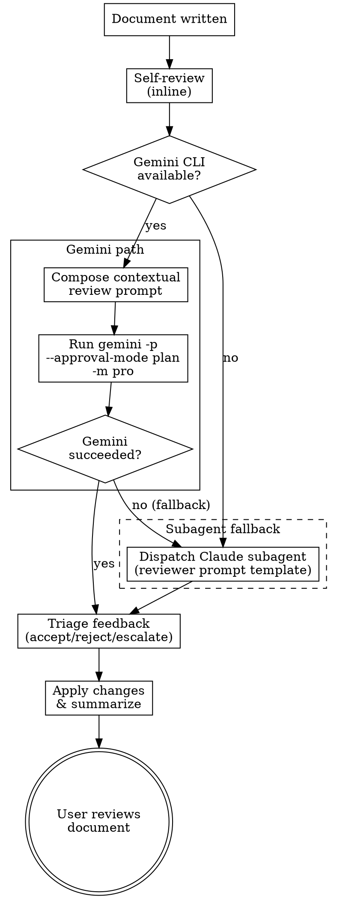

# Gemini CLI Review Integration — Design Specification

## Overview

Add automated external review of design specs and implementation plans by invoking Gemini CLI in headless, read-only mode. This introduces a new `gemini-review` skill that brainstorming and writing-plans invoke after their existing inline self-review step, before the user review gate.

The goal is to automate what has been a manual workflow: after Claude produced a document, the user manually asked Gemini to review it, pasted the feedback back to Claude, and iterated until satisfied. This design makes Claude orchestrate that loop directly.

## Motivation

- **An independent AI perspective catches different issues.** Claude's inline self-review checks consistency and completeness, but it's the same model reviewing its own work. Gemini brings a genuinely different perspective — different training, different reasoning patterns, different blind spots.
- **Collaborative, not just adversarial.** The review asks for suggestions and improvements, not just error-finding. The two models collaborate to produce better designs and plans.
- **Reduces manual toil.** The user was doing this every time by hand. Automating it saves time and makes the quality gate consistent.

## Design Decisions

### Standalone skill (not embedded)

The Gemini review logic lives in a new `gemini-review` skill, invoked by other skills via `superartes:gemini-review`. This follows the `commit-message` pattern — a focused, reusable capability that multiple skills reference.

Rationale: DRY, single place to improve review quality, and the skill can gracefully degrade when Gemini CLI is not installed (important since SuperArtes is a published plugin used by others).

### Dynamic prompt composition (not templates)

Claude composes each review prompt dynamically based on context: document type, related documents, what changed since the last cycle, and project context. This replicates the quality of the user's manual prompts, which were always contextual and tailored.

Rationale: Templated prompts produce generic reviews. The value of Gemini's review comes from understanding *what it's looking at and why it matters*.

### Read-only mode

Gemini runs with `--approval-mode plan` (read-only). It can explore any project file to inform its review but cannot modify anything.

Rationale: Matches the reviewer role — observe and advise, never change.

### Best available model

Gemini runs with `-m pro` to use the strongest reasoning model available.

Rationale: Reviews benefit from deep reasoning. Speed is not critical here — quality is.

### Graceful degradation with subagent fallback

The skill's first step checks `which gemini`. If the CLI is installed, it runs the full Gemini review. If not, it falls back to dispatching a Claude subagent using the existing reviewer prompt templates (`spec-document-reviewer-prompt.md` or `plan-document-reviewer-prompt.md`). This ensures every user gets an additional review layer beyond self-review, regardless of whether Gemini CLI is installed.

Rationale: SuperArtes is a published plugin. Most users will not have Gemini CLI installed, but they still benefit from a structured review dispatch. The subagent review is weaker (same model reviewing its own work) but the separate dispatch with a focused reviewer persona and structured criteria still catches things the inline self-review misses. The existing reviewer prompt templates were built for exactly this purpose.

## New Skill: `gemini-review`

### File structure

```
skills/gemini-review/
  SKILL.md              # The skill itself
  review-guidelines.md  # Reference: what makes a good review, calibration notes
```

### SKILL.md responsibilities

1. **Check availability** — `which gemini`. Result determines the review path:
   - **Gemini available:** proceed to step 2 (dynamic prompt composition + Gemini CLI)
   - **Gemini not available:** fall back to step 2b (subagent review using existing reviewer prompt templates)
2. **Compose the review prompt** dynamically based on:
   - Document type (spec or plan)
   - The document being reviewed (referenced via `@path/to/file`)
   - Related context documents (parent architecture spec, the spec a plan is based on, etc.) — Claude knows these from the current conversation context, since it produced or worked with the document being reviewed
   - What changed since the last review cycle (if this is a re-review)
   - Project context (brief note about the project and where this document fits)
3. **Invoke Gemini CLI:**
   ```bash
   cat << 'EOF' | gemini -p "$(cat)" --approval-mode plan -m pro
   <composed prompt with role, context, documents, focus>
   EOF
   ```
   The prompt MUST be passed via heredoc (with single-quoted `'EOF'` delimiter) to avoid shell escaping issues — dynamic prompts will contain `$`, backticks, quotes, and other characters that break double-quoted strings. The Bash tool timeout should be set to 280 seconds.

**Fallback path (step 2b) — when Gemini CLI is not available:**

Dispatch a Claude subagent using the existing reviewer prompt templates:
- For spec reviews: use `skills/brainstorming/spec-document-reviewer-prompt.md`
- For plan reviews: use `skills/writing-plans/plan-document-reviewer-prompt.md`

The subagent is dispatched via the Agent tool with the template's prompt, substituting the actual file paths. The subagent returns structured output (Status, Issues, Recommendations) which feeds into the same triage step below.

Note to user: "Gemini CLI not available — running Claude subagent review instead."

4. **Triage feedback** into three buckets:
   - **Accept & apply** — clear improvements: bugs, omissions, inconsistencies, genuinely better ideas and suggestions. Fix in the document immediately.
   - **Reject** — reviewer lacked context, contradicts a deliberate decision, unhelpful. Skip, note briefly in summary.
   - **Escalate** — genuine judgment calls, design decisions where both sides have merit. Present to user along with Claude's own recommendation.
5. **Summarize to user:**
   ```
   Gemini review processed:
   - Applied (N): [brief description of each change]
   - Skipped (N): [brief reason for each]
   - Your input needed (N): [tradeoff + Claude's recommendation for each]
   ```
6. **Update document** — if changes were applied, update and re-commit the document.

### Prompt composition guidelines

The prompt should include:

1. **Role & task** — "You are reviewing [type] for [project context]"
2. **Documents** — the primary document and any related context docs via `@path`
3. **Review focus** — what matters most for this particular review
4. **Situational context** — what changed, what decisions were made and why
5. **Permission to explore** — Gemini can look up other project files as needed
6. **Collaborative framing** — ask for issues AND suggestions/improvements/ideas
7. **Output guidance** — ask for structured feedback but don't over-constrain

The prompt should NOT:
- Limit response length (kills depth)
- Over-template the output format
- Tell Gemini what to conclude

### review-guidelines.md content

Reference material for Claude when composing prompts, covering:

- **Spec reviews** focus on: architectural soundness, completeness, internal consistency, feasibility, YAGNI, gaps that would cause implementation problems, and suggestions for better approaches or simplifications
- **Plan reviews** focus on: spec alignment, task decomposition quality, buildability, completeness of steps, DRY, quality of algorithms and code snippets, suggestions for better task ordering or alternative implementation approaches
- **Calibration:** flag real issues, not style preferences. A missing requirement is an issue. "I'd phrase this differently" is not.
- **Re-reviews:** focus on what changed, don't re-raise resolved points

### Error handling

| Failure mode | Behavior |
|---|---|
| Gemini CLI not installed | Fall back to subagent review using existing reviewer prompt templates |
| Non-zero exit / API error | Report error, fall back to subagent review |
| Timeout (>280s) | Report timeout, fall back to subagent review |
| Empty or unparseable output | Treat as failure, fall back to subagent review |
| Subagent also fails | Report error, continue to user review (user is the final safety net) |

No automatic retries for Gemini. On any Gemini failure, fall back to subagent review immediately. The user review gate is always the final step.

## Changes to Existing Skills

### Brainstorming skill

**Current review sequence:**
```
Write design doc -> Spec self-review (inline) -> User reviews spec
```

**New review sequence:**
```
Write design doc -> Spec self-review (inline) -> Gemini review -> User reviews spec
```

Changes:
- Add checklist item between spec self-review and user review: "Gemini external review — invoke `superartes:gemini-review`"
- Update process flow diagram with new node between "Spec self-review" and "User reviews spec?"
- Existing subagent reviewer template (`spec-document-reviewer-prompt.md`) is unchanged in content but now actively used as the fallback review path by `gemini-review`

### Writing-plans skill

**Current flow:**
```
Write plan -> Self-review (inline) -> Execution handoff
```

**New flow:**
```
Write plan -> Self-review (inline) -> Gemini review -> User reviews plan -> Execution handoff
```

Changes:
- Add Gemini review step after self-review: "Gemini external review — invoke `superartes:gemini-review`"
- Add explicit user review gate before execution handoff (currently missing — user was using the execution choice prompt as an ad-hoc review opportunity)
- Update flow and checklist accordingly
- Existing subagent reviewer template (`plan-document-reviewer-prompt.md`) is unchanged in content but now actively used as the fallback review path by `gemini-review`

### No changes to other skills

The visual companion, commit-message, and all other skills remain untouched. The existing subagent reviewer prompt templates (`spec-document-reviewer-prompt.md`, `plan-document-reviewer-prompt.md`) are now used by the gemini-review skill as the fallback review path — their content is unchanged, but they go from dormant reference files to actively used components.

## Out of Scope

- **Codex as an alternative reviewer** — planned for a future iteration, not this one
- **Reviewer selection UI** — comes with Codex support
- **The self-review criteria inconsistency** (andybrandt/superartes#1) — the YAGNI criterion missing from the inline self-review checklist; tracked separately
- **Code or scripts** — this feature is purely skill documentation (SKILL.md files)

## Review Sequence Diagram


