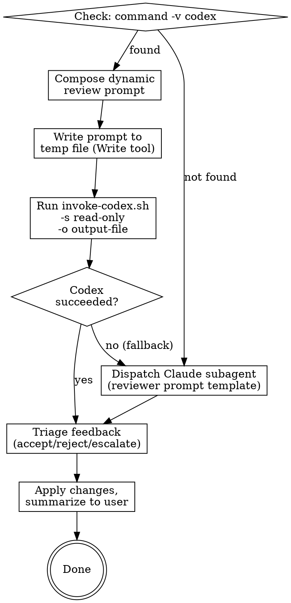

# External Document Review

Review a design spec, an implementation plan or other document by invoking an external AI CLI in headless, read-only mode. The default external reviewer is [Codex CLI](https://developers.openai.com/codex/) (`codex exec`). Falls back to a Claude subagent review when the external CLI is not available.

## Inputs

This skill needs to know:
- The path to the document being reviewed
- The document type (e.g., "spec", "plan", or a brief description for other document types)
- Related context documents, if any (parent architecture spec, the spec a plan is based on, etc.)

When invoked by another skill (brainstorming, writing-plans), these are available in the conversation context. When invoked directly by user request, determine them from the user's message and the current conversation - ask the user if anything is unclear.

## Process



### Step 1: Check external CLI availability

Run `command -v codex` via the Bash tool. If it succeeds, proceed with the Codex review. If it fails, note to user: "Codex CLI not available - running Claude subagent review instead." and skip to Step 4 (Subagent Fallback).

### Step 2: Compose the review prompt

Compose a contextual, tailored review prompt. Do NOT use a rigid template - write the prompt as if you were a developer asking a senior colleague for a thorough review. The prompt quality directly determines the review quality.

**Include in the prompt:**

1. **Role & context** - tell the reviewer what project this is, what the document is, and where it fits in the bigger picture as much as is needed for a good review
2. **Documents** - reference the primary document to be reviewed and any related context docs by their file paths, and tell the reviewer it may open and read them
3. **Review focus** - what matters most for this particular document (architectural soundness? spec coverage? consistency with parent design? technical merit? use of well known design patterns?)
4. **Situational context** - if this is a re-review, explain what changed and why since the last cycle
5. **Permission to explore** - tell the reviewer it has read-only access to the whole project and should look up files if needed
6. **Collaborative framing** - ask for issues, suggestions, improvements, and alternative ideas - not just error-finding

**The prompt must NOT:**
- Limit response length (this kills depth and defeats the purpose)
- Over-template the expected output format (let the reviewer organize its thoughts)
- Tell the reviewer what conclusions to reach

**Review focus by document type:**

For **spec reviews**, focus on: architectural soundness, completeness, internal consistency, feasibility, YAGNI, DRY, design patterns, and suggestions for better approaches or simplifications.

For **plan reviews**, focus on: spec alignment, task decomposition quality, buildability, completeness of steps, DRY, code quality in snippets, and suggestions for better task ordering or alternative approaches.

**Calibration:** Flag real issues, not style preferences. A missing requirement is an issue. "I'd phrase this differently" is not. A step so vague it can't be acted on is an issue. Minor formatting preferences are not.

**Re-reviews:** When composing a re-review prompt (after changes from a previous cycle), tell the reviewer what changed and why, ask it to focus on the changes rather than re-reviewing everything, and mention which previous feedback points were addressed and which were intentionally declined (with reasons).

### Step 3: Invoke Codex CLI

Write the prompt to a temporary file, then invoke the wrapper script. This two-step approach avoids shell escaping issues (the prompt is in a file fed to Codex via stdin, not a command-line argument) and avoids the pipe operator in the Bash tool call (which triggers Claude Code's "Unhandled node type: pipeline" sandbox prompt on every invocation).

**First step** — use the Write tool to save the prompt to a temp file:

Write your composed prompt to a temporary file path. Use a path inside the system temp directory to keep the prompt file outside the project tree. The path must work cross-platform:
- On Unix/macOS: `/tmp/external-review-prompt.md`
- On Windows (Git Bash): use `$TMPDIR` or `/tmp/` (Git Bash maps this appropriately)

Using the Write tool (instead of a Bash heredoc) avoids an additional shell permission prompt per invocation.

**Second step** — invoke Codex via the wrapper script (Bash tool):

```bash
bash /path/to/skills/external-review/invoke-codex.sh "/tmp/external-review-prompt.md" -s read-only --skip-git-repo-check -o "/tmp/external-review-output.md"
```

Replace `/path/to/skills/external-review/` with the actual skill directory path, and the temp paths with the ones you used. Set the Bash tool timeout to 280 seconds. The script feeds the prompt to `codex exec` via stdin and cleans up the prompt file automatically.

**Why these flags:**
- `-s read-only` (`--sandbox read-only`) — the review must never modify files; read-only is the safe sandbox for a critique.
- `--skip-git-repo-check` — lets the review run even when the project is not a git repository.
- `-o <file>` (`--output-last-message`) — writes only Codex's final review message to the given file. This is preferred over `--json` (a JSONL event stream that would need parsing) — read the output file with the Read tool to get the clean review text.
- `-m <model>` is optional. Codex uses the model configured by the user; do not force one unless the user asks. Authentication and model configuration are the user's responsibility, not this skill's.

**Sandbox / network note:** Codex needs network access to reach its model provider. If your host environment sandboxes the Bash tool without network access (as some Claude Code and Codex sandbox configurations do), the wrapper must run outside that sandbox — the user will have to confirm and allow it. Explain to the user why this is necessary. Resolving Codex authentication itself is out of scope: the user is responsible for preparing `codex` to run headlessly.

**After the run:** read the output file (e.g. `/tmp/external-review-output.md`) with the Read tool to obtain the review.

**If Codex fails** (non-zero exit, timeout, empty output file): report the error briefly and fall through to Step 4 (Subagent Fallback).

### Step 4: Subagent Fallback (when the external CLI is unavailable or failed)

Dispatch a Claude subagent using the existing reviewer prompt templates:
- For spec reviews: read `skills/brainstorming/spec-document-reviewer-prompt.md` and use its prompt template
- For plan reviews: read `skills/writing-plans/plan-document-reviewer-prompt.md` and use its prompt template
- For other documents create your own appropriate prompt for the subagents, you can use either or both of the templates listed above as inspiration

Substitute `[SPEC_FILE_PATH]` and `[PLAN_FILE_PATH]` with the actual file paths. Dispatch using your platform's subagent tool (e.g., the Agent tool in Claude Code). If your platform does not support subagents, execute the review yourself in the current session using the template.

### Step 5: Triage the feedback

Read the reviewer's feedback (whether from Codex or subagent) and categorize each point:

| Bucket | Criteria | Action |
|--------|----------|--------|
| **Accept & apply** | Clear improvements: bugs, omissions, inconsistencies, better ideas | Fix in the document immediately |
| **Reject** | Reviewer lacked context, contradicts a deliberate decision, unhelpful | Skip silently |
| **Escalate** | Genuine judgment call, design decision, both sides have merit | Present to user with your recommendation |

### Step 6: Summarize and update

Present a brief summary to the user:

```
[Codex/Subagent] review processed:
- Applied (N): [brief description of each change]
- Skipped (N): [brief reason for each]
- Your input needed (N): [tradeoff + your recommendation for each]
```

If changes were applied, update the document and commit using `superartes:commit-message`.

If there are escalated items, wait for the user's input before proceeding.
