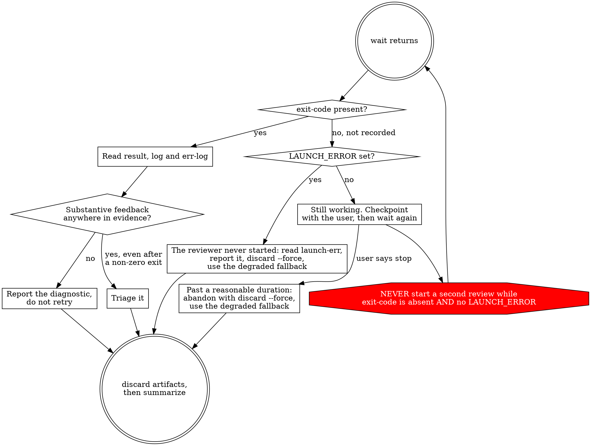

# External Document Review

Obtain a review from a different model family and harness than the controller.

## Required input

- Primary document paths and document type
- Related context documents
- Canonical project path

When another skill hands off (`superartes:brainstorming`, `superartes:writing-plans`)
these are already in the conversation. On a direct user request, derive them from
the request and the conversation, and ask the user about anything unclear.

## Reviewer selection

| Controller | Independent review mode |
|------------|---------------------|
| Claude Code / Anthropic | `codex-prompt` |
| Codex / OpenAI | `claude-prompt` |
| Unknown or conflicting | Stop and ask |

Use explicit runtime identity first, then corroborating Claude/Codex environment
markers. Executable availability never determines controller identity. A
same-model fallback is degraded, not independent.

## Prompt composition

Compose a contextual prompt covering project role, document paths, review focus,
re-review history, permission to explore read-only context, and collaborative
feedback. Do not impose a response limit, prescribe conclusions, or over-template
the review.

Focus a spec review on architectural soundness, completeness, internal
consistency, feasibility, YAGNI, DRY, and better alternatives. Focus a plan
review on spec alignment, task decomposition, buildability, step completeness,
and ordering. Calibrate the reviewer: a missing requirement is an issue, "I would
phrase this differently" is not. For a re-review, say what changed, which earlier
points were addressed, and which were declined and why.

## Invocation

Resolve this skill's absolute source directory — the path your skill loader
reported, never a path resolved against the user's project. Under Claude Code,
`${CLAUDE_PLUGIN_ROOT}/skills/external-review` is the preferred root when
available. Quote every resolved path.

`codex-prompt` names the document-review mode: a composed prompt fed to `codex exec`
on stdin, with the repository readable but not writable. A Claude Code controller
runs that mode through the background runner's `start prompt`; a Codex controller
runs it as the managed adapter's profile of the same name. The Reviewer selection
table above names the mode, not the mechanism.

### Claude Code controller

Write the composed prompt to a unique temporary file, then run the background
runner. Each shell call is a separate process, so a shell variable holding the run
directory is empty by your next call: **record the `RUN_DIR` the runner prints as a
literal path in your own reply** and paste that literal into every later call.

```bash
"$DIR/invoke-codex.sh" start prompt "$WORK_DIR" "$PROMPT_FILE"   # prints RUN_DIR=...
"$DIR/invoke-codex.sh" wait    "<the literal RUN_DIR>" 540
"$DIR/invoke-codex.sh" status  "<the literal RUN_DIR>"
"$DIR/invoke-codex.sh" discard "<the literal RUN_DIR>"
```

Every `$NAME` above is a placeholder for you to substitute: `$DIR` is the resolved
skill directory, `$WORK_DIR` the directory the reviewer should read, `$PROMPT_FILE`
your temporary prompt. Only `RUN_DIR` is written as a literal you paste back.

`status` reports on a run without waiting, and `wait` ends by printing exactly the
same block. That block is where every artifact path comes from — `RESULT=`,
`STDOUT_LOG=`, `STDERR_LOG=`, `ELAPSED_SECONDS=`, and `LAUNCH_ERROR=` when the
reviewer failed to start. Read the paths from there rather than assembling them
yourself; the Windows runner names one file differently on disk, and `LAUNCH_ERROR=`
is what makes that invisible to you.

On native Windows use `invoke-codex.ps1` with identical subcommands:

```powershell
powershell.exe -NoProfile -ExecutionPolicy Bypass -File "<DIR>\invoke-codex.ps1" start prompt "<work-dir>" "<prompt-file>"
```

That runner has not yet been verified on a native Windows host, so report any failure it produces there.

`$DIR` above stands for that resolved skill directory. It is subject to the same
rule as `RUN_DIR`: a shell variable does not survive to your next call, so either write
the absolute path literally into every command or re-derive it in the same call that
uses it.

The runner copies your prompt into the run directory, so delete your own temporary
copy as soon as `start` returns.

**Run `status` once, a few seconds after `start`.** A reviewer that failed to launch
never writes `exit-code`, so a `wait` would poll for its whole timeout before showing
you `LAUNCH_ERROR` — nine minutes to learn something visible in five seconds.

`wait` exits 3 while completion has **not been recorded** and 0 once it has; 3 is a
lifecycle fact, not a failure. It does not by itself mean the reviewer is alive — check
`LAUNCH_ERROR` to tell a working reviewer from one that never started. Size each `wait` at 540 seconds or less under a
600-second shell-tool cap. Reviews of 250–600 seconds are ordinary and complex
repositories exceed that — keep waiting rather than starting a second review.
Never start a second review while the first has no `exit-code` file.

If you lose the printed `RUN_DIR`, do **not** take the newest run — a concurrent session
reviewing another project would win that race and you would read or destroy its result.
Match on the work directory the runner recorded, and require exactly one hit:

```bash
grep -lx "<the work directory you started the run against>" \
  "${TMPDIR:-/tmp}"/superartes-codex-runs/run.*/work-dir \
  /tmp/superartes-codex-runs/run.*/work-dir 2>/dev/null |
  sed 's:/work-dir$::' | sort -u
```

Substitute the **physical** path of the directory you started the run against —
`cd <that directory> && pwd -P`, since the runner canonicalises before recording, and
`grep -lx` matches whole lines exactly. A symlinked path or a trailing slash silently
returns nothing. For a code review that directory is the repository, which is not
necessarily your current one. The `sed` matters:
the grep finds `work-dir` files, and `RUN_DIR` is the directory containing one. The
runner tolerates a changed `TMPDIR` — it validates a run directory by shape rather
than against a recomputed root — so search both the current temporary directory
and `/tmp`.

On native Windows, list the runs root instead and read each run's `work-dir`, since
the PowerShell runner roots its runs at the .NET temporary path rather than `$TMPDIR`:

```powershell
Get-ChildItem (Join-Path ([System.IO.Path]::GetTempPath()) 'superartes-codex-runs') -Directory -ErrorAction SilentlyContinue |
  Where-Object { (Get-Content -LiteralPath (Join-Path $_.FullName 'work-dir') -Raw -ErrorAction SilentlyContinue) -and
                 (Get-Content -LiteralPath (Join-Path $_.FullName 'work-dir') -Raw).Trim() -eq '<work directory>' } |
  ForEach-Object { $_.FullName }
```

The `ForEach-Object` is what makes the output pasteable: without it PowerShell renders
a table whose directory header line-wraps, and a wrapped path is exactly the copy
corruption the literal-path rule exists to prevent.

If either returns more than one run, read each one's `mode`, `cmd` and `started-at`
and choose deliberately. Never guess.

### Codex controller

Read `invoking-reviewers.md` from this skill's absolute source directory and follow
the managed lifecycle it describes. That adapter exists because Codex's command
runner reaps detached descendants, which the simple runner cannot survive. It is
POSIX-only: on native Windows a Codex controller has no supported path to an
independent reviewer — say so and stop.

## Completion and fallback


```dot
digraph completion {
    "wait returns" [shape=doublecircle];
    "exit-code present?" [shape=diamond];
    "LAUNCH_ERROR set?" [shape=diamond];
    "The reviewer never started: read launch-err,\nreport it, discard --force,\nuse the degraded fallback" [shape=box];
    "Still working. Checkpoint\nwith the user, then wait again" [shape=box];
    "Past a reasonable duration:\nabandon with discard --force,\nuse the degraded fallback" [shape=box];
    "Read result, log and err-log" [shape=box];
    "Substantive feedback\nanywhere in evidence?" [shape=diamond];
    "Triage it" [shape=box];
    "Report the diagnostic,\ndo not retry" [shape=box];
    "NEVER start a second review while\nexit-code is absent AND no LAUNCH_ERROR" [shape=octagon, style=filled, fillcolor=red, fontcolor=white];
    "discard artifacts,\nthen summarize" [shape=doublecircle];

    "wait returns" -> "exit-code present?";
    "exit-code present?" -> "LAUNCH_ERROR set?" [label="no, not recorded"];
    "LAUNCH_ERROR set?" -> "The reviewer never started: read launch-err,\nreport it, discard --force,\nuse the degraded fallback" [label="yes"];
    "The reviewer never started: read launch-err,\nreport it, discard --force,\nuse the degraded fallback" -> "discard artifacts,\nthen summarize";
    "LAUNCH_ERROR set?" -> "Still working. Checkpoint\nwith the user, then wait again" [label="no"];
    "Still working. Checkpoint\nwith the user, then wait again" -> "NEVER start a second review while\nexit-code is absent AND no LAUNCH_ERROR";
    "Still working. Checkpoint\nwith the user, then wait again" -> "Past a reasonable duration:\nabandon with discard --force,\nuse the degraded fallback" [label="user says stop"];
    "Past a reasonable duration:\nabandon with discard --force,\nuse the degraded fallback" -> "discard artifacts,\nthen summarize";
    "NEVER start a second review while\nexit-code is absent AND no LAUNCH_ERROR" -> "wait returns";
    "exit-code present?" -> "Read result, log and err-log" [label="yes"];
    "Read result, log and err-log" -> "Substantive feedback\nanywhere in evidence?";
    "Substantive feedback\nanywhere in evidence?" -> "Triage it" [label="yes, even after\na non-zero exit"];
    "Substantive feedback\nanywhere in evidence?" -> "Report the diagnostic,\ndo not retry" [label="no"];
    "Triage it" -> "discard artifacts,\nthen summarize";
    "Report the diagnostic,\ndo not retry" -> "discard artifacts,\nthen summarize";
}
```

Inspect `result` first — it holds the review Codex wrote through `-o`. `log` is stdout,
carrying Codex's final message; `err-log` is stderr, carrying its progress event stream,
which routinely runs to hundreds of kilobytes. `launch-err` is where a failure to start
the reviewer at all explains itself, and `status` prints `LAUNCH_ERROR=` when it is
non-empty. Substantive feedback anywhere in that evidence means triage it, even after a
non-zero exit.

An absent `exit-code` means **completion was not recorded** — which covers a running
reviewer, a failed launch and a killed wrapper alike. `LAUNCH_ERROR` is what tells
those apart, and it is the first thing to check.

**If `LAUNCH_ERROR` is set, the reviewer never started and `exit-code` will never
appear.** `status` shows this as `STATE=not-recorded` with a `LAUNCH_ERROR=` line.
Waiting again is futile: read the file it names, report the cause, run
`discard "<the literal RUN_DIR>" --force`, and go to the degraded fallback. Plain
`discard` exits 66 on a run with no `exit-code`, so pass `--force` here.

A failed launch is **not** a retry precondition — do not read it as "a demonstrated
terminal failure" below and start a second review. The prohibition on a second review
guards against duplicating a reviewer that might still be alive; a launch that failed
leaves nothing alive, and nothing to gain from repeating it under the same conditions.
Report it and fall back.

For interactive work, fifteen minutes of recorded runtime is a checkpoint: report
`ELAPSED_SECONDS` and ask whether to continue or abandon. For autonomous work, judge a
reasonable duration from scope and complexity and extend it when justified.

Abandoning a run that has not completed needs `discard "<the literal RUN_DIR>" --force`
(the flag works on either side of the path). `discard` removes the run's artifacts and
**does not stop a reviewer that is running** — this runner has
no cancellation, so an abandoned review keeps running and keeps spending tokens until it
finishes on its own. Say that plainly when you report abandoning one. `discard` refuses a
run with no `exit-code` unless given `--force`.

Exit 127 from `start` means `codex` is not on PATH. That is the "unavailable CLI"
case below: do not retry it, go straight to the degraded fallback or report that no
independent reviewer is available.

A second attempt is permitted only by an unavailable CLI, a demonstrated terminal
failure that produced no review, or explicit user approval. Approval never permits
one while `exit-code` is absent — a live reviewer is not a failed one.

When no external review is obtainable and the user accepts a degraded same-model
review, dispatch a subagent with the matching template: the `brainstorming` skill's
`spec-document-reviewer-prompt.md` for a spec, substituting `[SPEC_FILE_PATH]`, or the
`writing-plans` skill's `plan-document-reviewer-prompt.md` for a plan, which needs **both**
`[PLAN_FILE_PATH]` and `[SPEC_FILE_PATH]` — say explicitly when no parent spec exists.
Compose an equivalent brief for other document types. Label the result degraded, never
independent.

A Codex controller follows the reference's terminal-evidence order and its
`indeterminate` handling instead. That state cannot arise under Claude Code, where
nothing reaps the reviewer.

## Triage and summary

Accept and apply clear improvements, reject feedback contradicted by deliberate
context (especially known user decisions), and escalate genuine judgment calls.
Summarize Applied / Skipped / Input needed. Use `superartes:commit-message` to
document changes that are committed.
