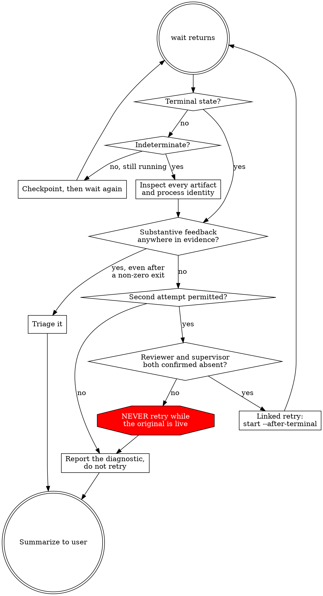

# External Document Review

Obtain a review from a different model family and harness than the controller.

## Required input

- Primary document paths and document type
- Related context documents
- Canonical project path

When another skill hands off (`superartes:brainstorming`, `superartes:writing-plans`)
these are already in the conversation. On a direct user request, derive them from
the request and the conversation, and ask the user about anything unclear.

## Reviewer selection

| Controller | Independent profile |
|------------|---------------------|
| Claude Code / Anthropic | `codex-prompt` |
| Codex / OpenAI | `claude-prompt` |
| Unknown or conflicting | Stop and ask |

Use explicit runtime identity first, then corroborating Claude/Codex environment
markers. Executable availability never determines controller identity. A
same-model fallback is degraded, not independent.

## Prompt composition

Compose a contextual prompt covering project role, document paths, review focus,
re-review history, permission to explore read-only context, and collaborative
feedback. Do not impose a response limit, prescribe conclusions, or over-template
the review.

Focus a spec review on architectural soundness, completeness, internal
consistency, feasibility, YAGNI, DRY, and better alternatives. Focus a plan
review on spec alignment, task decomposition, buildability, step completeness,
and ordering. Calibrate the reviewer: a missing requirement is an issue, "I would
phrase this differently" is not. For a re-review, say what changed, which earlier
points were addressed, and which were declined and why.

## Invocation

Read `invoking-reviewers.md` from this skill's absolute source directory — the
path your skill loader reported, never a path resolved against the user's
project. Then run the managed lifecycle:

1. Build the stable review key. The key is the identity of *this* review: it lets
   a repeated invocation attach to a run already in flight instead of starting a
   duplicate. The reference defines how to construct it.
2. Write the composed prompt to a unique temporary file.
3. Run the profile `check`, then `start`. Preflight runs before key lookup and
   must succeed.
4. Record the `RUN_DIR` that `start` prints as a literal path in your own reply.
   Each shell call is a separate process, so a shell variable holding it is empty
   by your next call.
5. `wait` in bounded chunks — 540 seconds or less under a 600-second shell-tool
   cap, because `wait` can overshoot its own timeout by a few seconds.
6. On a terminal state, inspect evidence in the reference's order, triage, then
   `cleanup`.

A live process or an empty live result is never failure.

If you lose the `RUN_DIR` that `start` printed, follow "Recover lost start
output" in the reference. Never improvise a second `start`.

On native Windows, Claude Code has no OS-level sandbox. Tell the user when
selecting `claude-prompt` there; the reference lists the standing safeguards.

For interactive work, fifteen minutes of recorded reviewer runtime is a status
checkpoint: ask whether to continue or cancel. To cancel, run `cancel`, `wait`
until the state is terminal, inspect evidence, then `cleanup` — `cleanup` refuses
while a reviewer or supervisor is still alive. For autonomous work, judge a
reasonable duration from scope and complexity, and extend it when justified.

## Completion and fallback

```dot
digraph completion {
    "wait returns" [shape=doublecircle];
    "Terminal state?" [shape=diamond];
    "Indeterminate?" [shape=diamond];
    "Checkpoint, then wait again" [shape=box];
    "Inspect every artifact\nand process identity" [shape=box];
    "Substantive feedback\nanywhere in evidence?" [shape=diamond];
    "Triage it" [shape=box];
    "Second attempt permitted?" [shape=diamond];
    "Reviewer and supervisor\nboth confirmed absent?" [shape=diamond];
    "Report the diagnostic,\ndo not retry" [shape=box];
    "NEVER retry while\nthe original is live" [shape=octagon, style=filled, fillcolor=red, fontcolor=white];
    "Linked retry:\nstart --after-terminal" [shape=box];
    "Summarize to user" [shape=doublecircle];

    "wait returns" -> "Terminal state?";
    "Terminal state?" -> "Substantive feedback\nanywhere in evidence?" [label="yes"];
    "Terminal state?" -> "Indeterminate?" [label="no"];
    "Indeterminate?" -> "Checkpoint, then wait again" [label="no, still running"];
    "Indeterminate?" -> "Inspect every artifact\nand process identity" [label="yes"];
    "Checkpoint, then wait again" -> "wait returns";
    "Inspect every artifact\nand process identity" -> "Substantive feedback\nanywhere in evidence?";
    "Substantive feedback\nanywhere in evidence?" -> "Triage it" [label="yes, even after\na non-zero exit"];
    "Substantive feedback\nanywhere in evidence?" -> "Second attempt permitted?" [label="no"];
    "Second attempt permitted?" -> "Report the diagnostic,\ndo not retry" [label="no"];
    "Second attempt permitted?" -> "Reviewer and supervisor\nboth confirmed absent?" [label="yes"];
    "Reviewer and supervisor\nboth confirmed absent?" -> "NEVER retry while\nthe original is live" [label="no"];
    "NEVER retry while\nthe original is live" -> "Report the diagnostic,\ndo not retry";
    "Reviewer and supervisor\nboth confirmed absent?" -> "Linked retry:\nstart --after-terminal" [label="yes"];
    "Linked retry:\nstart --after-terminal" -> "wait returns";
    "Triage it" -> "Summarize to user";
    "Report the diagnostic,\ndo not retry" -> "Summarize to user";
}
```

A second attempt is permitted only by an unavailable CLI, a demonstrated terminal
failure that produced no review, or explicit user approval. Approval never
permits a retry while the original is live, and `indeterminate` never permits an
immediate one. The same-model fallback for a Claude Code controller is the
`claude-prompt` profile through the same adapter — label it degraded.

## Triage and summary

Accept and apply clear improvements, reject feedback contradicted by deliberate
context (especially known user decisions), and escalate genuine judgment calls.
Summarize Applied / Skipped / Input needed. Use `superartes:commit-message` to
document changes that are committed.
