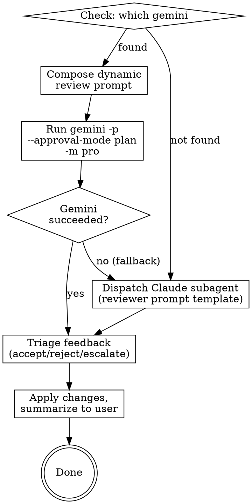

# External Document Review

Review a design spec, an implementation plan or other document by invoking Gemini CLI in headless, read-only mode. Falls back to a Claude subagent review when Gemini CLI is not available.

## Inputs

This skill needs to know:
- The path to the document being reviewed
- The document type (e.g., "spec", "plan", or a brief description for other document types)
- Related context documents, if any (parent architecture spec, the spec a plan is based on, etc.)

When invoked by another skill (brainstorming, writing-plans), these are available in the conversation context. When invoked directly by user request, determine them from the user's message and the current conversation - ask the user if anything is unclear.

## Process



### Step 1: Check Gemini CLI availability

Run `which gemini` via the Bash tool. If it succeeds, proceed with Gemini review. If it fails, note to user: "Gemini CLI not available - running Claude subagent review instead." and skip to Step 4 (Subagent Fallback).

### Step 2: Compose the review prompt

Compose a contextual, tailored review prompt. Do NOT use a rigid template - write the prompt as if you were a developer asking a senior colleague for a thorough review. The prompt quality directly determines the review quality.

**Include in the prompt:**

1. **Role & context** - tell Gemini what project this is, what the document is, and where it fits in the bigger picture as much as is needed for a good review
2. **Documents** - reference the primary document to be reviewed and any related context docs using `@path/to/file` syntax
3. **Review focus** - what matters most for this particular document (architectural soundness? spec coverage? consistency with parent design? technical merit? use of well known design patterns?)
4. **Situational context** - if this is a re-review, explain what changed and why since the last cycle
5. **Permission to explore** - tell Gemini it has read-only access to the whole project and should look up files if needed
6. **Collaborative framing** - ask for issues, suggestions, improvements, and alternative ideas - not just error-finding

**The prompt must NOT:**
- Limit response length (this kills depth and defeats the purpose)
- Over-template the expected output format (let Gemini organize its thoughts)
- Tell Gemini what conclusions to reach

Read `review-guidelines.md` in this skill's directory for document-type-specific review focus areas.

### Step 3: Invoke Gemini CLI

Pass the prompt via heredoc to avoid shell escaping issues:

```bash
cat << 'REVIEW_PROMPT_EOF' | gemini -p "$(cat)" --approval-mode plan -m pro
<your composed prompt here>
REVIEW_PROMPT_EOF
```

Set the Bash tool timeout to 280 seconds. The heredoc delimiter MUST use single quotes (`'REVIEW_PROMPT_EOF'`) to prevent shell variable expansion.

**If Gemini fails** (non-zero exit, timeout, empty output): report the error briefly and fall through to Step 4 (Subagent Fallback).

### Step 4: Subagent Fallback (when Gemini is unavailable or failed)

Dispatch a Claude subagent using the existing reviewer prompt templates:
- For spec reviews: read `skills/brainstorming/spec-document-reviewer-prompt.md` and use its prompt template
- For plan reviews: read `skills/writing-plans/plan-document-reviewer-prompt.md` and use its prompt template
- For other documents create your own appropriate prompt for the subagents, you can use either or both of the templates listed above as inspiration

Substitute `[SPEC_FILE_PATH]` and `[PLAN_FILE_PATH]` with the actual file paths. Dispatch using your platform's subagent tool (e.g., the Agent tool in Claude Code). If your platform does not support subagents, execute the review yourself in the current session using the template.

### Step 5: Triage the feedback

Read the reviewer's feedback (whether from Gemini or subagent) and categorize each point:

| Bucket | Criteria | Action |
|--------|----------|--------|
| **Accept & apply** | Clear improvements: bugs, omissions, inconsistencies, better ideas | Fix in the document immediately |
| **Reject** | Reviewer lacked context, contradicts a deliberate decision, unhelpful | Skip silently |
| **Escalate** | Genuine judgment call, design decision, both sides have merit | Present to user with your recommendation |

### Step 6: Summarize and update

Present a brief summary to the user:

```
[Gemini/Subagent] review processed:
- Applied (N): [brief description of each change]
- Skipped (N): [brief reason for each]
- Your input needed (N): [tradeoff + your recommendation for each]
```

If changes were applied, update the document and commit using `superartes:commit-message`.

If there are escalated items, wait for the user's input before proceeding.
