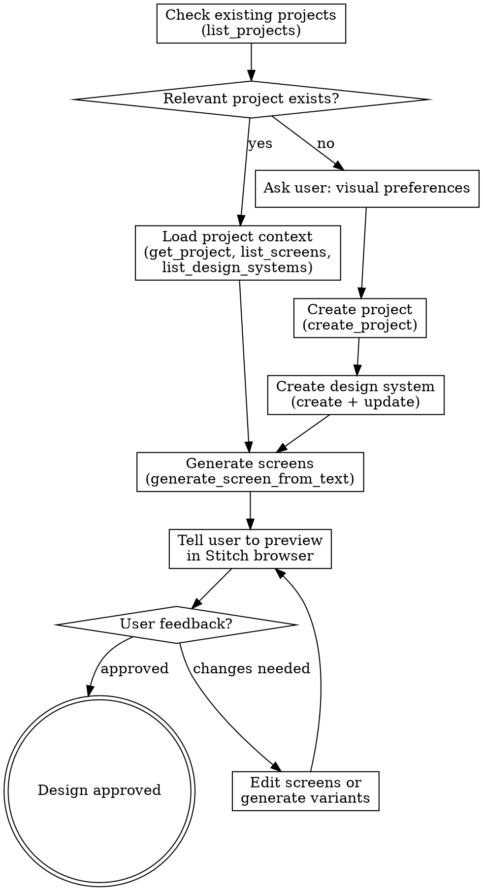

# Using Google Stitch for UI Design

Use Google Stitch MCP to generate, iterate on, and preview UI designs during brainstorming. Stitch produces real visual designs that the user can review and fine-tune in their browser.

## Prerequisites

This skill applies ONLY when `mcp__stitch__*` tools are present in your available tools. If they are not available, skip this skill entirely and fall back to the Visual Companion or text-only brainstorming.

## Process Flow

## Step 1: Check Existing Projects

Before creating anything, check if relevant Stitch projects already exist:

1. Call `list_projects` (no filter needed — defaults to owned projects)
2. If a project matches the current work, use `get_project` to load details, then `list_screens` and `list_design_systems` to understand existing design state
3. If an existing project and design system fit, skip to screen generation

## Step 2: Gather Visual Preferences (New Projects Only)

Before creating a new project, ask the user about their visual preferences. Ask these as focused questions (one at a time, per brainstorming skill rules):

| Question | Maps to | Options |
|----------|---------|---------|
| What is the purpose/audience of this app? | `designMd` | Open-ended — informs overall design direction |
| Light or dark mode? | `colorMode` | LIGHT, DARK |
| Primary brand color? | `customColor` | Hex color, e.g. "#2563eb" |
| Color feel? | `colorVariant` | MONOCHROME, NEUTRAL, TONAL_SPOT, VIBRANT, EXPRESSIVE, FIDELITY, CONTENT, RAINBOW, FRUIT_SALAD |
| Typography style? | `headlineFont`, `bodyFont` | Modern sans-serif (Inter, DM Sans, Geist), Classic serif (Noto Serif, EB Garamond, Literata), Geometric (Montserrat, Sora, Space Grotesk), Humanist (Nunito Sans, Rubik, Plus Jakarta Sans) |
| Corner style? | `roundness` | Sharp (ROUND_FOUR), Medium (ROUND_EIGHT), Rounded (ROUND_TWELVE), Pill (ROUND_FULL) |
| Target device? | `deviceType` | MOBILE, DESKTOP, TABLET, AGNOSTIC |

If the user has no strong preferences, propose sensible defaults based on the app's purpose and get confirmation.

## Step 3: Create Project and Design System

1. Call `create_project` with a descriptive title
2. Call `create_design_system` with the gathered preferences:
   - Set `projectId` from the created project
   - Fill all required theme fields: `colorMode`, `headlineFont`, `bodyFont`, `roundness`, `customColor`
   - Use `designMd` for freeform design instructions (app purpose, audience, style notes)
   - Set optional color overrides if user specified secondary/tertiary colors
3. **Immediately** call `update_design_system` after creation — this is required to apply it and make it visible in the UI

## Step 4: Generate Screens

Use `generate_screen_from_text` to create screens:

- Set `modelId` to `GEMINI_3_1_PRO` (current best model; `GEMINI_3_PRO` is deprecated)
- Write detailed prompts describing the screen's purpose, layout, and content
- Set `deviceType` to match the user's target
- **Be patient**: generation can take a few minutes. Do NOT retry on timeout — the generation may still succeed. Use `get_screen` to check later if the call fails with a connection error.
- Handle `output_components`: if the response contains suggestions, present them to the user. If they accept one, call `generate_screen_from_text` again with the accepted suggestion as the prompt.

## Step 5: Preview and Iterate

After generating screens, tell the user:

> "Screens have been generated in Stitch. Please open your project at stitch.withgoogle.com to preview the designs. You can also fine-tune them directly in the Stitch editor."
>
> **Note:** Sometimes Stitch does not refresh properly after MCP-initiated changes. If you don't see the latest designs, try refreshing the page or reopening the project.

### Editing Existing Screens

Use `edit_screens` when the user wants modifications:
- Requires `projectId`, `selectedScreenIds` (array), and a `prompt` describing the changes
- Get screen IDs from `list_screens` if needed

### Generating Variants

Use `generate_variants` to explore design alternatives:
- `variantOptions.creativeRange`: REFINE (subtle tweaks), EXPLORE (balanced, default), REIMAGINE (radical alternatives)
- `variantOptions.aspects`: focus on specific elements — LAYOUT, COLOR_SCHEME, IMAGES, TEXT_FONT, TEXT_CONTENT (or leave empty for all)
- `variantOptions.variantCount`: 1-5 variants (default 3)

Present variants to the user and let them pick favorites or mix elements.

### Applying Design Systems

Use `apply_design_system` to restyle existing screens with a different design system:
- Requires `projectId`, `assetId` (from `list_design_systems`), and `selectedScreenInstances`
- Screen instances come from `get_project`, NOT `list_screens` — use the instance `id` and `sourceScreen` fields

## Quick Reference

| Tool | When to use |
|------|-------------|
| `list_projects` | Find existing projects |
| `create_project` | Start new design work |
| `get_project` | Load project details and screen instances |
| `list_screens` | See all screens in a project |
| `get_screen` | Get details of one screen, or verify generation succeeded |
| `generate_screen_from_text` | Create new screen from description |
| `edit_screens` | Modify existing screens |
| `generate_variants` | Create design alternatives |
| `create_design_system` | Set up visual theme (always call update after) |
| `update_design_system` | Apply/modify design system |
| `list_design_systems` | Find existing design systems |
| `apply_design_system` | Restyle screens with a design system |

## Common Mistakes

| Mistake | Fix |
|---------|-----|
| Retrying `generate_screen_from_text` on timeout | Don't retry — use `get_screen` to check if it succeeded |
| Using `GEMINI_3_PRO` model | Use `GEMINI_3_1_PRO` — 3 Pro is deprecated |
| Creating design system without calling update after | Always call `update_design_system` immediately after `create_design_system` |
| Using screen IDs from `list_screens` for `apply_design_system` | Use screen **instance** IDs from `get_project` |
| Generating screens without establishing a design system first | Set up the design system first so screens are consistent |
| Skipping existing project check | Always check `list_projects` first to avoid duplicating work |
